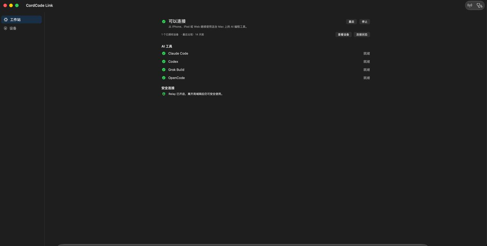
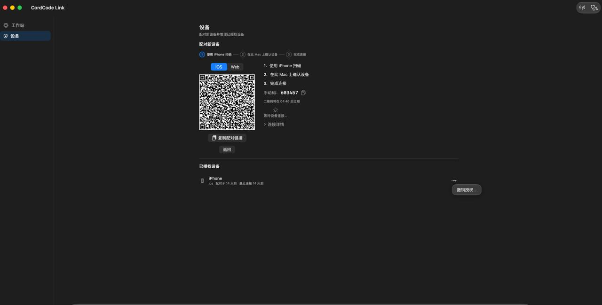
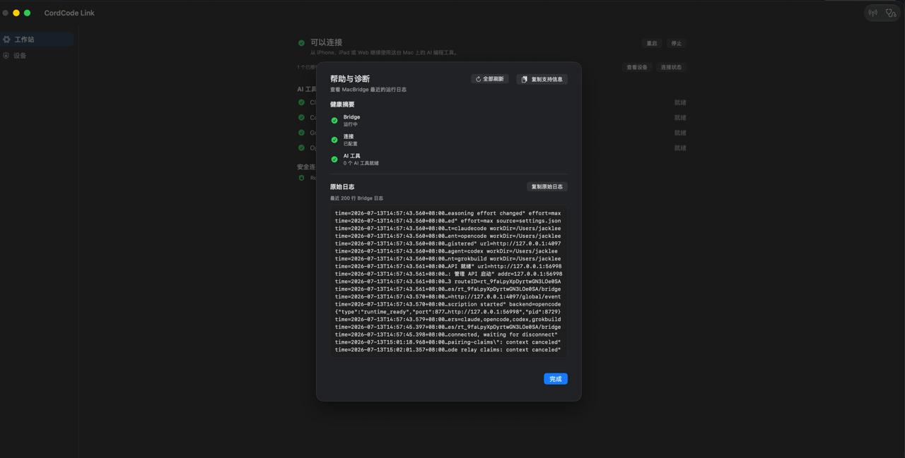
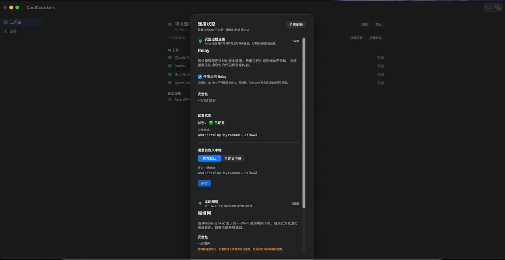

# 第二轮界面升级设计文档（MacBridge App UI Polish - Round 2）

**日期**：2026-07-13  
**版本**：r5 最终容器宽度算术修正版（仍待批准进入 P0）  
**前置文档**：`docs/2026-07-13-macbridge-app-ux-redesign-report.md`（第一轮 UX 重设计）  
**评审记录**：`docs/2026-07-13-第二轮界面升级设计文档-评审.md`、`docs/2026-07-13-第二轮界面升级设计文档-评审-r2.md`、`docs/2026-07-13-第二轮界面升级设计文档-评审-r3.md`、`docs/2026-07-13-第二轮界面升级设计文档-评审-r4.md`、`docs/2026-07-13-第二轮界面升级设计文档-评审-r5.md`  
**目标读者**：实现 agent、reviewer、owner  
**参考截图**（已放入仓库并从 docs 忽略规则精确放行）：

- `docs/assets/workspace-main.jpg` —— 工作站首屏
- `docs/assets/devices-pairing.jpg` —— 设备页 / 配对
- `docs/assets/diagnostics-sheet.jpg` —— 帮助与诊断 Sheet
- `docs/assets/connection-status-sheet.jpg` —— 连接状态 Sheet

---

## 0. 评审结论（必须遵守）

本轮**r5 最终容器宽度算术修正版**。前序所有阻塞已解决；本轮仅修正最后一处 PageContainer.maxContentWidth 与内层 GeometryReader 可用宽度的算术关系（必须把 padding 两侧 60pt 纳入容器上限）。

按 r5 复核，完成本版最后一次容器宽度算术修正后，即可批准进入 P0 实施（本次为最终文档修正）。

**已通过项**（r5 确认）：
- 日志脱敏边界（`copySupportInfo` 仅脱敏摘要）
- 辅助栏 P0 内容
- 主 CTA 状态表
- 唯一连接**目的地**
- 自定义 Relay endpoint 可见性

**核心方向**（不变）：
- 解决**宽屏稀薄**（实际内容宽度自适应双列 + 只读辅助栏）。
- 解决**状态层级不足**（分组状态行 + 清晰交互表面）。
- **严禁**把工作站做成卡片仪表盘（dashboard）。

**关键裁决**（逐项已确认）：

| 原建议 | 裁决 | 约束 |
|--------|------|------|
| 工作站放宽至 960pt 居中 | 采纳（r5 最终） | `GeometryReader` 必须放在 PageContainer 内容内部。内容阈值 1164（最小双列 900/240）、1204（推荐 920/260）。容器宽度必须是 1224 / 1264（+60pt padding）。Workspace 始终传入 `workspaceMaxContainerWidth`，由内部 GeometryReader 决定单/双列。 |
| AI 工具与安全连接全卡片化 | **拒绝** | AI 工具采用**分组状态行**；Relay 保持紧凑状态行。拒绝每段套圆角卡。 |
| 查看设备 + 连接状态 双主 CTA | **拒绝** | 常态只有一个主操作。首次使用唯一 `.borderedProminent` 是“添加设备”。 |
| 复制配对链接升级主操作 | **拒绝** | 维持次级动作。QR 仍是主视觉锚点。 |
| 日志用 TextEditor 或合成格式 | **拒绝** | 保留原始证据。默认浏览最近 30 行，**必须一键查看并原样复制最近 200 行**。 |
| 全区域卡片 + 大量新样式库 | **限制** | 只在真正需要时抽取窄的 `StatusSurface`。优先使用 `AgentStatusRow`。 |

**本轮不变**：
- 运行语义、配对状态机、Relay 默认路径、连接 Sheet 的单一目的地。
- Sidebar 仍仅 “工作站 / 设备”。
- “连接状态” 是唯一的连接相关**目的地**（按钮位置可多处）。

---

## 1. 背景

第一轮已完成从“技术控制台”到“任务工作站”的信息架构迁移。当前问题主要是**视觉稀薄**和**状态层级不够清晰**，尤其在宽屏下工作站内容像短文字柱悬浮在空画布上。

第二轮目标：**用有目的的布局和层级解决空洞感**，而不是通过加卡片或升级多个主按钮来填满空间。

---

## 2. 设计原则（本轮必须遵守）

1. **宽屏自适应优先**：当可用内容宽度 ≥ `workspaceWideContentThreshold`（1164pt）时提供只读辅助栏，而不是简单放大主内容列。
2. **单一主操作**：常态下只允许一个 `.borderedProminent` 大按钮（首次使用为“添加设备”）。其他入口保持次级。
3. **状态用行而非卡**：AI 工具使用分组状态行；健康结论使用可交互表面（必要时才抽组件）。
4. **克制分组**：使用分隔线、间距、行层次和极轻容器。拒绝 dashboard 风格。
5. **证据完整性**：原始日志必须能完整、原样获取最近 200 行。
6. **Relay 唯一性**：连接相关动作只通过现有“连接状态”**目的地**（同一 Sheet）。工作站内 Relay 行和 Toolbar 均可显示“连接状态”按钮，只要它们打开同一个 Sheet。

---

**连接目的地与 Endpoint 可见性补充**（设计原则第 6 条精确定义）：
- “唯一连接相关”指**唯一目的地**（同一个 `RemoteAccessView` Sheet），而不是唯一按钮出现位置。工作站健康区和 Toolbar 同时出现“连接状态”按钮是允许的。
- Endpoint 显示规则：
  - 官方默认 Relay：可隐藏 endpoint 展示和重复说明（降低噪音）。
  - 自定义中继：**必须**显示真实 endpoint、恢复官方默认按钮、以及真实错误状态（支持用户核对与排障）。

---

## 3. 工作站自适应布局（P0 核心）

**文件**：
- `MacBridge/MacBridge/Views/WorkspaceView.swift`
- `MacBridge/MacBridge/Views/Components/PageContainer.swift`（可能需微调）
- `MacBridge/MacBridge/Views/Components/LayoutConstants.swift`

### 3.1 宽屏阈值与尺寸公式（P0 必须实现，r5 最终修正）

**核心算术规则（r5 强制）**：
- `PageContainer.maxContentWidth` **包含** 两侧 `pageHorizontalPadding`（30pt × 2 = 60pt）。
- `GeometryReader` 放在内容内部时，测到的是**扣除 padding 后的可用内容宽度**。
- 因此传给 PageContainer 的上限必须比内容阈值多 60pt。

**唯一正确构造方式（r5 强制）**：
`WorkspaceView` **必须在创建 PageContainer 时就传入最大容器宽度**，由内部 GeometryReader 决定单/双列。

```swift
PageContainer(maxContentWidth: LayoutConstants.workspaceMaxContainerWidth) {
    GeometryReader { geometry in
        let availableContentWidth = geometry.size.width   // 已是扣除 padding 后的内容宽度
        let isWide = availableContentWidth >= LayoutConstants.workspaceWideContentThreshold
        // ...
    }
}
```

**绝不能**先判断 isWide 再决定传什么 maxContentWidth（循环依赖）。

**LayoutConstants 必须定义**（P0 集中）：

```swift
// 内层 GeometryReader 看到的可用内容宽度
static let workspaceWideContentThreshold: CGFloat = 1164   // 900 + 24 + 240
static let workspacePreferredContentWidth: CGFloat = 1204  // 920 + 24 + 260

// PageContainer 传入的 maxContentWidth（必须 + 两侧 padding）
static let workspaceWideContainerWidth: CGFloat =
    workspaceWideContentThreshold + 2 * pageHorizontalPadding   // 1224
static let workspaceMaxContainerWidth: CGFloat =
    workspacePreferredContentWidth + 2 * pageHorizontalPadding  // 1264
```


**Workspace 宽屏实现要求**：
- 始终传入 `workspaceMaxContainerWidth`（不能根据 isWide 反向决定容器上限）。
- 低于阈值：父容器自然限制，GeometryReader 得到较小宽度，走单列。

**低于阈值**：必须直接单列。严禁压缩列宽。

**备选（不推荐）**：若坚持以 NSWindow 总宽度为阈值，则需 ≥1405pt，并仍放宽 PageContainer 上限。

traffic lights 不计入内容预算。所有契约必须来自 LayoutConstants。

### 3.2 辅助栏最小内容（P0 必须包含）

**P0 即要求辅助栏有实际内容，不得出现空壳栏**。以下为最小必备内容（数据源不得新增探测）：

- 此 Mac 名称：从 `SettingsViewModel.displayName`（或同一持久化源）获取；空值时显示默认占位文案（如“此 Mac”或配置的计算机名）。实现时不得新增任何网络探测。
- 已授权设备数量 + 最近连接摘要：来自 `DeviceStore`
- Relay 自动连接状态摘要：来自 `BridgeStatusViewModel`

辅助栏仅展示**只读事实**，禁止任何操作按钮或重复 backend 状态。

P1 仅允许视觉细化与文案润色。

### 3.3 健康结论与唯一主 CTA（按运行状态定义，P0）

**必须使用运行时真实状态**（基于现有 `BridgeRuntimeStatus` / `viewModel.status` 分支），不得另造 UI 状态。

| 工作站状态                  | 唯一主 CTA（.borderedProminent） | 次级入口                  | 说明 |
|-----------------------------|----------------------------------|---------------------------|------|
| Bridge 可连接、无设备       | 添加设备                         | 连接状态（次级）          | 首次使用场景 |
| Bridge 可连接、已有设备、无异常 | **无**（不得出现大主按钮）     | 查看设备、连接状态        | 常态健康 |
| Bridge 已停止 / idle / sleeping | 启动工作站                       | 查看设备、连接状态        | 真实恢复动作 |
| Bridge 崩溃                 | 重新启动                         | 帮助与诊断                | 真实恢复动作 |
| Bridge 运行但存在 backend / Relay 问题 | **无全局主 CTA**               | 查看设备、连接状态        | 问题在对应行内显示真实修复动作（例如重新检查或指向连接状态） |

**规则**：
- 常态健康（有设备、无异常）时**绝不**使用 `.borderedProminent` 大按钮。
- “启动工作站”和“重新启动”是真实恢复动作，必须保留为该状态下的唯一主 CTA。
- 故障时优先在问题行内提供针对性动作，而非全局主按钮。
- “连接状态”按钮可在工作站和 Toolbar 同时出现，只要两者打开**同一个** `RemoteAccessView` Sheet（唯一连接目的地）。 

首次使用时“添加设备”是唯一主按钮。

### 3.4 AI 工具（分组状态行，P0）

新增推荐组件：`AgentStatusRow`

- 每行包含：图标 + 名称 + 状态点 + 状态文字
- 正常状态：仅展示状态，不常驻操作按钮
- 失败状态：按该 backend 真实能力显示行内修复动作（例如“重新检查”或指向“连接状态”）
- 使用 hover 反馈，但不使用完整卡片背景

### 3.5 安全连接（Relay，P0）

- 作为紧凑状态行展示。
- 状态点 + 简短说明 + “连接状态”次级按钮（作为唯一出口）。
- 不得再建第二个连接相关入口。

---

## 4. 其他区域具体建议

### 4.1 设备页（P1）

**文件**：`MacBridge/MacBridge/Views/ContentView.swift`（设备内容区）、`PairingView.swift`

- 已授权设备：使用**分组容器 + 原生列表行**（而非每台设备一张卡）。
  - 行内容：设备图标 + 名称 + 最近连接时间 + `…` 菜单
  - 空状态：给出明确的“添加设备”动作
- 配对区：
  - 可对 QR 区域加极轻底色以增强焦点
  - 当前步骤高亮可加强
  - “复制配对链接”保持次级按钮
- 间距收紧到合理 macOS 水平（16–20pt 为主）

### 4.2 连接状态 Sheet（P1）

**文件**：`MacBridge/MacBridge/Views/RemoteAccessView.swift`

优先降低滚动负担：
- **默认 endpoint 只对官方默认值隐藏**：当使用官方 Relay（非自定义）时可隐藏 endpoint 展示和重复安全说明。
- 当用户选择“自定义中继”时，必须显示真实 endpoint、保存/恢复官方默认按钮，以及真实错误信息（不得变成黑箱）。
- Relay / 本地网络 以“自动连接摘要”状态行呈现。
- 高级内容仅用一个 `DisclosureGroup`，内部使用 inset group（不要为 Tailscale 和自定义地址各做一张卡）。
- 可统一使用 `LabeledContent` 表达配置项。

### 4.3 帮助与诊断 Sheet（P2）

**文件**：`MacBridge/MacBridge/Views/DiagnosticsSheet.swift`

- 健康摘要：使用三条**统一状态行**（Bridge / 连接 / AI 工具），不在窄 Sheet 内做三张卡片。
- 原始日志与支持信息边界（显示集 vs 复制集，r3 安全修正）：
  - `rawLogs`：最近 200 行的完整原始数据。
  - `visibleLogs`：仅用于界面渲染的切片（默认 `rawLogs.suffix(30)`，展开时为完整 `rawLogs`）。30 行限制**仅影响渲染**，不影响数据加载或复制。
  - “展开 200 行”和“复制原始日志”：**必须使用完整 rawLogs**（原样）。
  - `copySupportInfo`：**继续严格脱敏摘要**，仅包含 Bridge / 连接 / AI 工具健康结论 + 必要版本/运行时信息。**严禁**将任何 rawLogs 混入支持信息（避免泄露 route、token、密码、endpoint 等）。
  - “原样”指读取与复制时保持原始日志文本；屏幕显示可继续使用 `displayLogLine` 进行超长行截断（显示与复制语义分离）。
  - **不得**添加行号、时间戳合成格式，也**不得**用 `TextEditor` 替换当前只读等宽呈现。
- 复制反馈使用短暂、原生、可访问的状态变化（不要悬浮 toast，除非已有实现）

---

## 5. 组件与视觉语言（最小化）

**推荐新增**（仅在真实复用时）：
- `AgentStatusRow.swift` —— 输入为 `BackendAgentStatus` + 可选故障动作
- 如健康结论与注意事项确实需要共享可点击表面，再考虑抽取轻量的 `StatusSurface`

**最小 token 集**（建议在合适位置定义或直接使用）：
- 状态点：`Circle().fill(color).frame(width: 8, height: 8)`
- 状态必须同时通过**文字 + 图标/颜色**表达
- Section 标题：`.headline.weight(.semibold)` 或 `.title3`
- 辅助文字：`.foregroundStyle(.secondary)`
- 行高与间距保持克制

**不预建**大而全的 `MacBridgeStyle.swift` 或全局卡片组件。

---

## 6. P0 / P1 / P2 实施边界（严格遵守）

### P0（必须先完成，r5 最终收口）
- `GeometryReader` 放在 PageContainer 内容内部（可用宽度 = geometry.size.width）；PageContainer 必须使用 `LayoutConstants.pageHorizontalPadding` token（P0-1）
- Workspace 创建 PageContainer 时始终传入 `workspaceMaxContainerWidth`（1224/1264）；由内部 GeometryReader 决定 isWide。1164 对应最小双列，1204+ 提升推荐尺寸（P0-1）
- 辅助栏在 P0 即包含最小内容（Mac 名称 + 设备摘要 + Relay 摘要），不得空壳（P0-2）
- 按运行状态表实现唯一主 CTA（包含“启动工作站”“重新启动”等真实恢复动作）（P0-3）
- `AgentStatusRow` 实现 + AI 工具分组状态行
- 920pt 最小宽度下单列；达到 `workspaceWideContentThreshold` 时双列，列宽与阈值在临界点精确匹配
- LayoutConstants 集中定义所有宽度契约（pageHorizontalPadding、workspaceWideContentThreshold、workspace*ContainerWidth、dual* 常量）

### P1
- 设备分组列表 + 配对微调（轻底色、步骤高亮）
- 连接状态 Sheet 密度优化（官方默认隐藏 endpoint，自定义时必须显示真实值 + 恢复默认）
- 连接“唯一目的地”验证（Toolbar 与工作站按钮打开同一 Sheet）

### P2
- 诊断 Sheet 的 `visibleLogs`（默认 30 行）与 `rawLogs`（200 行复制）拆分实现
- 整体状态语义一致性收口
- 必要时抽取轻量 StatusSurface

**禁止在本轮**：
- 引入双主 CTA
- 对工作站或 Sheet 大范围卡片化
- 把“复制配对链接”升级为主操作
- 用 TextEditor 或格式化日志替换原始证据
- 新建第二个连接目的地

---

## 7. 状态语义约束

- 所有 backend（Claude Code、Codex、Grok Build、OpenCode）和连接状态必须**同时**用文字描述 + 视觉标识（颜色点 / 图标）表达。
- 正常状态不展示过多操作；只有在真实失败时才出现针对该失败的行内修复动作。
- “连接状态”按钮在工作站和 Sheet 中语义一致，指向同一个 Sheet。

---

## 8. 验收与验证约束

必须满足以下全部条件（代码完成后由实现者自验）：

- [ ] 920pt 最小窗口宽度下：无横向截断，健康结论、AI 工具状态、唯一主动作均可见且无需滚动；单列布局。
- [ ] `GeometryReader` 放在 PageContainer 内容内部，`availableContentWidth = geometry.size.width` 即为可用内容宽度；PageContainer 已使用 `pageHorizontalPadding` token。
- [ ] Workspace 在创建 PageContainer 时**始终**传入 `workspaceMaxContainerWidth`（1224 或 1264）。由内部 GeometryReader 决定 isWide（1164 最小双列，1204+ 推荐尺寸）。
- [ ] 宽屏判断与双列尺寸预算使用**同一可用内容宽度坐标系**（GeometryReader 测量值与 LayoutConstants 一致）。
- [ ] 逐一验证五种工作站状态表：至多一个 `.borderedProminent` 主 CTA，且动作与真实 `BridgeRuntimeStatus` 一致（“启动工作站”“重新启动”不得被误降级）。
- [ ] AI 工具使用分组状态行（非卡片）。
- [ ] “连接状态”按钮（工作站内 + Toolbar）均打开**同一个** `RemoteAccessView` Sheet（唯一目的地，无第二 Sheet）。
- [ ] 官方默认 Relay 可隐藏 endpoint；选择自定义中继时必须显示真实 endpoint、恢复默认按钮及真实错误。
- [ ] 诊断日志：
  - 默认渲染最近 30 行（visibleLogs）。
  - 存在明确控件可一键展开 200 行并使用完整 rawLogs。
  - “复制原始日志”使用完整 rawLogs。
  - `copySupportInfo` 仅生成脱敏摘要，**不包含**任何 rawLogs。
- [ ] 所有状态均通过文字 + 图标/颜色同时表达。
- [ ] 配对、撤销、Relay 开关、自定义地址等既有语义和 API 调用完全不变。
- [ ] 代码完成后：
  - 运行 `xcodebuild ... test`（相关测试类）
  - 执行 macOS Release 定向 build
  - 按项目约定覆盖安装到 `/Applications`
  - 核对 `lsof :8777`、进程、runtime.json、日志路径

**UI 视觉验收**（snapshot / simulator / 真机截图 / 人眼）：仍需 owner 明确授权后执行。本轮不默认包含。

**P0 自验额外要求**（r5 后）：
- `GeometryReader` 放在 PageContainer 内容内部测量（`geometry.size.width` 即内容宽度）。
- Workspace 创建 PageContainer 时始终传入 `workspaceMaxContainerWidth`（1224/1264），不能根据 isWide 反向决定。
- 阈值 1164 与最小双列精确匹配；≥1204 提升推荐尺寸。PageContainer 使用 `pageHorizontalPadding` token。
- 辅助栏 P0 即有内容（三类事实）。
- 状态表五种情况的主 CTA 正确性。
- LayoutConstants 已暴露所有相关常量并被实际使用。

---

## 9. 参考截图

```markdown




```

---

## 附录：本轮明确拒绝的改动（继续维持）

- 把工作站变成多张卡片仪表盘
- 双主 CTA（查看设备 + 连接状态同时突出）
- “复制配对链接”升级为主要操作
- 用 TextEditor 替换原始日志或对其做装饰性格式化
- 在辅助栏重复展示 backend 状态
- 新建第二个连接相关 Sheet 或入口

**本轮已明确采纳并固化的规格**（r5 最终）：
- `GeometryReader` 放在 PageContainer 内容内部（可用宽度 = geometry.size.width）
- 内容阈值 1164（最小双列）、1204（舒适）；容器宽度分别为 1224 / 1264（+60pt padding）
- Workspace 始终传入 `workspaceMaxContainerWidth`，由内部 GeometryReader 决定单/双列
- PageContainer 使用 `pageHorizontalPadding` token
- 辅助栏最小内容在 P0 即填充
- 按真实 `BridgeRuntimeStatus` 的主 CTA 状态表
- 日志 `visibleLogs` / `rawLogs` 拆分 + `copySupportInfo` 严格脱敏
- 官方默认 vs 自定义 Relay 的 endpoint 可见性规则
- 连接唯一性 = 唯一目的地（同一 Sheet）

---

**使用说明**：本版已按 r5 复核意见完成最后一处容器宽度算术修正：
- 内容阈值 1164 / 1204；容器宽度 1224 / 1264（+ 2×padding）
- Workspace 必须在创建 PageContainer 时无条件传入 `workspaceMaxContainerWidth`
- 由内部 GeometryReader 决定单/双列（不能反向依赖 isWide 决定容器上限）
- PageContainer 使用 `pageHorizontalPadding` token

r5 后规格已满足进入 P0 的全部门槛。实现时必须逐条核对 §8 验收约束与 LayoutConstants 常量。

后续如有实现问题，按正常 bug 流程处理。