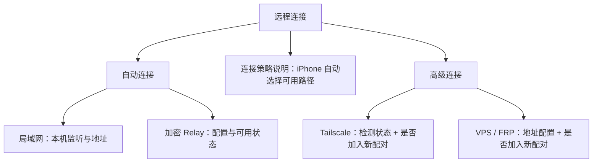

# “远程访问”界面重构设计方案评审

> 评审对象：[remote_access_design_proposal.md](../remote_access_design_proposal.md)  
> 评审日期：2026-06-19  
> 评审视角：资深 iOS / Apple 平台交互设计  
> 结合范围：设计方案、现有 `RemoteAccessView`、当前连接与配对语义

## 一、评审结论

**方案提出的“整理信息层级、按需展示高级配置”方向正确，但当前版本不建议直接进入视觉实现。**

主要问题并不在双栏样式本身，而在于方案把四条连接路径塑造成了四个地位相同、可独立启停的“通道”。这与产品实际模型不一致：

- 局域网与官方 Relay 是自动工作的默认路径；
- Tailscale 与 VPS / FRP 是高级候选地址；
- 当前两个 Toggle 控制的是“配对时是否下发候选地址”，并不是启动或关闭网络服务；
- iPhone 端最终执行的是自动选路，而不是让用户手动选择一种长期固定的连接方式。

如果直接按现方案实现，界面会比旧版更整齐，却仍可能让用户形成错误心智：以为自己正在管理四个并列的网络服务，或者以为关闭开关会立即切断现有连接。

**建议保留双栏框架，但重构信息架构与状态模型后再实施。**

## 二、方案中值得保留的部分

1. **主从式布局适合诊断型页面。** 左侧快速浏览、右侧查看说明与配置，适合 Mac 大屏，也能减少当前长页面中的上下跳读。
2. **配置内容按需展示是正确方向。** 自定义 Relay、Tailscale、VPS / FRP 不应默认占据主要视觉空间。
3. **地址校验、保存状态与健康检查应在同一区域闭环。** 这比输入框、状态和错误信息分散在页面不同位置更容易理解。
4. **复制连接地址具有实际价值。** 对诊断、客服支持和手动配置都有效，但需要避免暴露凭据或完整路由标识。

## 三、阻塞实施的问题

### P0-1：四个“通道”不应以同等权重并列

方案左栏将 LAN、Relay、Tailscale、VPS / FRP 作为四个平级项目，视觉上暗示它们都是用户需要管理的主要连接服务。

实际产品策略是：

1. 同一网络优先局域网；
2. 不同网络自动尝试加密 Relay；
3. Tailscale 和 VPS / FRP 只是高级候选路径。

这会产生两个后果：

- 新用户被迫理解 Tailscale、VPS、FRP 等技术概念；
- 官方 Relay 的“开箱即用默认路径”被弱化成普通列表项。

**修改建议：**

- 左栏首先展示“自动连接”和“高级连接”两组，而不是四个并列服务；
- “自动连接”下展示局域网和加密 Relay；
- “高级连接”默认折叠或降低视觉权重，内部再展示 Tailscale、VPS / FRP；
- 页面主叙事应是“系统会自动选择最佳路径”，而不是“请选择或启用通道”。

### P0-2：Toggle 的语义与真实行为不一致

方案写的是“启用 / 禁用通道”，但当前 `pairingIncludeTailscale` 和 `pairingIncludeRemote` 实际控制的是：**生成配对信息时，是否把相应地址作为候选路径下发给 iPhone。**

“已启用”容易被理解为：

- 已启动 Tailscale；
- 已开启 VPS 服务；
- 当前连接正在使用该路径；
- 关闭后现有 iPhone 会立即断开。

这些理解都不准确。

**修改建议：**

- 不使用无上下文的“启用”；
- Toggle 标题改为“配对时提供此连接方式”；
- 辅助文案明确作用范围，例如：“用于之后生成的配对信息，不会启动 Tailscale，也不会更改已配对设备”；
- 若实际行为会影响现有设备或触发 Bridge 重启，必须在控件附近明确说明；
- 当地址为空或未检测到 Tailscale 时，Toggle 应禁用并解释原因，而不是允许打开后再让输入框闪烁。

### P0-3：状态模型混用了配置、可用性、连通性和选路状态

当前方案中的“已开启、已启用、已连接、已就绪、正常监听、已检测到 IP”不是同一个维度，却都依赖绿灯表达。用户无法判断绿灯具体意味着什么。

每条路径至少存在四个不同状态维度：

| 维度 | 示例 |
|---|---|
| 配置状态 | 未配置、已配置 |
| 本机可用性 | 正在监听、未检测到 Tailscale、Relay 未注册 |
| 网络连通性 | 可达、检查中、检查失败、未知 |
| 配对发布状态 | 会加入新配对、不会加入新配对 |

**修改建议：**

- 左栏只展示一个最关键、可比较的摘要状态；
- 右栏分别展示“配置”“本机状态”“连通性”“配对设置”；
- 不要用颜色承担全部含义，状态灯旁必须有文字；
- 未检测或未检查不应显示成故障红色，应区分“未知”“不可用”“配置错误”；
- “Relay 已配置”不能写成“Relay 已连接”，除非系统确实持续维护并确认在线连接。

建议统一状态词：

- 正常：`可用`
- 正在处理：`正在检查…`
- 缺少前置条件：`需要配置`
- 明确失败：`连接失败`
- 无法取得状态：`状态未知`
- 配对发布：`会加入新配对` / `不会加入新配对`

### P0-4：Relay 的安全说明与当前协议不一致

方案写的是“通过 Noise Protocol 进行端到端加密”，而项目协议文档定义的是 RFC 9180 HPKE 配对与加密 Relay 协议。设计文案不应写入错误的安全机制。

**修改建议：**

- 面向普通用户写：“端到端加密，中继服务无法读取代码和消息内容”；
- 技术细节放入“了解更多”或帮助文档，使用项目协议中的准确术语；
- 不在主界面堆叠 Noise、HPKE、WireGuard 等协议名，除非它们能帮助用户完成当前任务。

### P0-5：方案展示了当前接口并不提供的信息

设计中出现了 Relay 延迟、网络适配器 IP 列表、健康检查反馈等内容；当前 `RemoteStatus` 只提供局域网地址、Tailscale 地址、远程地址、监听状态，以及 Relay 是否配置和 endpoint，并不提供延迟或完整健康检查结果。

**修改建议：**

- 将每项信息标注为“已有数据”或“需要新增能力”；
- 未提供真实检测能力前，不显示模拟延迟、假成功状态或占位诊断；
- “重新检测”应明确会检查哪些内容，并只刷新能够真实获取的状态。

## 四、重要交互问题

### P1-1：左栏选择与行内 Toggle 会产生操作冲突

整行点击用于选择详情，行尾 Toggle 又用于改变设置。用户点击开关附近时，可能同时触发选中和配置变更；键盘与 VoiceOver 导航也会变得啰嗦。

建议左栏仅承担导航和状态摘要。所有会改变配置的控件放到右侧详情区。

### P1-2：“重新检测”作用域不清晰

头部的“重新检测”看起来像刷新全部网络路径，但每条路径的检测成本和能力不同。

建议：

- 全局按钮改为“刷新状态”，并刷新所有可检测项目；
- 如果某项支持主动连通性测试，在对应详情内提供“测试连接”；
- 刷新期间保留旧状态并标记“正在更新”，不要把整个页面重置为空。

### P1-3：保存行为缺少完整事务反馈

Relay 与 VPS 配置可能引发 provisioning、Bridge 重启或短暂断连。仅让按钮变为不可用不足以表达过程。

每次保存应有完整状态：

`有未保存更改 → 正在验证 → 正在应用 → 已保存 / 应用失败`

失败时：

- 保留用户输入；
- 明确指出是格式错误、服务不可达还是应用失败；
- 不把失败输入展示为当前生效配置；
- 不通过自动降级制造“保存成功”的假象。

### P1-4：错误引导不应依赖“闪烁输入框”

闪烁是注意力抢夺，不符合严肃设置界面的气质，也会带来动态效果和无障碍问题。

建议在用户打开缺少配置的选项时：

- 阻止无效状态提交；
- 自动选中对应详情；
- 将焦点移到首个必填字段；
- 在字段下方显示具体错误；
- 对 VoiceOver 发布简短状态变化。

### P1-5：地址展示需要安全边界

方案中的 Relay 地址可能包含路由路径或可识别标识。界面与复制功能应只展示确认可公开的 endpoint；route ID、凭据和 token 不应进入普通设置页面或剪贴板。

## 五、视觉与动效评审

### 双栏布局

- 240pt 左栏可以作为初始值，但不应成为固定宽度；中英文标题、辅助状态和系统文字放大后都可能截断。
- 需要定义最小窗口宽度下的行为。建议窄窗口切换为单栏导航，而不是继续压缩右侧表单。
- 右侧应使用稳定的表单网格，避免不同通道切换时标题、状态和按钮位置大幅跳动。

### 状态颜色

- 绿色只用于“已验证可用”，不用于“已配置”；
- 蓝色不应表示一种不清楚的状态，系统强调色更适合选择态或操作；
- 灰色可表示未知、未配置或不可用，但必须有文字区分；
- 图标、颜色和文字三者共同表达状态，不能只依靠红黄绿。

### 动效

- 详情切换使用短暂淡入即可，不建议同时叠加明显位移；
- “检测中”使用 `ProgressView` 比呼吸灯更符合系统习惯；
- 不建议状态灯持续闪烁；
- 所有非必要动效应尊重“减少动态效果”设置；
- 配置页面优先稳定、可信，不应追求展示型动画。

## 六、建议的信息架构

推荐的页面结构：

1. **顶部摘要**
   - 标题：远程连接
   - 摘要：`iPhone 会优先使用局域网，离开当前网络后自动使用加密 Relay`
   - 操作：刷新状态

2. **自动连接**
   - 局域网：可用 / 状态未知 / 不可用
   - 加密 Relay：可用 / 正在配置 / 需要配置 / 连接失败

3. **选中项详情**
   - 工作方式
   - 当前状态
   - 地址与复制操作
   - 可执行的诊断或配置

4. **高级连接**
   - 默认折叠或独立分组
   - Tailscale 与 VPS / FRP 的开关统一表述为“加入新配对”

## 七、建议文案

| 原文 | 建议 |
|---|---|
| 局域网直连（推荐首选） | 同一网络时自动使用，速度最快 |
| 加密 Relay（已启用） | 加密 Relay：可用 |
| Tailscale（已启用） | Tailscale：会加入新配对 |
| VPS / FRP（已启用） | 自定义地址：会加入新配对 |
| 未开启 | 未加入新配对 / 未检测到客户端 / 尚未配置 |
| 重新检测 | 刷新状态 |
| 中继服务器无法解密您的任何代码与数据 | 连接采用端到端加密，中继服务无法读取传输内容 |

## 八、实施前验收条件

方案完成以下修订后，可进入实现：

1. 明确默认路径与高级路径的层级，不再将四者等权展示；
2. 将 Toggle 从“启用通道”改为准确的配对发布语义；
3. 定义统一状态模型，区分配置、可用性、连通性和配对发布；
4. 修正 Relay 安全文案；
5. 删除当前后端无法提供的虚构诊断信息，或同步列出所需接口改动；
6. 定义保存、验证、应用、失败和重试的完整交互；
7. 明确窄窗口、键盘操作、VoiceOver、减少动态效果等平台适配要求；
8. 确认界面不会展示或复制 route ID、凭据等敏感数据。

## 九、最终意见

**有条件通过。**

双栏只是表现形式，真正需要优先修正的是用户心智与状态语义。建议把页面从“管理四条网络通道”改造成“查看自动连接状态，并在必要时配置高级候选路径”。完成上述 P0 修订后，这套方案会更符合 Apple 平台设置界面的克制感，也更贴合 iPhone 用户真正关心的问题：现在能不能连、系统会怎么连、失败时我该做什么。
