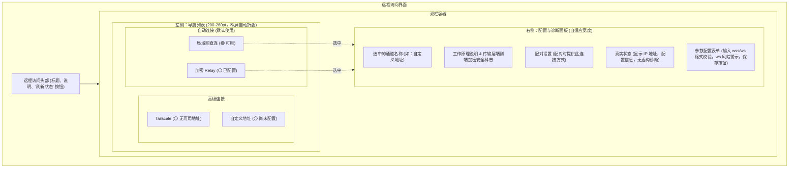

# CCCode Bridge “远程访问” 界面重构设计方案 (第二版)

为了解决“远程访问”界面的信息布局混乱、状态维度混杂以及保存/验证事务定义不全等问题，我们根据第二轮评审反馈（[remote_access_design_proposal_review_r2.md](archive/remote_access_design_proposal_review_r2.md)），对重构方案进行了深度修订。

---

## 1. 核心修订日志 (Revision Log)

根据第二轮评审的阻塞性与重要建议，本版本进行了以下重大修正：
1. **Relay 连通性对齐 (P0-1)**：Relay 状态在 UI 上调整为“已配置/需要配置/状态未知”，不再进行虚假的在线连通性检查（对齐当前 `GET /internal/remote/status` 仅读取本地配置的实际能力）。
2. **细化保存与生效事务 (P0-2)**：将保存流程细分为“格式校验、应用配置、Bridge 重启”多阶段，并区分格式、中继开通、重启等不同失败类型。
3. **公网未加密风险警告 (P0-3)**：引入公网 `ws://` 风险检测规则，当检测到非局域网/非 Tailscale 的明文 `ws://` 连接时，展示高亮警告横幅。
4. **Tailscale 状态去推断化 (P1-1)**：文案收敛为“已检测到 Tailscale 地址 / 未检测到可用的 Tailscale 地址”，不对客户端是否运行做过度推断。
5. **统一左栏状态维度 (P1-2)**：左侧列表统一展示各路径的**可用性与配置状态**，将“配对发布状态”降为右栏设置与左栏次要 subtitle。
6. **修正局域网安全表述 (P1-3)**：更正局域网直连地址安全属性，去除不必要的“公网安全”字眼，提示其仅限可信局域网。
7. **失效过滤与状态继承 (P1-4)**：当 Toggle 开启但地址为空时，Toggle 保持开启但置灰禁用，并标明“无可发布地址”，防止静默篡改用户设置。
8. **折叠导航与状态保持 (P1-5)**：定义了窄屏模式下的返回导航，承诺窗口拉伸折叠切换时表单输入、错误与焦点不丢失。

---

## 2. 界面布局示意图 (Mermaid Layout)



---

## 3. 详细设计说明

### 3.1 左侧：导航列表（Master List）
左栏宽度初始为 `240pt`，支持 `200pt - 260pt` 拖拽拉伸。行内不包含任何 Toggle 或输入框，整行用于选择详情。
* **分组与状态词统一**：
  - **局域网直连**：🟢 `可用` / 🔴 `不可用` / ⚪️ `状态未知`
  - **加密 Relay**：⚪️ `已配置` / ⚪️ `需要配置` / ⚪️ `状态未知`
  - **Tailscale**：🟢 `地址已检测` / ⚪️ `无可用地址`
  - **自定义地址**：🟢 `已配置` / ⚪️ `尚未配置`
* **状态灯颜色逻辑**：
  - **绿色 (🟢)**：仅用于已验证可用（LAN IP 存在、或 Tailscale 地址已检测到，或自定义地址/Relay 已配置且通过格式校验）。
  - **灰色 (⚪️)**：表示需要配置、无可用地址、或者状态未知。
  - **红色 (🔴)**：表示明确的配置或启动失败，不用于“未检测”或“未配置”的灰色状态。
* **次级 Badge**：若“配对发布”Toggle 开启，在对应项的下方显示弱化的辅助文字（例如：“新配对中包含”），不影响主状态灯颜色。

### 3.2 右侧：配置与诊断面板（Detail View）

根据左侧选中的通道，右侧渲染对应的配置、工作原理说明与配置表单。

#### 通道 1：局域网直连 (LAN)
* **介绍说明**：当 iPhone 与 Mac 处于同一 Wi-Fi 或局域网下时，使用此方式进行高速直连。数据不离开局域网。
* **安全性警示**：
  - 本地监听地址使用 `ws://` 协议，未启用传输层加密。此设计基于在可信本地局域网内运行的安全策略，**仅应在可信局域网内使用**。
* **诊断信息**：
  - 本地监听状态：🟢 正常监听中
  - 连接地址：`ws://[局域网IP]:[端口]/bridge`（提供一键复制按钮，仅展示已确认安全的完整连接地址，屏蔽其他无关网卡列表）。

#### 通道 2：加密 Relay (Relay Server)
* **介绍说明**：跨公网远程连接时的安全通道。数据包经由端到端加密传输，中继服务无法读取您的代码和消息内容。
* **连通状态**：
  - 配置状态：🟢 `已配置` / ⚪️ `需要配置`
  - 接口展示数据：展示当前配置的 `endpoint`，屏蔽内部敏感的 `routeId` 及 `relayCredential`，不进行假延迟检测。
* **配置表单与保存事务**：
  - 模式切换：Segmented Control 选择 `官方默认` 或 `自定义中继`。
  - **保存事务流程**：
    ```
    [未修改] ──(输入变更)──> [未保存] ──(点击保存)──> [正在校验格式] ──> [正在申请中继(Provisioning)] ──> [正在应用配置] ──> [Bridge 正在重启] ──> [已应用]
    ```
  - **保存失败分支**：若在中继申请或重启阶段失败，保持当前输入与编辑态，在输入框下方以红色文字高亮具体失败原因（例如：`格式错误`、`中继注册失败`、`Bridge 重启超时`），不通过静默自动降级制造保存成功的假象。

#### 通道 3：Tailscale VPN
* **配对发布设置**：
  - Toggle 标题：`配对时提供此连接方式`。
  - 辅助说明：仅用于未来生成的新配对凭证，不会在后台启动或关闭您的 Tailscale 客户端，也不影响当前已连接的设备。
  - **前置失效逻辑**：若 `tailscaleURL` 为空（即“未检测到可用的 Tailscale 地址”），此 Toggle **保持用户之前的开关设置（不擅自关闭）但变灰禁用**，旁侧红色警告提示：“⚠️ 当前无可用的 Tailscale 虚拟网 IP，新生成的配对二维码中将无法包含此连接方式。”
* **诊断信息**：
  - Tailscale 地址：🟢 `100.x.x.x` (检测到可用地址) / ⚪️ `未检测到可用的 Tailscale 地址`。

#### 通道 4：自定义地址 (原 VPS / FRP)
* **配置表单与 ws:// 未加密警告**：
  - 输入框接收用户输入的公网接入地址，保存时将通过 `BridgeRemoteURLFormatter` 自动将输入的 `https://` 规整为 `wss://`。
  - **安全警告横幅**：若输入框中填写的是公网 IP/域名的明文 `ws://` 地址（即 `remoteAnalysis.isPublicWS` 为真），在输入框下方展示持久、醒目的橙黄色安全警告：`“⚠️ 警告：检测到您使用的是未加密的公网连接方式 (ws://)。您的代码及消息在公共网络传输时存在被监听和泄露的风险，强烈建议使用加密的 wss:// 协议。”`
* **配对发布设置**：
  - Toggle 标题：`配对时提供此连接方式`。若自定义地址尚未配置或配置格式非法，此 Toggle 置灰禁用。
* **保存事务流程**：
  - 点击保存经历：`[未保存] -> [正在校验格式] -> [正在保存] -> [Bridge 正在重启] -> [已应用]`。不执行连通性网络测试，保存成功后提示“配置已应用”。

---

## 4. 平台适配与无障碍交互设计

### 4.1 窗口响应式与导航行为
* **单双栏尺寸切换 (阈值 680pt)**：
  - 当窗口宽度缩窄至 `680pt` 以下时，视图转为**单栏导航栈 (NavigationStack)**，默认保留用户当前选中的详情页。左上角展示 `< 返回` 按钮，点击返回通道列表。
  - 当窗口宽度重新拓宽到 `680pt` 以上时，无缝切回**双栏分栏布局**。
  - **状态保持要求**：**在任何大小窗口切换、分栏折叠/展开过程中，表单中未保存的文本输入、当前焦点（Focus）、校验错误警告提示均必须 100% 完整保留，不得丢失。**

### 4.2 无障碍支持 (Accessibility)
* **语音朗读 (VoiceOver)**：
  - 左侧列表中所有状态指示灯都必须附加文本 Label，不可使用孤立颜色。例如，朗读时为“局域网直连，状态可用”或“加密 Relay，已配置”。
  - 右侧 Toggle 置灰或保存失败时，向系统发送 Accessibility Announcement 广播通知，以简短的语音读出“保存失败：配置格式错误”。
* **减少动态效果 (Reduce Motion)**：
  - 遵循 macOS 系统“辅助功能 -> 减少动态效果”设置。开启后，右侧详情页切换的渐变位移、小箭头的旋转动效全部关闭，直接进行状态硬切换。

### 4.3 刷新状态反馈 (P1-2)
* 顶部的“重新检测”统一改写为 **“刷新状态”**。
* 当点击“刷新状态”时，保留当前界面的已有状态值，在对应的状态项旁显示微型的本地 `ProgressView`（而非重置或清空页面）。
* 若刷新成功，无缝更新数据；若刷新失败，继续保留上次有效状态，并在下方以小字提示：“上次更新时间：18:42 · 刷新未成功”。

---

## 5. 本地化翻译对照表 (Localization Reference)

| 键名 | 英文 (en) | 中文 (zh) |
| :--- | :--- | :--- |
| `remote_publish_in_pairing` | Include in new pairing | 配对时提供此连接方式 |
| `remote_lan_hint` | Local network address, copy for diagnostics or manual connection. Use only in trusted LAN. | 局域网连接地址，可复制用于诊断或手动连接。仅应在可信局域网内使用。 |
| `remote_unencrypted_warning` | Warning: Unencrypted connection detected. Data sent over public networks without encryption is unsafe. | 警告：检测到您使用的是未加密的公网连接方式 (ws://)。数据在公共网络传输时存在安全风险，强烈建议使用加密协议。 |
| `remote_no_tailscale_ip` | No available Tailscale address detected | 未检测到可用的 Tailscale 地址 |
| `remote_tailscale_ip_detected` | Tailscale address detected | 已检测到 Tailscale 地址 |
| `remote_refresh_failed` | Last updated: %@ · Refresh failed | 上次更新时间：%@ · 刷新未成功 |
