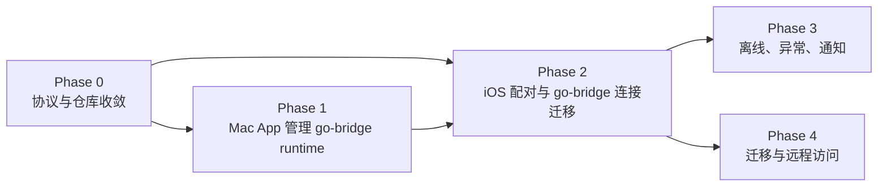
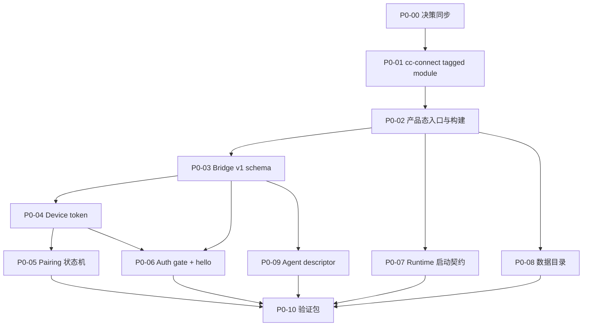

# CCCode Mac Bridge Phase 0-4 工程路线图与 Phase 0 执行拆分

> 版本：v0
> 日期：2026-05-07
> 上游文档：
> - 《CCCode 产品化与 Mac 端 Bridge 产品设计》
> - 《CCCode Mac Bridge 产品化技术方案》
> - 《CCCode 产品定义 v1.0 决策确认记录》
> - 《CCCode 低保真体验原型 v0.1》
> - 《CCCode 视觉设计 Brief v0》

## 1. 文档目的

这份文档做两件事：

1. 给 Phase 0-4 建立完整工程路线图，明确每个阶段的目标、输入、输出、依赖和验收门槛。
2. 把 Phase 0 拆到可以开始执行的任务粒度。

它刻意不把 Phase 1/2/3/4 现在就拆成 implementation ticket。原因是 Phase 0 会冻结 go-bridge 发布态、Bridge v1 schema、device token、pairing/auth、runtime 启动契约等基础接口。P1/P2 的细票必须依赖这些契约，否则会把未来返工提前写进计划里。

## 2. 不变决策

以下决策在 Phase 0 开始前冻结，后续任务不得绕开：

1. **go-bridge 是唯一 backend/runtime 基础**。
2. 旧 Node.js UnifiedBridge 服务已废弃，不进入产品化方案。
3. iOS 里的 `UnifiedBridge*` 是历史命名债，不代表当前功能废弃；如果它当前仍在连接 go-bridge，迁移方式是重命名、认证改造和模型迁移，不是直接删除功能。
4. CCCode Bridge for macOS 必须内置 go-bridge 访问层和定制 `cc-connect` 组件。
5. 用户不需要单独下载、编译、配置 `cc-connect`、go-bridge CLI、launchctl 服务或其他 Bridge 依赖。
6. `cc-connect` Phase 0 收敛优先采用 tagged Go module，不直接复制到 go-bridge `internal/`。
7. Mac App 管理 API 与 iOS Bridge v1 API 分离：管理 API 只监听 `127.0.0.1`，iOS API 使用 device auth。
8. 开发阶段默认不主动运行 UI tests、snapshot tests、simulator automation 或高消耗视觉验证流程。

## 3. Phase 总览

Phase 0 是所有后续阶段的接口地基。Phase 1 和 Phase 2 可以在 P0 核心契约冻结后并行推进，但 P2 的真机闭环需要 P1 至少提供可启动的 Mac runtime。Phase 3 依赖 P2 的 Saved Mac、event stream 和 offline snapshot key。Phase 4 的远程访问依赖 P2 的 auth 模型，旧配置检测可以提前在 P1 并行准备。

## 4. Phase 0-4 路线图

### 4.1 Phase 0：协议与仓库收敛

目标：

- 把 go-bridge 从开发态 CLI 服务收敛为可发布 runtime 基础。
- 移除发布态本地 `replace`。
- 冻结 Bridge v1 的最小协议、auth、pairing、启动契约。
- 为 P1/P2 提供稳定接口。

关键输出：

- `cc-connect` tagged module 方案落地。
- go-bridge 产品态构建入口确定。
- Bridge v1 Go/Swift schema 草案和对照表。
- Device token 格式和 trusted device store 契约。
- Pairing session 状态机和错误码。
- WebSocket auth gate 和 `hello` handshake 契约。
- runtime 启动参数、ready/error frame、shutdown 契约。

验收门槛：

- `go.mod` 中没有发布态本地路径 `replace`。
- `cc-connect` 依赖来自明确 tagged version。
- `GOOS=darwin GOARCH=arm64 go build` 对产品态 runtime 入口成功。
- `go test ./... -count=1` 通过。
- 未认证 WebSocket 连接被拒绝。
- Go/Swift schema 字段命名一致。
- P1/P2 所需契约不再悬空。

### 4.2 Phase 1：Mac App 管理 go-bridge runtime

目标：

- 用户安装并打开 `CCCode Bridge.app` 后，Mac App 可以启动、停止、监控内置 go-bridge runtime。
- Mac UI 能表达 Bridge ready、no agents、crashed、stopped by user、sleeping/unreachable 等状态。

输入依赖：

- P0 runtime 启动参数和 ready/error frame。
- P0 management API auth 方式。
- P0 数据目录和日志契约。
- P0 signing spike 结果。

关键输出：

- Apple Silicon Mac App shell。
- 内嵌 go-bridge runtime。
- runtime manager。
- local management API client。
- Bridge 状态页、agent/provider 检测页、pairing entry。
- 菜单栏入口。
- codesign binary -> codesign bundle -> notarize 路径验证。

验收门槛：

- 干净 Mac 只安装 App 即可启动 go-bridge runtime。
- 用户不需要运行 go-bridge CLI。
- runtime 崩溃、端口占用、用户停止可区分。
- Mac App 可显示 no agents 但不误判为安装失败。

### 4.3 Phase 2：iOS 配对与 go-bridge 连接迁移

目标：

- iOS 从旧手动服务器/历史 `UnifiedBridge*` 命名迁移到 Saved Mac + CCCode Bridge v1。
- 扫码或手动码配对后，iOS 保存 device token 并自动连接 go-bridge。

输入依赖：

- P0 Bridge v1 schema。
- P0 token/auth/pairing 契约。
- P0 WebSocket keepalive/reconnect 契约。
- P1 可用的 runtime 管理和 pairing entry。

关键输出：

- `Services/Bridge` 新模块。
- `CCCodeBridgeClient` / `CCCodeBridgeTransport`。
- `BridgePairingService`。
- `SavedBridgeStore`。
- `BridgeCredentialStore`。
- `CCCodeBridgeBackendClient` 接入现有 `BackendClient` 抽象。
- iOS 旧 `UnifiedBridge*` 命名迁移清单落地。

验收门槛：

- iOS 扫 Mac 二维码后，Mac 确认，iOS 保存授权。
- 重启 iOS 后能自动连接已配对 Mac。
- token 撤销后 iOS 进入重新配对，不显示普通网络错误。
- `message.started` / `message.delta` / `message.completed` 能驱动消息容器。

### 4.4 Phase 3：离线、异常、通知

目标：

- 让“旁观长任务”和“中途断连”体验可信。
- Mac 睡眠、go-bridge 重启、agent crash、网络切换时，iOS 能展示正确状态。

输入依赖：

- P2 Saved Mac。
- P2 Bridge event stream。
- P2 session/workspace cache key。
- P2 reconnect 状态。

关键输出：

- offline snapshot store。
- running session notification policy。
- notification deep link。
- Mac sleep/wake reconnect 文案与状态。
- session mid-run go-bridge restart / agent crash 映射。
- Claude Code `requiresPollingForExternalTurns` 能力驱动刷新。

验收门槛：

- 离线时可只读查看最近 Workspace/Session/Message。
- 断连发生在运行中任务期间，iOS 显示 reconnecting 或 Mac may be asleep，不误判配对失败。
- 权限请求和任务完成能触发本地通知。
- 离线草稿遇到已结束 session 时保留并提示处理。

### 4.5 Phase 4：迁移与远程访问

目标：

- 老用户从开发态 go-bridge/cc-connect/手动 server config 平滑迁移到 Mac App。
- 支持用户自带远程访问 URL。

输入依赖：

- P1 Mac App runtime 管理。
- P2 Saved Mac + device auth。
- P2 local/remote URL 模型。

关键输出：

- 旧 go-bridge 进程检测。
- 旧 iOS server config 迁移提示。
- remoteURL 配置。
- FRP/Tailscale/Cloudflare Tunnel 等用户自带方案配置入口。
- local/remote 当前连接来源展示。

验收门槛：

- 老用户不需要维护 go-bridge + cc-connect 双服务心智。
- 远程访问仍走同一 device token auth。
- remoteURL 变化不导致设备授权失效。
- 首次远程连接有明确安全提示。

## 5. Phase 0 执行拆分

### P0-00 开发者决策同步

目的：

- 把“go-bridge 是唯一 backend”从文档结论同步为开发共识。

范围：

- 同步 §2 定位表。
- 明确 Node.js UnifiedBridge 已废弃。
- 明确 iOS `UnifiedBridge*` 是命名债，不是功能废弃。
- 明确 Claude/OpenCode/Codex 是 agent/provider target，不是和 go-bridge 并列的 backend。

交付物：

- 一段可复制到 issue/PR/开发群的决策摘要。
- Phase 0 任务中统一使用 go-bridge/agent/provider 术语。

验收：

- 后续 Phase 0 文档和任务不再把 UnifiedBridge 写成当前 backend。
- 后续 Phase 0 文档和任务不再要求用户单独安装 `cc-connect`。

### P0-01 cc-connect tagged module 收敛

目的：

- 消除 go-bridge 发布构建对 `/Users/.../cc-connect` 本地路径的依赖。

范围：

- 梳理 go-bridge 当前依赖的 `cc-connect` agent/core API。
- 在定制 `cc-connect` 仓库打 tagged version。
- go-bridge `go.mod` 引用 tagged version。
- 删除发布态本地 `replace`。

交付物：

- `cc-connect` tag，例如 `v0.1.0-cccode.1`。
- go-bridge `go.mod` 更新。
- 干净 checkout 构建记录。

验收：

- `go list -m all` 能解析 tagged `cc-connect`。
- `go env GOMOD` 所在工程不依赖 `/Users/jacklee/Projects/cc-connect`。
- `go test ./... -count=1` 通过。

风险：

- 私有仓库权限或 module path 不稳定会阻塞 CI/发布构建。
- 如果 tagged module 无法满足发布要求，再评估 vendoring，但不直接复制成长期方案。

### P0-02 go-bridge 产品态入口与构建

目的：

- 确定 Mac App 内嵌 runtime 的构建入口和可执行文件命名。

范围：

- 决定保留 `go-bridge/` 目录还是引入 `cmd/cccode-bridge-runtime/`。
- 确定 binary 名称：建议 `cccode-bridge-runtime`。
- 确定默认 flags 与产品态 flags。
- 确认 Apple Silicon 构建命令。

交付物：

- 产品态 runtime 构建入口。
- 构建命令记录。
- 构建产物路径约定。

验收：

- `GOOS=darwin GOARCH=arm64 go build` 成功。
- binary 可打印版本信息。
- binary 不依赖当前工作目录保存产品状态。

### P0-03 Bridge v1 schema 对照

目的：

- 冻结 Go 和 Swift 都能实现的最小 schema，避免 P1/P2 各自发明字段。

范围：

- `hello` / `hello_ack`。
- `pairing.claim` / `pairing_result`。
- `bridge.status`。
- `backend.list` 或 `agent.list` 命名决策。
- `workspace.list`。
- `session.list` / `session.messages` / `session.send`。
- event envelope。
- error envelope。

交付物：

- Go struct 草案。
- Swift Codable struct 草案。
- 字段命名对照表。
- schema revision。

验收：

- Go/Swift 对同一 JSON fixture encode/decode 一致。
- 协议名为 `cccode-bridge`，不再是 `unified-bridge`。
- 错误码和事件类型覆盖技术方案 §9.7/§9.8。

### P0-04 Device token 与 trusted device store

目的：

- 实现配对后长期认证的基础格式和存储契约。

范围：

- `ccb1_` token 生成。
- 32 bytes secure random。
- base64url 无 padding。
- Mac 端 token hash。
- trusted device record。
- revoke 标记。
- WebSocket header 校验。

交付物：

- Go token 生成与 hash 工具。
- trusted device store 接口。
- 认证错误码。
- 单元测试。

验收：

- Mac 端不保存明文 token。
- 同一 token 可认证。
- 撤销后认证失败并返回 `auth.revoked`。
- 缺 token 返回 `auth.missing_token`。
- 错 token 返回 `auth.invalid_token`。

### P0-05 Pairing session 状态机

目的：

- 建立扫码/手动码配对的服务端状态机。

范围：

- Created。
- Claimed。
- Approved。
- Completed。
- Rejected。
- Expired。
- QR/manual code 共享 session。
- 重复 claim 拒绝。
- runtime 重启清理未完成 pairing。

交付物：

- pairing session store。
- pairing state transition。
- pairing 错误码。
- pairing JSON fixtures。
- 单元测试。

验收：

- 过期 session 不可 claim。
- 第二台设备重复 claim 返回 `pairing.already_claimed`。
- reject 后 iOS 收到 rejected。
- approve 后 token 只返回一次或在 pickup timeout 内短期可取。

### P0-06 WebSocket auth gate 与 hello handshake

目的：

- 让 go-bridge 从未认证开发服务变成默认拒绝未授权访问的产品 runtime。

范围：

- `/bridge` WebSocket endpoint。
- Authorization header。
- `X-CCCode-Device-ID` header。
- `hello` 首包。
- protocol version mismatch。
- `hello_ack` 中返回 bridge profile、capabilities、currentURLs、runningSessions。

交付物：

- auth middleware。
- hello handler。
- protocol mismatch 错误。
- 未认证连接测试。

验收：

- 非 pairing endpoint 未认证时拒绝。
- token 正确时 `hello_ack.ok == true`。
- 不支持协议版本时返回 `protocol.unsupported_version`。
- `hello_ack` 包含 P1/P2 需要的 bridge identity 和 status 摘要。

### P0-07 Runtime 启动契约 spike

目的：

- 验证 Mac App 后续可以稳定启动和管理 go-bridge runtime。

范围：

- 启动参数。
- stdout ready frame。
- stdout error frame。
- `/internal/status`。
- `/internal/shutdown`。
- management token。
- graceful shutdown。

交付物：

- runtime 启动契约 fixture。
- ready/error frame parser 测试。
- shutdown 行为测试。
- 端口占用错误路径验证。

验收：

- runtime 成功启动时输出 `runtime_ready`。
- 端口占用时输出 `runtime_error.port_bind_failed`。
- `/internal/status` 需要 management token。
- `/internal/shutdown` 后 runtime 在约定时间内退出。

### P0-08 数据目录与配置契约

目的：

- 固定 runtime 状态位置，避免产品状态进入 cwd 或临时目录。

范围：

- `identity.json`。
- `devices.json`。
- `config.json`。
- `pairing/`。
- `logs/`。
- `runtime/`。
- schema version。

交付物：

- data dir 初始化逻辑。
- identity 创建/读取。
- config 读取/写入接口。
- 损坏配置错误。

验收：

- 空目录首次启动会创建必要文件。
- 已存在 identity 不会被覆盖。
- config 损坏返回 `config_invalid` 或等价 runtime error。
- runtime 不把产品状态写入 cwd。

### P0-09 Agent/provider descriptor

目的：

- 让 iOS 和 Mac App 用 capability 驱动体验，而不是硬编码 provider 差异。

范围：

- Claude Code descriptor。
- OpenCode descriptor。
- Codex descriptor。
- Copilot 是否进入 v1 默认列表的记录。
- `liveEvents`。
- `requiresPollingForExternalTurns`。
- `status` 与 `reason`。

交付物：

- descriptor schema。
- 当前 agent/provider descriptor 输出。
- 检测失败 reason 枚举。

验收：

- Claude Code 声明 `requiresPollingForExternalTurns: true`。
- Codex/OpenCode 声明可广播实时事件。
- 全部未检测时 Bridge 状态仍可为 ready/no agents。

### P0-10 Phase 0 验证包

目的：

- 给 P0 收尾提供可复核证据。

范围：

- Go build。
- Go unit tests。
- JSON fixture encode/decode。
- 未认证连接拒绝。
- token revoke。
- pairing 状态机。
- runtime ready/error frame。

交付物：

- Phase 0 完成报告。
- 命令输出摘要。
- 未完成风险列表。
- P1/P2 详细拆分输入清单。

验收：

- 完成报告能直接支撑 P1/P2 开始详细拆票。
- 没有遗留“接口还没定但先开发”的任务。

## 6. Phase 0 执行顺序

推荐顺序：

并行建议：

- `P0-03 Bridge v1 schema` 可以和 `P0-07 Runtime 启动契约` 并行，只要二者共享 protocol/version 命名。
- `P0-08 数据目录` 可以和 `P0-04 Device token` 并行，但 trusted device store 最终要落到同一 data dir。
- `P0-09 Agent/provider descriptor` 可以在 token/pairing 之前做，但最终要走 authenticated `hello_ack` 或 `agent.list` 返回。

## 7. Phase 0 完成定义

Phase 0 完成时，项目应达到以下状态：

- go-bridge 是唯一 backend 的定位已经写入任务和代码命名策略。
- go-bridge 发布态构建不依赖开发者本机 `cc-connect` 路径。
- Bridge v1 schema 有 Go/Swift 对照和 JSON fixtures。
- device token、pairing、trusted device、auth gate 可被单元测试验证。
- runtime 启动、ready/error、shutdown 契约可被 P1 Mac App 直接消费。
- P2 iOS 可以基于 schema 开始迁移连接层，而不需要猜字段。
- P1/P2 的详细工程拆分可以开始。

Phase 0 不要求：

- 完整 Mac App UI。
- iOS 完整扫码 UI。
- 远程访问配置 UI。
- 离线通知闭环。
- UI tests、snapshot tests、simulator automation。

## 8. Phase 0 风险

| 风险 | 影响 | 处理 |
|---|---|---|
| `cc-connect` tagged module 访问不稳定 | 发布构建不可复现 | 先解决 module path 和 tag 权限，再做 runtime 改造 |
| 旧 iOS `UnifiedBridge*` 命名迁移范围过大 | P2 返工 | P0 只冻结 schema 和命名策略，P2 再拆实际迁移 |
| token/auth 过早耦合 UI | P1/P2 阻塞 | P0 只做协议和服务端最小实现，UI 留给后续 |
| runtime 启动契约只在 shell 验证 | P1 Mac App 集成风险 | P0 输出 ready/error/shutdown fixtures，P1 spike 必须验证 Swift Process |
| agent/provider descriptor 不完整 | iOS 体验硬编码 | P0 至少覆盖 Claude/OpenCode/Codex 三个主路径 |

## 9. 下一步

下一步进入 Phase 0 执行。第一批任务应按这个顺序启动：

1. `P0-00 开发者决策同步`
2. `P0-01 cc-connect tagged module 收敛`
3. `P0-02 go-bridge 产品态入口与构建`
4. `P0-03 Bridge v1 schema 对照`

这四项完成后，Phase 0 的实现工作会从“整理地基”进入“auth/pairing/runtime 契约落地”。
