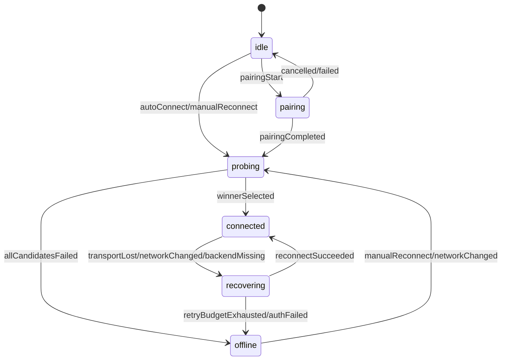

# CCCode 长连接稳定性优化报告

> 日期：2026-05-16  
> 范围：CCCode iOS / MacBridge / go-bridge 长连接、配对、重连、弱网恢复  
> 对照源码：`/Users/jacklee/Projects/cc-connect`、`/Users/jacklee/Projects/tdesktop`

## 结论

用户用 ChatGPT iOS 连接 macOS Codex app 的对照实验很有价值：在同一个 iPhone、同一个 5G、同一个新加坡梯子节点、同一个 Mac 网络条件下，ChatGPT/Codex 稳定，而 CCCode/MacBridge 不稳定，说明不能再把主要原因归结为“新加坡 VPS 跨境链路差”。

跨境链路仍会增加 RTT、抖动和丢包，但它更像放大器，不是根因。当前 CCCode 的主要问题更可能是连接生命周期没有收敛：自动连接、配对、竞速探测、transport 内部重连、missing backend recovery、前后台恢复、UI 状态恢复都能不同程度触发连接动作，缺少一个单一的连接 owner 来串行化和去重。

一句话建议：

> 把 Bridge 连接改成一个明确的连接状态机，由单一 owner 管理所有连接、探测、重连和 UI 状态输出；所有临时 probe 必须不可重连、可取消、可观测；心跳和超时策略改成弱网友好。

## 接手开发说明（2026-05-16 更新）

这份报告可以作为下一个 agent 的开发入口；实际开发以本节 Task 队列为准，后面的诊断和架构章节用于理解背景和取舍。

### 当前已落地基线

以下内容已经实现并通过验证，后续 agent 不应重复开发，只需在此基础上继续：

- `CCCodeBridgeTransport` active bridge 心跳已从 10s/5s 调整为 30s/20s。
- `CCCodeBridgeTransport` 已新增 `lastInboundAt`，最近一个 ping 周期内收到任意入站消息时跳过本轮 ping。
- `BridgeProvider.scheduleMissingBackendRecoveryIfNeeded` 已在 transport 健康时跳过完整 `connectBridge()`，避免 backend 缺失触发健康 WebSocket 重建。
- `go-bridge/server.go` 已补齐 90s read deadline，并在 pong handler 中刷新 read deadline。
- 竞速 probe transport 已使用 `.none` reconnect policy，胜出的 active transport 再升级为 `.unlimited`。

对应记录：

- `docs/2026-05-16-长连接稳定性优化落实记录.md`
- `docs/2026-05-16-长连接稳定性优化落实记录-评审.md`

已通过验证：

- `cd go-bridge && go test ./... -count=1`
- `xcodebuild -project OpenCodeiOS/CCCode.xcodeproj -scheme CCCode -destination 'generic/platform=iOS' build`
- `xcodebuild -project OpenCodeiOS/CCCode.xcodeproj -scheme CCCode -destination 'platform=iOS Simulator,name=iPhone 17 Pro Max' test -only-testing:CCCodeTests`

项目约束：未经用户明确允许，不主动运行 UI tests、snapshot tests、simulator automation 或真机自动化；优先使用代码阅读、静态检查、定向 build、定向 unit test。

### 下一个 agent 可直接执行的任务队列

建议按顺序执行，不要直接跳到大重构。

#### Task 1：连接实例级 telemetry

目标：先让连接风暴、旧任务残留、状态抖动可观测。

改动范围：

- `OpenCodeiOS/OpenCodeiOS/Services/Bridge/CCCodeBridgeTransport.swift`
- `OpenCodeiOS/OpenCodeiOS/Services/Bridge/BridgeProvider.swift`
- 必要时补 `OpenCodeiOS/OpenCodeiOS/Services/Network/NetworkStateManager.swift`

要求：

- 为每个 transport 实例生成短 `connectionID`。
- `connectionID` 用短 UUID 即可，例如 `UUID().uuidString.prefix(8)`，不要引入集中式 ID 服务或复杂追踪系统。
- 日志统一带上 `connectionID`、`owner`、`candidate`、`urlHost`、`reason`、`task`。
- `BridgeProvider` 维护并输出当前 active/probe/reconnect task 计数。
- 不改变连接行为，不新增 fallback，不用假状态掩盖失败。

验收：

- 同一次扫码/自动连接日志能看出创建了几个 WebSocket、谁是 probe、谁成为 active、旧实例何时关闭。
- 现有 Go 测试、iOS build、iOS 单元测试通过。

#### Task 2：轻量 UI 状态 debounce

目标：减少“重新连接中”横幅对底层瞬态的直接放大，但不隐藏认证失败和真实离线。debounce 应放在 `NetworkStateManager` 对 UI 发布状态的出口层，不改变 `BridgeProvider` 内部连接状态判断。

改动范围：

- `OpenCodeiOS/OpenCodeiOS/Services/Network/NetworkStateManager.swift`
- 可能涉及 `BridgeProvider.applyTransportState(...)`

要求：

- `.connected -> .reconnecting` 延迟 1.5s 左右再对 UI 可见。
- 延迟窗口内恢复 `.online` 时只记录日志，不显示横幅。
- 认证失败、设备撤销、所有候选失败仍应立即进入明确 offline/error 状态。
- 不引入 mock 状态或“假 online”。

验收：

- 单元测试覆盖 debounce：短抖动不展示，超过窗口展示，auth/offline 立即展示。
- 不运行 UI/snapshot tests，除非用户另行批准。

#### Task 3：`bridgeBackendReady` 健康路径去重

目标：降低健康 transport 下 backend recovery 的重复全量加载。

改动范围：

- `OpenCodeiOS/OpenCodeiOS/Services/Bridge/BridgeProvider.swift`
- 必要时补 `ChatViewModel` 侧轻量 guard，但优先在 provider 层解决。

要求：

- 不再盲目连续广播 3 次 `bridgeBackendReady`。
- 优先方案：广播前通过 bridge RPC 确认 backend 已恢复；该方案需要同步修改 iOS 与 `go-bridge` 协议/handler，属于跨端改动。
- 低成本方案：如果本轮只想改 iOS，则做短窗口 coalesce，并在日志中标注这是通知合并，不代表 backend 已确认恢复。
- 不伪造 backend ready；真实缺失仍应暴露为缺失。

验收：

- backend 持续缺失时不会触发多次全量加载。
- backend 短暂恢复时仍能通知 UI 重建 client。

#### Task 4：前台恢复与自动连接 intent 收敛

目标：减少 app 启动、前后台、配对后的连接入口互相抢。

改动范围：

- `OpenCodeiOS/OpenCodeiOS/App/OpenCodeiOSApp.swift`
- `OpenCodeiOS/OpenCodeiOS/Services/Bridge/BridgeProvider.swift`

要求：

- 配对流程进行中时，autoConnect / missingBackendRecovery / foreground reconnect 不应发起新连接。
- 前台恢复路径应只在无 active bridge 或 transport 明确不健康时发起恢复。
- 所有跳过都要有日志，便于复盘。

验收：

- 扫码批准期间不会出现 autoConnect 同时重连旧 bridge 的日志。
- 配对成功后只发起一次正式 connect。

#### Task 5：BridgeConnectionCoordinator 设计与迁移

目标：在 telemetry 证明仍存在多 owner 竞争后，再进入结构性重构。

要求：

- 先写最小设计文档或 patch plan，明确现有入口如何映射到 intent。
- 第一阶段只接管连接创建/销毁，不同时改 pairing protocol、候选 URL 策略和 UI 文案。
- transport 内部 `.unlimited` 重连只有在 coordinator 能完整接管 `.bridgeTransportDidReconnect` 语义后再移除。
- “完整接管 `.bridgeTransportDidReconnect` 语义”至少包括三件事：根据新的 `hello_ack` 重建 `cachedClients`；发送 `.bridgeDidConnect` 通知；正确处理 `bridgeBackendsChanged`，让新增/移除 backend 的 UI 与 client cache 保持一致。

验收：

- 同一时刻最多一个 active transport。
- 同一时刻最多一轮 probe。
- 所有旧 generation 回调被丢弃并有日志。

### 暂不建议下个 agent 立即做的事

- 不要直接删除 `CCCodeBridgeTransport.reconnectLoop()`：当前 `BridgeProvider.handleTransportReconnect` 仍依赖 `.bridgeTransportDidReconnect` 重建 `cachedClients`。
- 不要直接删除 `autoConnectOnLaunch` 中 `47.236.182.45` 清理：这是历史数据迁移技术债，应等 SavedBridge schema migration 后移除。
- 不要把 UI debounce 做成“永远 online”：弱网状态可以延迟展示，但 auth revoked、设备凭据丢失、所有候选失败必须直接暴露。
- 不要再调整 ping 到更激进的值；当前基线是 30s/20s，后续应基于 telemetry 调整连续失败阈值，而不是缩短 timeout。

## 重要前提

ChatGPT iOS ↔ macOS Codex app 的网络拓扑不一定等价于 CCCode iOS ↔ MacBridge：

- ChatGPT/Codex 可能是双方各自连云端服务，通过云端做会话同步或控制面中继。
- CCCode 现在更接近 iPhone 通过 VPS/FRP/Nginx 直连 MacBridge 的 WebSocket 数据面。
- 即使都走新加坡节点，云端服务的连接复用、QUIC/CDN/edge、断线恢复和 backoff 策略可能远成熟于我们手写的 WebSocket/TLS/framing 层。

所以这个对照实验不能证明“网络没有任何问题”，但足以证明“CCCode 实现层存在明显优化空间”。

## 当前 CCCode 连接链路观察

### 1. 连接入口过多

本项目中至少有这些入口会影响 bridge 连接：

- `OpenCodeiOS/OpenCodeiOS/App/OpenCodeiOSApp.swift`
  - `beginPairing(url:)`：扫码配对前先 `disconnectBridge()`，再 `pairingClient.claim(from:)`
  - app 启动和前台恢复路径会调用 `bridgeProvider.autoConnectOnLaunch()` 或 `connectBridge(...)`
- `OpenCodeiOS/OpenCodeiOS/Services/Bridge/BridgeProvider.swift`
  - `connectBridge(...)`：构建 local/remote 候选并行竞速
  - `autoConnectOnLaunch()`：启动时自动连接最近 bridge
  - `scheduleMissingBackendRecoveryIfNeeded(...)`：backend 缺失时延迟重连
  - `disconnectBridge()`：清理当前 active transport
- `OpenCodeiOS/OpenCodeiOS/Services/Bridge/CCCodeBridgeTransport.swift`
  - `receiveLoop` 结束后 `triggerReconnect()`
  - `ping` 失败后 `recoverFromTransportOperationFailure(...)`
  - `reconnectLoop(...)` 内部继续重连

这意味着“谁拥有连接”并不清楚。一个路径可能刚在配对，另一个路径已经在自动连接；一个路径刚断开旧 transport，另一个路径又基于旧状态触发 recovery。

### 2. 心跳策略偏激进

此前 `CCCodeBridgeTransport.startPingTimer()` 是约 10 秒发一次 WebSocket ping，5 秒未收到 pong 就主动断连并恢复。这个策略在局域网可接受，但在跨运营商 + VPS + FRP + Nginx 的弱网链路上偏激进。当前基线已调整为 30s ping / 20s timeout，并会在最近有入站消息时跳过本轮 ping。

Telegram Desktop 对照：

- `tdesktop/Telegram/SourceFiles/mtproto/session_private.cpp`
  - `kPingSendAfter = 30s`
  - `kPingSendAfterForce = 45s`
  - `kPingDelayDisconnect = 60`
  - 最小接收超时 `kMinReceiveTimeout = 4s`，最大 `kMaxReceiveTimeout = 64s`
- `onReceivedSome()` 会根据实际响应耗时动态缩短 `_waitForReceived`，而不是固定短超时。
- `sendPingByTimer()` 只有在 ping 长时间发不出去时才 `restart()`。

Telegram 的特点不是“永不重连”，而是更宽容：超时阈值随历史 RTT 调整，心跳间隔更长，避免把短暂抖动立刻解释成断线。

### 3. transport 内部重连与 provider 级连接管理重叠

`BridgeProvider.connectBridge(...)` 已经具备候选选择和竞速逻辑，但 `CCCodeBridgeTransport` 自己也有 `reconnectLoop(...)`。这会导致两个层面的恢复策略叠加：

- provider 层知道 local/remote 候选、bridge id、backend kind、UI 状态。
- transport 层只知道上一次 `lastConnectedURL`，无法重新评估候选地址，也不知道配对/前后台/缺 backend 等上下文。

因此，一旦 transport 内部无限重连，它可能固执地打一个已经不适合的 URL；而 provider 级别可能同时想发起另一轮连接。

近期已经修过一个相关问题：竞速候选 transport 不能用 `.unlimited`，否则失败候选会在后台重连，导致手机发烫。这个现象本身说明连接策略需要收敛到一个 owner。

### 4. go-bridge WebSocket 服务端比 cc-connect 更弱

`cc-connect/core/bridge.go` 的 WebSocket 服务端有一些值得保留的基本纪律：

- 首包必须是 `register`，握手语义明确。
- `SetReadDeadline(90s)`，`SetPongHandler` 每次 pong 延长 read deadline。
- 同一 platform 新连接注册时会替换旧 adapter，并关闭旧连接。
- 写路径统一走 `writeJSON(conn, &adapter.writeMu, ...)`，避免并发写。
- ping 是协议消息：收到 `"ping"` 回 `"pong"`，服务端本身不制造额外连接风暴。

go-bridge 当前也有 ping ticker 和 active connection registry，但整体上 pairing、bridge auth、hello、backend discovery、active conn 管理是分散实现的，尤其 pairing websocket 曾经出现 `pairing_complete` 写入后马上关闭导致 iOS 端 reset 的问题。

### 5. cc-connect 的订阅模型更可取消

`cc-connect` 的 OpenCode/Codex 订阅实现有一个共同点：订阅对象绑定 `context.Context`，`Close()` 通过 cancel + wait group 收敛生命周期。

例子：

- `agent/opencode/sse_subscriber.go`
  - `newSSESubscriber(ctx, a)` 创建 `subCtx, cancel`
  - `Subscribe(ctx)` 返回事件 channel，同时启动 goroutine 等 `sub.ctx.Done()` 后 `Close()`
  - `Close()` cancel 后等待 `wg.Wait()`，最多等 3 秒，再关闭事件 channel
- `agent/codex/passive_subscriber.go`
  - WebSocket 读错误时 `s.cancel()`，让上层重建订阅
  - `Close()` 发送 close frame，再关闭 socket

这套方式的关键不是 Go 特有，而是生命周期清晰：创建者拿到 cancel 权，read loop 属于订阅对象，关闭路径统一走 `Close()`。

当前 iOS 的 `CCCodeBridgeTransport` 中存在多处非结构化 `Task { ... }`，例如 `receiveLoop`、ping task、reconnect task。它们虽然可以工作，但审计难度高，容易出现“主连接已经切换，但旧任务还在跑”的问题。

## 与 Telegram Desktop 的设计差异

Telegram 的连接栈复杂得多，但有几个原则非常清楚：

1. **连接状态由 session 私有状态机控制**
   - `SessionPrivate::restart()` 统一取消等待 timer、断开连接、重置状态。
   - 不是每个 UI 或业务入口都直接发起新的连接。

2. **网络可达性变化触发 restart，但仍回到同一个 session owner**
   - `mtp_instance.cpp` 监听 `_networkReachability->availableChanges()` 后调用 `restart()`。
   - 事件源可以多个，但连接动作回到同一个 owner。

3. **心跳不是短间隔硬杀**
   - 主 session 的 ping 间隔约 30 秒。
   - ping 发送异常或长时间没有进展才 restart。
   - 接收超时根据实际响应时间动态调整，最大可到 64 秒。

4. **连接健康由“是否有实际收发进展”判断**
   - `onSentSome(size)` 根据请求大小设置等待时间。
   - `onReceivedSome()` 更新连接老化状态和响应时间基线。

对 CCCode 的启发：不要只用固定短周期 ping timeout 判断长连接死亡。当前已从 10s/5s 调整为 30s/20s；后续仍应结合最近成功收包时间、最近 RPC 成功时间、网络路径变化、后台/前台状态和请求类型来判断。

## 问题假设

按当前现象“扫码批准后慢、经常重新连接中、手机发烫”，优先怀疑以下问题：

1. **存在并发连接或旧任务残留**
   - 配对、autoConnect、reconnect、missing backend recovery 之间仍可能互相抢。
   - 某些旧 transport 的 ping/reconnect task 未完全收敛。

2. **ping timeout 曾经过短，后续需观察连续失败策略**
   - 10s ping / 5s timeout 在跨境 FRP 链路上容易误判，当前已调整为 30s/20s。
   - 仍需通过 telemetry 判断是否还存在“单次 ping timeout 立即重连”导致的候选竞速和负载放大。

3. **状态横幅太直接反映底层瞬态**
   - `.reconnecting` / `.failed` 直接推到 `NetworkStateManager`，UI 频繁显示“重新连接中”。
   - 连接恢复窗口没有足够 debounce/coalesce。

4. **provider 与 transport 分层边界不清**
   - provider 能选候选 URL；transport 能无限重连单 URL。
   - 两层都“聪明”，整体就容易不可预测。

5. **缺少连接实例级 telemetry**
   - 日志中没有稳定的 `connectionID` / `owner` / `reason` / `candidate` / `generation` 概念，很难判断到底同时存在几个 WS。

## 推荐架构

### 核心原则

1. **一个 BridgeConnectionCoordinator**
   - app 运行期间只有一个对象能创建/销毁 bridge transport。
   - 所有入口（启动、扫码、前台恢复、手动重连、backend recovery）都投递 intent，不直接连接。

2. **连接 intent 串行化**
   - intent 类型示例：`autoConnect`, `pairingStart`, `pairingCompleted`, `manualReconnect`, `networkChanged`, `backendMissing`, `transportLost`。
   - coordinator 内部维护 `generation`。旧 generation 的回调、ping、receiveLoop、reconnect 结果全部丢弃。

3. **probe 与 active transport 分离**
   - probe transport 永远不自动重连。
   - probe 必须有严格 timeout。
   - probe 成功后只返回候选 URL/ack/latency，不长期持有连接；或如果要复用，必须 transfer ownership 并更新 generation。

4. **重连只在 coordinator 层做**
   - transport 只负责单条 WebSocket 的 IO、ping/pong、close。
   - transport 不应该自己无限重连。
   - coordinator 才知道是否应该换 remote、是否正在 pairing、是否应等待前台、是否 backend missing。

5. **UI 状态来自收敛后的语义状态**
   - 底层 socket 短暂失败不直接等于 UI “重新连接中”。
   - 引入 debounce：例如 1.5-2s 内恢复则不显示横幅。
   - 首次连接、运行中断连、后台恢复、认证失效、远程不可达是不同状态。

### 状态机草图

重要规则：

- `pairing` 期间禁止 `autoConnect` 和 `backendMissing` 发起连接，只能排队或丢弃。
- `probing` 期间再次收到 `probing` intent，只更新目标，不并发开第二轮。
- `connected` 只有一个 active transport，且所有 callback 带 generation 校验。
- `recovering` 的 retry budget 属于 coordinator，不能由多个 Task 各自维护。

## 具体优化建议

### P0：先加观测，不再盲修

新增连接诊断日志字段：

- `connectionID`: 每个 WebSocket 实例 UUID 短码
- `generation`: coordinator 当前代号
- `owner`: `pairing`, `probe`, `active`, `recovery`
- `candidate`: `local`, `tailscale`, `frp`
- `urlHost`: host + port，不打 token
- `reason`: `autoConnect`, `pairing`, `pingTimeout`, `networkChanged`, `backendMissing`
- `task`: `receiveLoop`, `pingTask`, `reconnectTask`

新增运行时计数：

- 当前 active transport 数
- 当前 probe transport 数
- 当前 reconnect task 数
- 最近 5 分钟 reconnect 次数
- 最近 5 分钟 ping timeout 次数
- 当前 NetworkStateManager 状态变更次数

没有这些数据，很难继续判断手机发烫是哪个 task 引起。

### P1：取消 transport 内部无限重连

目标：

- `CCCodeBridgeTransport` 只做单连接 IO。
- 移除或禁用 `.unlimited` 内部 reconnectLoop。
- socket 断开后发出 `transportLost(connectionID, reason)` 事件。
- `BridgeConnectionCoordinator` 根据当前状态决定是否重连、何时重连、用哪些候选重连。

收益：

- 所有重连集中在一个队列里。
- 可以避免多个 transport 各自 backoff。
- 可以在弱网下统一放缓重试。

### P2：心跳策略弱网化（基础项已落地）

建议参数：

- active bridge ping 间隔：已从 10s 提到 30s。
- pong timeout：已从 5s 提到 20s。
- 最近有任何入站消息时，已跳过本轮 ping。
- 剩余建议：单次 ping timeout 不立即重连，连续 2 次或期间 RPC 也失败才重连。
- 剩余建议：最近 RPC 成功也应重置健康计时。
- 后台进入前台 3-5 秒内不立即判死，等待系统网络路径恢复。

Telegram 的 30s ping 和 45s force restart 阈值说明成熟 IM 不会用过短心跳硬杀长连接。

### P3：UI 状态 debounce

`NetworkStateManager` 不应直接暴露每次 transport 状态跳变。

建议：

- `.connected -> .recovering` 延迟 1.5s 再显示横幅。
- 如果 1.5s 内恢复 online，不展示横幅，只记录日志。
- `offline` 只用于认证失败、所有候选失败、retry budget 耗尽。
- `degraded` 用于“后台正在恢复/弱网重试”，不禁用所有交互。

### P4：配对与自动连接互斥

当前已有 `beginPairing` 先 `disconnectBridge()`，这是对的，但还不够。

建议：

- coordinator 进入 `pairing` 状态后：
  - autoConnect intent 直接丢弃
  - missingBackendRecovery intent 丢弃
  - transportLost intent 丢弃
  - 前后台恢复 intent 只记录，不连接
- pairing 成功保存 bridge 后，由 `pairingCompleted` intent 发起唯一一次 connect。

### P5：候选 URL 策略

不要每次都全量竞速所有候选。建议维护最近成功 URL：

- 最近成功 remote 优先，local 可作为后台 probe。
- 如果用户当前网络明显非 WiFi，local 不参与首轮 connect。
- local probe 失败不改变 UI。
- remote 成功后把 local 检测结果仅用于未来 WiFi 切换优化。

这样可减少 5G 下无意义 local timeout 和连接资源消耗。

### P6：go-bridge 服务端连接管理收敛（deadline 已落地）

参考 `cc-connect/core/bridge.go`：

- 同一 deviceID 的 active bridge 连接应明确替换旧连接。
- 每条连接设置 read deadline / pong handler，避免永久 zombie。（已完成 90s read deadline + pong handler）
- 所有写入统一经 write lock。
- close 使用 close frame + deadline，避免 abrupt RST。
- pairing websocket 完成后延迟关闭是补丁，更好的方式是 iOS 收到 `pairing_complete` 后主动 ack，服务端收到 ack 再关闭。

## 分阶段路线

### Phase 1：观测与限流

目标：不大改架构，先让问题可见并降低伤害。

- 加连接 ID / generation / owner 日志。
- 限制全局同时存在的 active/probe transport 数。
- 所有 probe 使用 `.none` reconnect policy。（已完成）
- ping 调整为弱网参数。（已完成 30s / 20s）
- UI reconnect debounce 1.5s。

验收：

- 弱网下日志能明确看到当前有几条 WS。
- 手机不再因为失败候选或旧任务发热。
- “重新连接中”横幅明显减少。

### Phase 2：BridgeConnectionCoordinator

目标：收敛连接 owner。

- 新增 coordinator actor / MainActor class。
- 所有连接入口改为投递 intent。
- coordinator 串行处理 intent。
- transport 断线只上报，不自重连。

验收：

- 同一时刻最多一个 active transport。
- 同一时刻最多一轮 probe。
- pairing 与 autoConnect 不并发。
- backend recovery 不直接 connectBridge，而是发 intent。

### Phase 3：连接健康模型

目标：从“ping timeout = 死亡”升级到“综合健康判断”。

- 记录 lastInboundAt / lastRPCSuccessAt / lastPingAt / lastPongAt。
- 最近有入站数据则不 ping。
- 单次 ping timeout 标记 suspect，不立刻断。
- 连续失败或 RPC 失败才 reconnect。

验收：

- 跨境 FRP 下不会因为单次抖动立刻断线。
- session 列表和消息刷新可以在 degraded 状态下继续读缓存或重试。

### Phase 4：协议层优化

目标：进一步减少长连接敏感性。

- pairing_complete 增加客户端 ack。
- bridge hello_ack 增加 server connection epoch。
- iOS reconnect 时带 lastEpoch / lastSeq，服务端可判断是否是旧连接。
- 事件通道增加 seq / replay window，弱网重连后可补事件。

## 与更换国内 VPS 的关系

国内 VPS 仍然会改善体验，尤其是降低 RTT 和丢包。但即使换国内 VPS，也建议先做 Phase 1/2：

- 如果实现层有连接风暴，国内 VPS 只是让风暴更快发生。
- 如果 ping timeout 过短，国内链路高峰期跨运营商也会误判。
- 如果 owner 不唯一，任何网络环境下都会出现偶发竞态。

合理顺序：

1. 先做连接 owner 收敛和观测。
2. 再换国内 VPS 作为网络层优化。
3. 最后基于 telemetry 决定是否继续优化协议层。

## 附：源码参考点

- CCCode iOS
  - `OpenCodeiOS/OpenCodeiOS/Services/Bridge/BridgeProvider.swift`
  - `OpenCodeiOS/OpenCodeiOS/Services/Bridge/CCCodeBridgeTransport.swift`
  - `OpenCodeiOS/OpenCodeiOS/App/OpenCodeiOSApp.swift`
  - `OpenCodeiOS/OpenCodeiOS/Services/Network/NetworkStateManager.swift`
- go-bridge
  - `go-bridge/pairing_handler.go`
  - `go-bridge/server.go`
  - `go-bridge/auth_gate.go`
- cc-connect
  - `/Users/jacklee/Projects/cc-connect/core/bridge.go`
  - `/Users/jacklee/Projects/cc-connect/agent/opencode/sse_subscriber.go`
  - `/Users/jacklee/Projects/cc-connect/agent/codex/passive_subscriber.go`
- Telegram Desktop
  - `/Users/jacklee/Projects/tdesktop/Telegram/SourceFiles/mtproto/session_private.cpp`
  - `/Users/jacklee/Projects/tdesktop/Telegram/SourceFiles/mtproto/mtp_instance.cpp`
