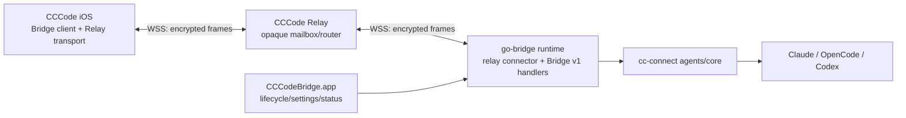
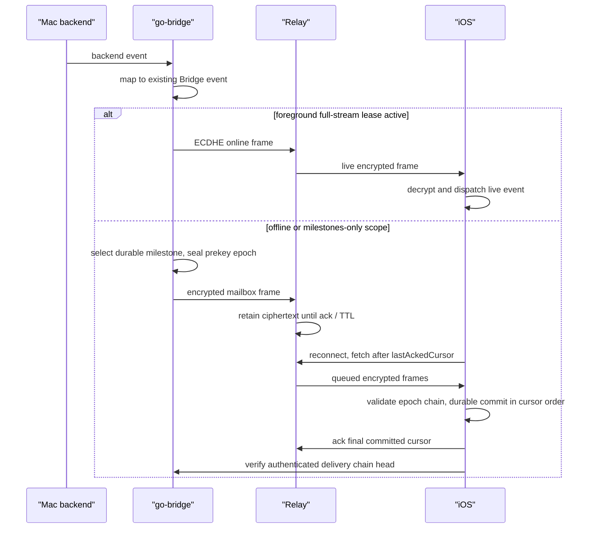

# CCCode E2E Relay 与加密离线同步实施方案

**日期**: 2026-05-24  
**状态**: 设计冻结版，可进入 Phase 0  
**范围**: MacBridge、go-bridge、OpenCodeiOS、可新增的 relay service  
**目标**: 让现有的远程创建、旁观、中断与续接能力在无需用户配置网络通道的情况下可用，并在 iOS 断网或挂起后可靠恢复真实任务状态。  
**评审依据**:  
- `docs/2026-05-24-CCCode-E2E-Relay与加密离线同步实施方案-评审报告.md`
- `docs/2026-05-24-CCCode-E2E-Relay与加密离线同步实施方案-二轮评审报告.md`
- `docs/2026-05-24-CCCode-E2E-Relay与加密离线同步实施方案-三轮评审报告.md`

---

## 1. 决策摘要

CCCode 已经具备本方案所要承载的业务能力，而不是缺少一套新的任务控制模型：

- iOS 已可选择已配对 Mac、backend、项目目录、agent/model，并由 Mac 上真实 backend 创建和执行 session。
- Codex `app_server` 已支持 Mac 端发起 turn 的 iOS 旁观、停止和续接；2026-05-20 至 2026-05-23 的提交集中补齐了该链路。
- OpenCode 已有 SSE 被动事件同步路径；Claude Code 已有基于历史读取和 polling 的旁观路径。
- Bridge v1 已有 device token、设备撤销、运行中 session 握手、事件 `seq` 与 completion pending notification。

本方案只补充两项基础设施能力：

1. **E2E Relay**：MacBridge/runtime 与 iOS 都主动连接一个公网 relay；relay 仅路由和暂存加密信封，不读取 Bridge RPC 内容。用户不再需要配置 Tailscale、FRP、VPS 或公网证书才能在外网访问自己的 Mac。
2. **加密离线同步**：Mac 在 iOS 离线/后台期间产生的 milestones 与恢复信号可在 relay 中以密文暂存，iOS 重连后按投递游标补取；完整消息/delta 始终从 Mac 的真实 backend 状态 reconcile，不在 mailbox 中复制完整流。

### 1.1 不做的事情

| 不做事项 | 原因 |
| --- | --- |
| 不在云端运行 agent 或复制 runtime 状态机 | Mac 始终是执行主体和状态权威 |
| 不替换现有局域网/Tailscale/WSS 直连路径 | 直连仍是低延迟、自管、无需云服务的首选路径 |
| 不增加远程专用 sandbox | 远程操作应保持与用户在 Mac 上操作同一真实能力边界 |
| 不照搬 Happy 的独占式 terminal handoff | CCCode 的价值包含多设备观察与跨端续接 |
| 首版不排队执行 iOS 在 Mac 离线时发出的写操作 | 过期 `send_message`、`abort`、permission approval 可能对真实任务造成错误副作用 |
| 不把 Claude Code 描述成实时广播 backend | Relay 改善连接与恢复，不能改变 Claude 独立进程模型 |

### 1.2 评审建议处理结论

| 评审建议 | 决策 | 方案调整 / 不采纳理由 |
| --- | --- | --- |
| 在线握手引入 PFS | **采纳并提前到 Phase 1** | 在线 Relay 从首个可用版本起使用经长期设备身份认证的临时 ECDHE；已经结束的在线 channel 不因长期密钥日后泄露而被解密。 |
| Mailbox 离线密文也具备 PFS | **采纳，但不能仅靠 `hello/hello_ack` ECDHE** | iOS 离线时无法参与握手，因此 Phase 2 使用 iOS 预先上传的一次性 delivery prekey 池。若 prekey 耗尽，Mac 不退回长期静态密钥加密离线详情，而是标记恢复时必须 reconcile。 |
| Counter-based Nonce | **采纳** | 每方向、每密钥 epoch 使用严格递增 `uint64 counter` 构造 96 位 nonce，不再在信封中传输随机 nonce。 |
| Counter 严格连续校验 | **采纳并扩展** | 接收方只接受 `lastCommittedCounter + 1`；另以认证 epoch chain/head 检测整批删除。空洞立即封存 epoch 并回源 Mac，不能继续应用后续帧。 |
| Pairing Claim 使用标准加密协议 | **采纳** | 新设备 Relay 配对限定使用 RFC 9180 HPKE Base Mode；不接受自行拼装的“X25519 加密”。已有设备的可信直连升级路径不需要 HPKE。 |
| 密文 padding 降低流量特征泄露 | **部分采纳，置于 Phase 2** | Durable mailbox milestones 与在线 delta payload 按 256 字节桶填充，减少明显长度泄露；时间、频率和总量仍对 Relay 可见，产品不得宣称消除流量分析。 |
| 前后台动态 observation scope | **采纳并增强** | 前台发送完整流，后台只发送 milestones；由于系统可能来不及回调，full-stream scope 还必须带短租约，心跳到期自动降为 milestones。 |
| Claude Code 使用 `fsnotify` 由 Mac 主动提示更新 | **暂不纳入本方案首轮交付** | 这是 Claude backend 的事件采集优化，不是 Relay 可达性/可靠投递的必要条件；且 Claude/OpenCode direct-path 尚待基线验证。先保持真实 polling 语义，基线完成后另立增强项验证 JSONL 写入、路径映射与资源开销。 |
| Go 侧定义 `Connection` 接口 | **采纳** | Direct 与 Relay connection 经最小接口注入既有 handlers，避免 `Conn` 结构中散落 relay 分支。 |
| Cursor Ack crash safety | **采纳并修正实现表述** | 不能只在 dispatch 前保存 cursor，否则崩溃后会跳过尚未落地的业务状态；iOS 在 durable apply 或 durable `localReconcileRequired` 标记完成后才 ack。 |
| Mac 至 Relay 断链时使用有界缓冲 | **采纳并收紧 gap 行为** | go-bridge 暂存有界加密帧；溢出后废弃当前 delivery epoch，重建认证 epoch 后发出 `delivery_reconcile_required` 控制消息，避免在严格 counter 空洞后继续处理普通数据帧。 |

### 1.3 二轮评审微调结论

| 二轮建议 | 决策 | 方案调整 / 不采纳理由 |
| --- | --- | --- |
| 在线建立 channel 后检查 prekey 池水位并自动补充 | **采纳** | Phase 2 增加 prekey status/upload inner RPC；已认证在线连接中，余额低于低水位时补充至目标水位，并设置数量上限、幂等 batch ID 与 Keychain 清理规则。 |
| Reconcile 期间使用抗闪烁展示 | **部分采纳** | 保留最后一次经 Mac 校验的内容并标记 `Relay - Syncing`，新结果完成后原子替换局部状态；不采用以骨架屏覆盖已有已验证历史的通用策略，也不展示尚未回源确认的完整状态。 |
| 二轮报告关于“彻底杜绝 Relay 流量抑制”的结论 | **收紧表述** | Epoch chain/head 可检测已恢复通道上的缺失或截断；Relay 仍能拒绝服务、阻断连接或延迟投递。方案保证完整性失败可见并回源，不承诺公网中继可用性。 |

### 1.4 三轮评审冻结前补充结论

| 三轮建议 | 决策 | 落地位置 |
| --- | --- | --- |
| P-1 prekey 低水位触发机制消除模糊推送表述 | **采纳** | §5.4 固定为 channel 建立后无条件查询，并允许前台在线时每 30 分钟周期查询；首版不新增 low-watermark push event。 |
| P-2 上传响应格式 | **采纳** | §5.4 定义 `acceptedCount`、`totalAvailable`、`duplicateBatchId` 响应。 |
| P-3 硬上限错误码与行为 | **采纳** | §5.4 定义 `prekey_limit_exceeded` 整批拒绝与 iOS 待重试规则。 |
| P-4 `get_delivery_chain_head` RPC | **采纳** | §5.5 定义独立 inner RPC 及响应字段。 |
| I-1 两类 reconcile 名称混淆 | **采纳** | Mac 到 iOS 控制消息统一为 `delivery_reconcile_required`；iOS durable 本地标记统一为 `localReconcileRequired`。 |
| I-2 chain-head RPC 实施任务遗漏 | **采纳** | §15 协议、go-bridge、iOS 与验证任务均加入该 RPC。 |
| §8.3 milestones 事件类型枚举 | **采纳** | §8.3 增加 durable mailbox 白名单；白名单外事件不持久投递。 |
| §5.4 prekey 生成数量公式 | **采纳** | §5.4 固定 `min(targetCount - availableCount, maxCount - availableCount)`。 |
| R-1 多 session 并行 reconcile 展示策略 | **采纳为 Phase 2 首版限制** | §8.6 仅当前可见 session 展示 syncing/原子更新；后台 session 仅标记待同步。 |

---

## 2. 已有能力基线

### 2.1 最近已完成的跨端任务链路

| 日期 / Commit | 能力 |
| --- | --- |
| `2026-05-20` `60c2771` / `9b20054` | OpenCode 外部 Mac turn 通过 SSE 同步至 iOS |
| `2026-05-20` `18c97e0` | Codex Mac 端新 turn 在 iOS 中激活执行态并保持变化探测 |
| `2026-05-22` `90ec950` + cc-connect `b99c5dba` | Codex 复用既有 app-server WebSocket，支持 abort 与 Todo 驱动的继续任务入口 |
| `2026-05-23` `0a7c433` | Bridge 补充 `resume_session` 与 session ID rebind/event relay 修复 |
| `2026-05-23` cc-connect `0944e60e` | 降低 Codex 长历史续接丢失风险 |
| `2026-05-23` `50b4906` | events channel 关闭时补发 `turn_completed`，收口 iOS 完成态 |

### 2.2 当前代码锚点

| 现有模块 | 可复用职责 | 本方案扩展点 |
| --- | --- | --- |
| `go-bridge/types.go` | `WireMessage`、`EventMessage`、session registry、broadcaster、pending notifications | 不改变业务消息；新增 relay secure envelope 与可靠投递适配 |
| `go-bridge/bridge_v1_schema.go` | `hello` / `hello_ack`、running sessions、设备能力 | 增加 relay capability 与 secure channel 状态 |
| `go-bridge/trusted_device_store.go` | device token、撤销记录、持久化设备列表 | 绑定设备加密公钥与 relay 授权状态 |
| `OpenCodeiOS/Services/Bridge/CCCodeBridgeTransport.swift` | 请求关联、hello 握手、事件流与重连 | 抽取 frame connection，新增加密 relay connection |
| `OpenCodeiOS/Services/Bridge/BridgeProvider.swift` | local/remote 候选地址竞速与 backend client 建立 | 将 relay 作为新增候选连接模式 |
| `MacBridge/Services/RuntimeManager.swift` | 启动 go-bridge、远程设置、runtime 管理 | 管理 relay 配置、连接状态与密钥初始化入口 |
| `ChatViewModel+SessionManagement.swift` | 外部运行 session 探测和 backend 特定恢复策略 | relay 重连后的 reconcile 仍复用现有策略 |

### 2.3 当前不足

| 问题 | 当前状态 | 方案目标 |
| --- | --- | --- |
| 外网首次可达性 | 用户配置 Tailscale 或 WSS/FRP | Mac/iOS 只需登录/配对后主动连接 relay |
| 中转方可见 payload | WSS 终点若由第三方托管可读明文 | relay 永不持有解密密钥 |
| iOS 后台/掉线期间的状态恢复 | 主要靠 reconnect、历史刷新、completion pending | durable milestone 密文补投 + Mac 权威 history/Todo reconcile |
| 现有 `EventMessage.seq` | go-bridge 进程内内存序号，不是持久化投递游标 | 新增独立 `deliveryCursor`，不混用业务事件序号 |

---

## 3. 产品与架构原则

### 3.1 Mac 权威原则

所有业务真相继续来自 Mac 侧真实路径：

- session 是否存在、是否正在运行，由 go-bridge/backend 决定。
- message history、Todo、Memory、context usage、tool 状态由 backend 或 cc-connect 读取/生成。
- iOS 不通过 relay 创建影子 session。
- relay 不解析、不合并、不重建 session 内容。

Relay 保存的加密事件仅用于恢复传输连续性。密文过期、丢失或投递存在歧义时，客户端必须回到 Mac 读取真实状态。

### 3.2 业务协议复用原则

本方案不另造一套云端 RPC。现有 Bridge v1 message 作为端到端加密的 inner payload：

```text
iOS BackendClient
  -> Bridge v1 request/event 语义
  -> relay secure channel 加密
  -> relay 只路由密文
  -> Mac 端解密
  -> 现有 go-bridge handlers / backend runtime
```

本地直连和 relay 连接应在 `CCCodeBridgeClient` 之上表现一致，ViewModel 不应感知业务请求经过哪条传输路径。

### 3.3 真实失败原则

- Mac 离线时，首版 relay 对写请求返回明确 `relay.bridge_offline`，不制造“已提交稍后执行”的假象。
- 密文无法验证、序号回退、设备已撤销时，立即失败并保留诊断信息。
- 缺失事件不能由 iOS 猜测补齐；应触发从 Mac 重新拉取状态。

---

## 4. 总体架构

### 4.1 目标拓扑



### 4.2 为什么推荐把加密 relay connector 放在 go-bridge

推荐首版由 `go-bridge` 承担 relay secure channel 的终止与 Bridge v1 分发，而 MacBridge 继续负责启停、配置与状态展示。

| 选择 | 优点 | 代价 |
| --- | --- | --- |
| **go-bridge 内置 relay connector（推荐）** | 已拥有 `WireMessage`、设备撤销、broadcaster、backend dispatch；无需引入本地转发协议 | Go 侧新增密钥持久化与密码库依赖 |
| MacBridge 解密后代理到本地 go-bridge | Swift/CryptoKit 与 Keychain 使用方便 | 必须创建内部代理认证与虚拟连接层，MacBridge 开始承担 wire dispatch，职责扩大 |

relay 是 wire transport 能力，不是 backend runtime 逻辑，因此放入 go-bridge 不违反“runtime 逻辑归 cc-connect，go-bridge 只做协议适配”的约束。

### 4.3 双路径并存

```text
已保存的 Bridge
  ├── localURL        -> 现有局域网直连
  ├── remoteURLs      -> 现有 Tailscale / 自建 WSS
  └── relayEndpoint   -> 新增 E2E Relay
```

默认连接策略建议为：

1. 用户显式选择的模式优先。
2. 自动模式下，局域网可达时优先 local。
3. local 不可达时并行竞速已有 remote 与 relay。
4. relay 使用 E2E 后，可标识为可信远程候选；公网明文 `ws://` 规则不变。

---

## 5. 安全模型

### 5.1 需要保护的数据

必须端到端加密的 inner payload 包含：

- `hello_ack` 中的 backend 列表与运行中 session。
- 所有 Bridge RPC params/result，包括目录、prompt、model、provider、文件内容。
- 所有事件内容，包括 text、thinking、tool、Todo、context usage、错误详情。
- session ID、backend ID、项目目录等业务标识。

Relay 可见的最小必要元数据：

- relay account/bridge route ID。
- sender endpoint ID 与 destination endpoint ID。
- 方向、密文大小、投递时间、TTL、mailbox cursor。
- 连接在线状态。

relay 不应看到 backend ID、session ID、event type、项目路径或内容摘要。

### 5.2 威胁与保证

| 威胁 | 必须保证 |
| --- | --- |
| Relay 数据库泄露 | 攻击者只能取得密文与必要路由元数据 |
| Relay 主动篡改/重放/选择性删除消息 | 端点通过 AEAD、严格 counter 与认证 epoch chain/head 拒绝篡改、重放或静默缺失 |
| Relay 拒绝服务、延迟或完全阻断投递 | 端点只能检测不可达/未收敛并展示失败；不能由 E2E 协议保证第三方中继可用性 |
| Relay 替换设备公钥 | 配对/升级时公钥绑定必须经过当前可信路径或包含在 Mac 二维码信任根中 |
| 长期设备密钥在未来泄露 | 已关闭的在线 channel 及已完成的一次性 prekey mailbox epoch 的历史密文仍不可被恢复解密 |
| 已撤销 iPhone 尝试连接 | Mac 端在解密/dispatch 前检查设备撤销；relay 停止投递新密文 |
| 已撤销设备保存了旧密文 | 无法撤回已下载数据；撤销保证未来数据与命令失效 |
| 本机用户账户被攻破 | 不作为 relay E2E 可解决的威胁；该攻击者本就可能访问 Mac 上真实 workspace 和 agent |

### 5.3 推荐密码方案

两端需跨 Swift/CryptoKit 与 Go 标准库互操作，推荐采用：

| 用途 | 算法 |
| --- | --- |
| endpoint 长期身份绑定 | X25519 (`Curve25519.KeyAgreement` / Go `crypto/ecdh`)；仅用于认证握手与配对后的身份绑定 |
| 在线 channel 前向安全 | 每次连接生成临时 X25519 ECDHE key pair，长期身份共享密钥对 transcript 进行 HMAC-SHA256 认证 |
| 离线 mailbox 前向安全 | iOS 一次性 X25519 delivery prekey + Mac 每 epoch 临时 X25519 key pair |
| 密钥派生 | HKDF-SHA256 |
| payload 加密与完整性 | ChaCha20-Poly1305 |
| 消息 nonce | `0x00000000 || uint64_be(counter)`；不在 envelope 中发送 nonce |
| replay / 删除防护 | 每方向、每 `keyEpoch` 严格接受 `lastCommittedCounter + 1`，counter 作为 AEAD AAD |
| 新设备配对 claim | RFC 9180 HPKE Base Mode，X25519 + HKDF-SHA256 + ChaCha20-Poly1305 |
| 长度侧信道缓解 | Phase 2 对 durable mailbox milestone 与在线 delta inner payload 追加已认证 padding，使明文长度进入 256 字节桶 |

在线 Relay channel 在传送任何业务 frame 前完成认证的临时握手：

```text
identityAuthKey  = HKDF(X25519(localIdentityPrivateKey, remoteIdentityPublicKey),
                        "cccode-relay/identity-auth/v1" + bridgeID + deviceID)
client_hello     = deviceID + channelGeneration + iosEphemeralPublicKey + clientRandom
clientAuthTag    = HMAC(identityAuthKey, client_hello)
server_hello     = client_hello_hash + macEphemeralPublicKey + serverRandom
serverAuthTag    = HMAC(identityAuthKey, server_hello)
ephemeralSecret  = X25519(localEphemeralPrivateKey, remoteEphemeralPublicKey)
trafficRoot      = HKDF(ephemeralSecret, transcriptHash, "cccode-relay/online/v1")
iosToMacKey      = HKDF(trafficRoot, "ios-to-mac")
macToIosKey      = HKDF(trafficRoot, "mac-to-ios")
```

长期 identity secret 认证临时公钥绑定，但不直接作为 traffic key 的秘密材料。双方在 channel 关闭后擦除临时私钥和 traffic keys；仅取得未来泄露的长期身份密钥，不能还原已经结束的在线 channel 密文。

### 5.4 离线 Mailbox 的一次性 Prekey Epoch

仅在 `hello/hello_ack` 中加入 ECDHE 不足以保护离线 mailbox：iOS 已挂起或断网时，没有正在参与的临时握手。Phase 2 因此必须增加异步一次性 prekey 机制，才可对已确认的历史离线密文作前向安全保证。

1. iOS 在线且 channel 已认证时生成一批一次性 X25519 delivery prekey，将 public key 与 `prekeyID` 经 inner RPC 上传给 Mac；private key 仅存 iOS Keychain。
2. Mac 要向离线设备产生 mailbox 数据时，原子消费一个未使用的 `prekeyID`，为一个不可追加的 bounded delivery epoch 生成 Mac 临时 X25519 key pair。
3. Mac 使用 `X25519(macEpochEphemeralPrivateKey, iosDeliveryPrekeyPublicKey)` 派生该 epoch 的单向 `macToIosMailboxKey`；并用 `identityAuthKey` 对 `prekeyID`、Mac 临时公钥、单调 `epochIndex`、前序 epoch digest 与 epoch 元数据生成 `epochAuthTag`。长期密钥仅认证发送方，不参与内容密钥派生。
4. 一个 epoch 只承载本次已聚合的有限批 frame，后续事件必须消费新 prekey 开启新 epoch；各 epoch 通过 `previousEpochDigest` 形成按设备的认证投递链。
5. Mac 将该 bounded epoch 的全部密文生成完毕并交给 relay/outbox 后擦除临时私钥与 batch key；iOS 验证 `epochAuthTag`、epoch 链和 frame counter，成功 durable commit 并 ack 完成该 epoch 后删除对应 prekey private key。
6. 某设备没有可用 prekey 时，Mac 不以长期 identity key 回退加密详细离线事件；记录该设备待恢复事实，并在设备重新在线建立新 channel 后发送 `delivery_reconcile_required` 控制消息，使 iOS 设置 `localReconcileRequired` 并从 Mac 权威状态恢复。

离线 mailbox 首轮只需要支持 `Mac -> iOS` 事件投递。`iOS -> Mac` 写操作在 Mac 不在线时仍 fail closed，不需要为离线写设计 prekey 队列。

#### Prekey 池水位与补充

Prekey 耗尽不应成为正常网络恢复路径，同时不能无限囤积私钥。Phase 2 初始策略如下：

| 项目 | 初始策略 |
| --- | --- |
| 查询时机 | iOS 每次建立已认证在线 channel 后无条件查询一次；前台 channel 持续在线时可每 30 分钟周期查询一次 |
| 低水位 | Mac 未消费 prekey 少于 `10` 个时需要补充 |
| 目标水位 / 硬上限 | 补充至 `32` 个；Mac 每设备拒绝保存超过 `64` 个未消费 prekey |
| 生成数量 | `min(targetCount - availableCount, maxCount - availableCount)`；仅当结果大于 `0` 时生成并上传 |
| 上传语义 | `upload_delivery_prekeys(batchID, prekeys[])` 为幂等 RPC；Mac 对 `prekeyID` 去重并原子提交 |
| 硬上限拒绝 | 若整批接收后会超过 `maxCount`，Mac 返回 `prekey_limit_exceeded` 且整批不入库；iOS 保留已 durable 写入的 batch，待后续水位下降后以同一 `batchId` 重试 |
| iOS 存储顺序 | 先将 private prekeys 与 `batchID` durable 写入 Keychain，再发送 public prekeys；确认 Mac 已接收后标记为 uploaded |
| 清理规则 | 已消费且 epoch durable ack 的 private prekey 删除；未上传成功的 batch 可重试；Mac 明确拒绝且未登记的 key 可删除；设备撤销时全部删除 |

首版不定义 Mac 主动发送的 `prekey_low_watermark` event。这里的“自动补充”仅发生在已建立认证 channel 且 iOS 获得执行时间时；App 已被系统挂起期间不能假设后台代码会被调度，也不能以不安全降级掩盖 prekey 耗尽。

最小 inner RPC 形态：

```json
{
  "method": "get_delivery_prekey_status",
  "params": {}
}
```

```json
{
  "availableCount": 8,
  "lowWatermark": 10,
  "targetCount": 32,
  "maxCount": 64
}
```

```json
{
  "method": "upload_delivery_prekeys",
  "params": {
    "batchId": "uuid",
    "prekeys": [
      { "prekeyId": "pk_uuid", "publicKey": "<base64>" }
    ]
  }
}
```

成功响应：

```json
{
  "acceptedCount": 24,
  "totalAvailable": 32,
  "duplicateBatchId": false
}
```

硬上限错误响应：

```json
{
  "error": {
    "code": "prekey_limit_exceeded",
    "message": "delivery prekey limit exceeded",
    "totalAvailable": 60,
    "maxCount": 64
  }
}
```

这些 RPC 是 E2E inner payload；Relay 不得看到 prekey 状态或公钥批次内容。相同 `batchId` 的成功重试返回相同接收结果并置 `duplicateBatchId = true`，Mac 只将此前未登记的 `prekeyId` 计入余额。`prekey_limit_exceeded` 是整批拒绝，不允许部分接受造成 iOS 私钥批次状态难以判定。

### 5.5 Counter、Nonce 与 Padding 规则

- `keyEpoch` 是一把发送密钥的生命周期，在线 channel 和每个 mailbox delivery epoch 分别拥有独立 `keyEpoch`。
- Mailbox `keyEpoch` 是不可追加的 bounded batch；只有这样 Mac 才能在生成该批密文后立即擦除临时密钥并维持前向安全边界。
- Mailbox receiver 除检查 epoch 内 counter 外，还持久化 `epochIndex` / `epochDigest` 链头；收到跳号或 predecessor 不匹配的整个 epoch 时同样拒绝并 reconcile。
- 如果 Relay 删除了队尾全部 epoch、因而没有后继帧暴露空洞，iOS 在每次 mailbox 恢复结束后通过在线认证 channel 向 Mac 查询最新 delivery chain head；head 不一致即 reconcile。
- Chain-head 只在 Mac 可达且认证 channel 建立后给出完整性判定。Relay 若持续拒绝服务，客户端只能显示尚未同步/不可达，不能声称状态已完整恢复。
- 每一方向从 `counter = 1` 开始，nonce 固定构造为 4 个零字节加 8 字节大端序 counter；同一 `keyEpoch` 下严禁复用 counter。
- 接收方只可提交严格下一个 counter。重复、回退或空洞均拒绝当前帧及该 epoch 后续普通数据；重新认证/建 epoch 后执行 reconcile。
- inner payload 在加密前封装真实长度并填充到 256 字节桶；超过阈值的现有 chunk 内容仍逐 frame 处理。Padding 只能降低长度识别精度，无法隐藏发送时间、频率或总字节数。

`get_delivery_chain_head` 是已认证在线 channel 内的独立 inner RPC，不与 prekey 水位查询合并：

```json
{
  "method": "get_delivery_chain_head",
  "params": {}
}
```

```json
{
  "epochIndex": 7,
  "epochDigest": "<base64>",
  "lastEpochFinalCounter": 3
}
```

请求的 device identity 取自已认证 `Connection`，不接受 iOS 自报 `deviceId`。`lastEpochFinalCounter` 是最新 bounded epoch 内已发出的最后 counter，用于确认完整消费该 epoch；没有已产生 epoch 时返回 `epochIndex = 0`、空 digest 与 `lastEpochFinalCounter = 0`。

### 5.6 密钥存储

| 数据 | iOS | Mac |
| --- | --- | --- |
| 设备私钥 | Keychain；不可写入 `UserDefaults` | 不适用 |
| Mac bridge 公钥 / fingerprint | 随 `SavedBridge` 密钥材料持久化，敏感快照放 Keychain | 公钥可公开 |
| Mac bridge 私钥 | 不进入 relay；首版由 runtime data-dir 以 `0600` 写入，后续可由 MacBridge Keychain 托管后注入子进程内存 | `~/Library/Application Support/CCCode Bridge/` |
| iOS delivery prekey 私钥 | Keychain；仅在对应 epoch 已确认或废弃后删除 | 不适用 |
| 设备公钥、未消费 prekey 公钥与 generation | 不适用 | 与 `TrustedDeviceRecord` 一并持久化，消费状态必须原子更新 |
| Relay 路由凭据 | Keychain | data-dir `0600` / MacBridge 配置 |

首版将 Mac 私钥落在 `0600` data-dir 是可接受的工程取舍：能够读取该文件的同一 macOS 用户，本身已经能够读取本地工作目录、runtime 连接及 agent 数据。后续若产品需要更高本机密钥隔离，可将其迁移至 MacBridge Keychain。

---

## 6. 配对与密钥绑定

### 6.1 已配对设备升级到 Relay

这是首个版本应优先支持的迁移路径，风险最低：

1. MacBridge 启用 Relay，go-bridge 创建或加载 bridge X25519 identity。
2. 已配对 iOS 通过现有 local / Tailscale / WSS 受信连接请求 `enable_relay_pairing`。
3. iOS 在本机生成 device X25519 identity key pair，发送 device public key。
4. Mac 返回 bridge identity public key、fingerprint、relay route 信息、`channelGeneration = 1`。
5. go-bridge 将该 device public key 绑定到现有 `TrustedDeviceRecord.deviceId`。
6. iOS 保存 relay endpoint 与 bridge public key；首次 Relay 在线握手使用临时 ECDHE，并在 Phase 2 离线投递启用后于认证 channel 内上传 mailbox delivery prekeys。

这一流程依赖当前 device token 身份认证，不需要 relay 参与密钥认证，也不会用长期 identity key 直接加密在线业务流量。

### 6.2 新设备直接通过 Relay 配对

为了实现真正“扫码即可外网接入”，第二阶段支持 relay 配对：

1. MacBridge 创建一次性 pairing session，并生成二维码。
2. 二维码新增以下字段：

```text
cccode://pair?
  id=<pairingID>
  &code=<manualCode>
  &relay=<relayURL>
  &route=<bridgeRouteID>
  &bridgeKey=<bridgePublicKey>
  &fingerprint=<bridgeKeyFingerprint>
```

3. iOS 扫码后生成 device identity public key；使用 RFC 9180 HPKE Base Mode 加密 pairing claim，接收方公钥为二维码中的 `bridgeKey`，`info` / AAD 绑定 `pairingID`、route 与 fingerprint。
4. HPKE 信封携带封装后的 ephemeral key 与 ciphertext；claim 内仅包含配对申请、device public key 和一次性审批关联信息。
5. MacBridge 解密 claim 后仍显示待审批设备，用户在 Mac 上批准。
6. 批准结果通过新绑定的设备身份建立的已认证 channel 返回 iOS，包含正式 device identity、relay channel generation 与业务认证绑定结果；delivery prekey 在该 channel 内后续上传。

关键约束：

- relay 不得生成或替换 bridge public key。
- QR 中的 `bridgeKey` / fingerprint 是新设备初始信任锚。
- 实现必须使用经过审查的 HPKE 库或经共享测试向量验证的 RFC 9180 实现；不能用自定义 ECDH + AEAD 拼接替代。
- Mac 端必须保留人工批准步骤；不能因 relay 已登录而自动批准新手机。

### 6.3 撤销行为

设备撤销应同时完成：

1. 当前 `TrustedDeviceStore.RevokeDevice(deviceID)`。
2. 标记对应 relay channel generation 不再接收或生成新密文，删除未消费 delivery prekeys。
3. 通知 relay 删除该设备未投递 mailbox 项并拒绝后续连接。
4. 已连接的 relay channel 发送不可伪造的加密 `device_revoked` 后关闭；如果设备离线，Mac 端拒绝其下次握手。

---

## 7. Relay 协议设计

### 7.1 外层信封与内层 payload

Relay 只处理外层信封。内层是原始 Bridge v1 JSON message 的密文。

```json
{
  "version": 1,
  "routeId": "br_route_xxx",
  "senderId": "dev_xxx",
  "destinationId": "bridge",
  "channelGeneration": 1,
  "keyEpochId": "ke_xxx",
  "prekeyId": null,
  "epochIndex": null,
  "previousEpochDigest": null,
  "epochAuthTag": null,
  "messageId": "uuid",
  "counter": 47,
  "ciphertext": "<base64>",
  "createdAt": "2026-05-24T08:00:00Z",
  "expiresAt": "2026-05-25T08:00:00Z"
}
```

`prekeyId`、`epochIndex`、`previousEpochDigest` 与 `epochAuthTag` 仅在 Mac 向离线 iOS 投递的 mailbox delivery epoch 中出现，是不承载业务语义的加密连续性元数据；在线 channel 为 `null`。ChaCha20-Poly1305 nonce 由 `counter` 本地构造，不在外层信封重复发送。`ciphertext` 包含 padding 后的 inner payload。

`ciphertext` 解密后才是：

```json
{
  "type": "request",
  "requestId": "...",
  "backendId": "codex",
  "method": "send_message",
  "params": {
    "sessionId": "...",
    "content": "...",
    "directory": "..."
  }
}
```

### 7.2 AAD 与篡改保护

以下外层字段必须序列化为稳定 AAD 并被 AEAD 校验覆盖：

- `version`
- `routeId`
- `senderId`
- `destinationId`
- `channelGeneration`
- `keyEpochId`
- `prekeyId`
- `epochIndex`
- `previousEpochDigest`
- `epochAuthTag`
- `messageId`
- `counter`
- `createdAt`
- `expiresAt`

relay 可以读取这些字段完成路由与过期淘汰，但无法篡改目的设备、顺序、有效期或方向而不被终端拒绝。

### 7.3 Relay 服务最小 API

Relay 只需要提供与业务无关的端点：

| API / 通道 | 作用 |
| --- | --- |
| `POST /v1/routes/register` | Mac 创建或恢复 bridge route |
| `WS /v1/routes/{routeId}/bridge` | Mac outbound 长连接，接收 iOS 密文并发送密文 |
| `WS /v1/routes/{routeId}/devices/{deviceId}` | iOS 长连接 |
| `GET /v1/mailbox?after=<cursor>` | 重连补取当前 endpoint 待投递密文 |
| `POST /v1/mailbox/ack` | endpoint 确认已 durable commit 或 durable 标记需 reconcile 的 delivery cursor |
| `POST /v1/devices/revoke` | Mac 撤销 relay 路由权限并清除未投递密文 |

Relay 认证使用单独的 opaque relay credential，不复用 go-bridge 的 device token。device token 属于 inner Bridge 身份系统，不应暴露给 relay。

### 7.4 路由与数据存储

Relay 数据表不包含业务字段：

| 表 | 字段要点 |
| --- | --- |
| `routes` | `route_id`、bridge online state、opaque bridge auth hash |
| `route_devices` | `route_id`、`device_id`、opaque device auth hash、revoked timestamp |
| `mailbox_frames` | destination、delivery cursor、crypto epoch metadata、ciphertext envelope、expires timestamp、acked timestamp |

禁止增加：

- `backend_id`
- `session_id`
- `event_type`
- prompt / response excerpt
- directory / filename

---

## 8. 加密离线同步设计

### 8.1 三类顺序标识必须分离

当前 `EventMessage.seq` 用于 go-bridge 运行期事件顺序，不能直接作为离线同步游标：

- 该序号是进程内计数。
- runtime 重启后不会提供跨实例持久投递语义。
- result/request 与握手消息不在同一可靠序列中。

新增三个概念：

| 标识 | 生成方 | 用途 |
| --- | --- | --- |
| `counter` | 发送端 | 端到端 replay/删除检测，每 `keyEpoch` direction 从 1 严格连续递增 |
| `epochIndex` / `previousEpochDigest` | Mac | 离线 bounded epoch 的认证链，检测 Relay 整批删除或乱序投递 |
| `deliveryCursor` | relay | 某 destination mailbox 的不透明投递位置，用于补取和 ack |

iOS 先通过 `deliveryCursor` 补取 durable mailbox 密文，再验证 epoch 认证链和 `counter == lastCommittedCounter + 1`；解密出的业务事件仍保留现有 `EventMessage.seq`。Relay 删除帧会导致 counter 空洞，删除整批会导致 epoch 链或 Mac chain-head 校验失败，均不能被静默忽略。

投递分为两类，不能混用密钥生命周期：

| 投递类别 | 内容 | 加密 / 保存规则 |
| --- | --- | --- |
| 在线实时流 | 前台活跃连接上的 text/tool/thinking/delta 与实时 RPC | 仅使用在线 ECDHE channel 转发；临时 key 不为 App 崩溃重放而持久化，丢失尾部以 Mac reconcile 恢复 |
| Durable mailbox | 后台/离线期间白名单中的 milestone 与 `delivery_reconcile_required` | 仅使用一次性 delivery prekey epoch 加密并暂存；不缓存完整 token 流 |

### 8.2 事件投递流程



### 8.3 观察范围

密文不可由 relay 按 backend/session 分流，因此 Mac 端必须决定向哪些设备发送哪些事件。新增端到端 inner RPC：

```json
{
  "type": "request",
  "method": "set_observation_scope",
  "params": {
    "backendId": "codex",
    "sessionIds": ["..."],
    "deliveryMode": "full_stream",
    "includeRunningSessionSignals": true,
    "leaseSeconds": 45
  }
}
```

建议语义：

- iOS 前台打开 session 时发送 `deliveryMode = full_stream`，订阅 text/tool/thinking/Todo/completion 等现有完整事件；前台心跳续租。
- iOS 即将进入后台时发送 `deliveryMode = milestones_only`，仅持久投递下表白名单内的 Bridge-level milestone，不投递 token 级 delta。
- iOS 可能被系统直接挂起、来不及发送切换请求；因此 `full_stream` 必须有短租约，Mac 在租约过期后自动降为 `milestones_only`。
- iOS 回到前台时先补取 milestones、重新建立 `full_stream` 租约，然后调用 Mac 权威读取接口恢复完整消息历史。
- `includeRunningSessionSignals` 允许 Mac 端新开始的任务触发轻量加密状态信号；iOS 重连后再通过 Mac 拉取详情。
- Relay 本身不知道 scope 内容。

`milestones_only` 首版持久投递白名单固定如下。backend adapter 必须映射到这些 Bridge-level event；不在白名单中的 delta、tool 细节、正文替换或 thinking 内容不得进入 durable mailbox：

| Bridge milestone event | 触发来源 | 持久化意义 |
| --- | --- | --- |
| `turn_completed` | Codex / OpenCode / Claude 可确认 turn 完成时 | 提示该 session 需要回源读取最终 history/Todo |
| `turn_error` | backend turn 失败或 bridge 可归属的执行错误 | 提示失败待回源校验，不包含错误详情正文 |
| `todos_updated` | backend 支持 Todo 且确认 Todo 变化时 | 提示需重新调用 `fetch_todos` |
| `session_running_signal` | 检测到 Mac 发起或继续中的任务 | 提示 running 状态待回源确认 |
| `delivery_reconcile_required` | prekey 耗尽、outbox 溢出、delivery epoch 废弃等 transport 原因 | 强制 iOS 设置 `localReconcileRequired` |

未能可靠产生上述某项 milestone 的 backend 不伪造该事件；仍以恢复后的权威 RPC 结果为准。例如 Claude Code 继续保持 polling/history 能力边界，不借 Relay 合成 token 级或虚假完成事件。

### 8.4 事件保留与容量

推荐初始策略：

| 项目 | 初始值 |
| --- | --- |
| 未确认事件 TTL | 24 小时 |
| 单设备 mailbox 密文容量 | 50 MB |
| 单 frame 上限 | 512 KB，超大内容沿用现有 chunk/read 能力 |
| Mailbox padding | payload 加密前按 256 字节桶填充 |
| ack 时机 | iOS 已解密且严格 counter 校验通过，并完成 durable apply 或持久化 `localReconcileRequired` 后 |

Mailbox 只持久投递 milestones 与恢复控制状态，不以缓存完整 text/tool delta 替代 Mac history。达到 TTL 或容量上限时，relay 可以淘汰最早密文，但不能伪造业务事件。Relay 返回 cursor 缺口只是触发恢复的非可信提示；iOS 仍会因 counter 不连续或 Mac 在新认证 epoch 中发出的 `delivery_reconcile_required` 控制消息而请求 Mac 权威 reconcile。

#### Ack 的崩溃安全提交顺序

“提交至内存事件队列后 ack”不足以应对 App 被杀。每个连续 mailbox batch 按以下顺序处理：

1. 验证 `epochAuthTag`、`previousEpochDigest` 链、AEAD 与严格 counter 连续性。
2. 若事件对应状态已能够持久化，则原子写入应用结果、`lastCommittedEpochDigest`、`lastCommittedCounter` 与 `lastCommittedCursor`。
3. 对 `turn_completed`、`todos_updated`、`session_running_signal` 或 `delivery_reconcile_required` 等只表达“需要回源确认”的 milestone，原子写入链头/counter/cursor 及 `localReconcileRequired(session/backend)`，表示重启后必须从 Mac 拉取完整真实历史。
4. durable write 成功后才向 Relay ack；失败则保持未确认，等待重投或恢复。
5. App 崩溃重启后，若存在 `localReconcileRequired`，在展示恢复完成前先回源 Mac；重复投递以已提交 counter/cursor 拒绝或跳过，不重复拼接 UI delta。

这样做不把 Relay 事件伪装为持久业务数据库，也不会因“先保存 cursor 但事件尚未应用”而静默遗漏状态。

### 8.5 Mac 到 Relay 断链与有界缓冲

Mac 正在执行但公网 Relay 短时不可达时，go-bridge 可按设备维护有界内存缓冲，存放已经加密、尚未送达 Relay 的 envelope：

| 约束 | 规则 |
| --- | --- |
| 缓冲上限 | 首版每设备最多 1000 frame 且最多 16 MB，两者任一达到即溢出 |
| Relay 恢复且未溢出 | 按原 counter 顺序发送积压密文，随后恢复实时发送 |
| 缓冲溢出 | 丢弃未送达 buffer，在 Mac 端记录需通知恢复，不继续使用产生空洞的 delivery epoch |
| 溢出后的恢复 | 重建认证 key epoch 后先发送加密 `delivery_reconcile_required` 控制状态，再允许新的普通事件；iOS 设置 `localReconcileRequired` 且不处理旧 epoch 中空洞后的帧 |

该缓冲仅保护短时 transport 断链，不是业务状态缓存，不会被用于回答 history/Todo/session RPC。

### 8.6 权威 Reconcile

即使 mailbox 无 gap，也不能把事件队列当作完整状态数据库。iOS 完成 replay 后应在以下情况下回源 Mac：

- 当前可见 session 正在 running。
- 收到 `mailbox_gap`。
- runtime/relay channel generation 改变。
- 解密失败、counter 跳跃或 `EventMessage.seq` 明显冲突。
- 收到新 epoch 中的 `delivery_reconcile_required`，或本地 durable `localReconcileRequired` 标记尚未清除。
- mailbox 补取结束后，iOS 保存的 delivery chain head 与 Mac 通过认证 channel 返回的链头不一致。
- App 从长时间后台恢复。
- 在线实时 channel 中断，导致未纳入 durable mailbox 的 delta 尾部可能缺失。

若 Mac 尚不可达，iOS 可展示已收到的 durable milestone，但必须保持 `Relay - Syncing` / 待校验状态，不能将完整内容已恢复或后台事件链完整作为既成事实。

#### Reconcile 展示与抗闪烁约束

Reconcile 是对真实状态的校验过程，不是加载占位数据的机会：

| 场景 | UI 行为 |
| --- | --- |
| 已有最近一次经 Mac 验证的消息/Todo | 保留可见内容，显示非阻塞 `Relay - Syncing` 状态；不得先清空再重载 |
| Durable milestone 提示任务已完成，但 history 尚未回源 | 可显示“待同步确认”的完成提示，不将正文/Todo 推断为最终值 |
| 回源结果返回 | 对 messages/Todo/running state 做一次原子更新，避免逐 RPC 闪回或重复拼接 |
| 首次打开且没有已验证内容 | 可显示明确的加载中空态；骨架样式仅代表等待真实数据，不承载模拟消息或 Todo |
| Reconcile 失败或 Mac 不可达 | 保留最后已验证快照与错误状态，不显示“恢复完成” |

因此，二轮建议中的局部抗闪烁处理予以采纳；用骨架屏覆盖已有可信内容、或把 mailbox milestone 渲染成未经回源的完整任务结果，不纳入实现。

Phase 2 首版在多个 session 同时待 reconcile 时只对**当前可见 session**运行上述 `Relay - Syncing` 展示与原子内容刷新。非当前 session 只在 session 列表中保留“待同步”状态标记，切换进入后再触发对应展示与权威读取；首版不引入跨 session 的全局同步进度 UI。

首版可复用已有 RPC，而不是立即发明大而全的 snapshot 协议：

| 恢复内容 | 复用接口 |
| --- | --- |
| backends / running sessions | `hello` / `hello_ack` |
| session 消息 | `get_session_messages` |
| Todo | `fetch_todos` |
| 当前 session 元数据 | `get_session` |

若后续证明多次 RPC 造成恢复闪烁或竞态，再增加只在 Mac 生成的 `sync_state` 聚合 RPC；它依然是实时读取真实 backend 的结果，而不是 relay snapshot。

### 8.7 Mac 离线期间的 iOS 写操作

首版规则必须明确：

| 请求 | Mac 在线 | Mac 离线 |
| --- | --- | --- |
| 读取 / 订阅请求 | 实时转发 | 明确失败；已有密文事件可回放 |
| `create_session` / `send_message` / `resume_session` | 实时转发并等待 Mac result | 返回 `relay.bridge_offline`，不排队 |
| `abort_generation` | 实时转发 | 返回 `relay.bridge_offline`，不延迟执行 |
| permission approval | 实时转发并校验 request ID | 返回 `relay.bridge_offline`，不延迟批准 |

原因很直接：CCCode 操作的是真实 Mac。写命令只有在用户提交时对应的 Mac 状态仍存在时才有意义。

---

## 9. Backend 行为边界

Relay 只增加 transport durability，不统一三类 backend 的实时能力。

### 9.1 Codex `app_server`

Codex 是第一优先验证对象，因为当前跨端续接链路已经最完整：

| 场景 | Relay 行为 |
| --- | --- |
| Mac 端开始 turn，iOS 在线 | passive notification 事件加密实时转发 |
| iOS 断网/后台后 Mac 继续输出 | 白名单 milestone 以 prekey mailbox 投递；delta 不积压 |
| iOS 恢复 | replay 未确认 milestones，再用现有 external turn probe / messages / Todo 拉取完整内容 |
| iOS stop / resume | 命令只在 Mac 在线时实时发送；复用已实现的 app-server WebSocket 与 `resume_session` |

重点防回归：

- pending session ID 到真实 thread ID 的 rebind 不因 relay 重放而重复执行。
- `turn_completed` 与事件通道关闭补发不会造成 UI 重复完成。
- 长历史 resume 不因 replay 顺序变化丢失 Todo 或已有上下文。

### 9.2 OpenCode

OpenCode 已有共享 SSE 广播，但 delta 与 snapshot replace 语义敏感。Relay 验证重点：

- SSE passive subscriber 的在线 `text_delta` / message replace 不重复拼接；断线后以 milestones + history reconcile 恢复，不重放完整 delta 流。
- 外部 Mac turn 的 running/completed 状态正确恢复。
- 重连后的 `get_session_messages` 能纠正 relay 期间任何被跳过的增量事件。

OpenCode 仍应走其真实 SSE/runtime 事件，不通过 relay 生成假增量。

### 9.3 Claude Code

Claude Code 没有共享广播服务。Relay 下的诚实行为应为：

- iOS 发起并由 bridge 创建的 Claude session，可将 bridge 已收到的事件通过 relay 转发。
- Mac Terminal 中另一个 Claude 进程发起的 turn，仍依赖 iOS/MacBridge 触发的历史 polling 读取变化。
- 对 polling 得到的消息更新，可以发送加密的 message/state 更新信号；不能声称是 token 级实时流。
- 断线恢复重点是最终消息、Todo 和运行状态不丢，而不是追求与 Codex 相同的实时细粒度。

评审提出在 go-bridge 侧用 `fsnotify` 监视 Claude 历史 JSONL，由 Mac 主动发送 `session_updated`。该方向有价值，但**不纳入本方案首轮 Relay 交付**：

- 它改变的是 Claude 独立进程的本地事件发现策略，而非 Relay 的传输正确性。
- 在 direct-path 基线尚未完成前引入 watcher，会让 JSONL 路径映射、半写入解析、session 归属或重复通知问题与 Relay 故障混在一起。
- Phase 0 先证明既有 polling 的真实行为；Relay 完成后可单独设计 Claude watcher spike，以“只发送变化提示、iOS 仍从权威历史读取”为前提评估收益。

### 9.4 验证现状

截至本方案撰写时：

- Codex 跨端继续任务路径已由项目近期重点测试与修复。
- Claude Code 与 OpenCode 的 Mac 端发起任务 / iOS 续接行为尚需在 relay 开发前先建立清晰的真实路径验收基线。

Relay 实施不得把尚未验证的 backend 行为误判为 relay 缺陷或用 relay fallback 掩盖原路径问题。

---

## 10. 代码改造范围

### 10.1 go-bridge

建议新增模块：

```text
go-bridge/
  relay_config.go          # relay endpoint、route credential、enabled 状态
  relay_identity.go        # identity binding、在线 ECDHE、delivery prekey/epoch chain 状态
  relay_envelope.go        # outer envelope、AAD、counter nonce、padding 与连续性校验
  relay_client.go          # Mac -> relay outbound WebSocket 与 mailbox ack/control
  relay_conn.go            # 将安全 relay device channel 适配为现有 RPC/event connection
  relay_observation.go     # per-device scope、租约降级与加密事件发送策略
  relay_outbox.go          # Mac 断链时的有界密文缓冲与 delivery_reconcile_required 信号
```

现有文件改动：

| 文件 | 改动 |
| --- | --- |
| `types.go` | 定义 handlers 依赖的最小 `Connection` 接口；业务消息类型不改 |
| `server.go` | 现有连接改为 `DirectConn` 实现接口；增加 relay 认证后注册 `RelayConn` 的入口，不在 direct conn 内堆积分支 |
| `trusted_device_store.go` | 新增 device identity public key、relay enabled、channel generation、未消费 delivery prekeys、delivery chain head、revoke 后 channel 禁用字段 |
| `bridge_v1_schema.go` | capability 中声明 `encryptedRelay` / `offlineEncryptedDelivery` |
| `handlers.go` | 接收 `Connection`；新增 `set_observation_scope`、prekey status/upload、`get_delivery_chain_head` RPC，复用既有 request dispatch 与 reconcile RPC |
| `main.go` | 根据 MacBridge 配置启动/关闭 relay client，并输出 relay status |

建议接口以现有 handlers 实际调用点为准，保持最小而稳定，例如：

```go
type Connection interface {
	SendJSON(v any) error
	AuthedDevice() *TrustedDeviceRecord
	Close() error
}
```

若现有诊断确需远端地址，再追加只读 `RemoteAddr()`；不为 Relay 提前扩大业务可见接口。

不得做的改动：

- 不把 agent session 或 backend 特有逻辑移动进 relay 模块。
- 不用 relay cached ciphertext 回答 `get_session_messages` 或 `fetch_todos`。
- 不因 relay 失败而生成 synthetic completion、synthetic Todo 或 fake backend 状态。

### 10.2 MacBridge

MacBridge 负责产品配置与运行状态，不承担 inner Bridge message 解析：

| 功能 | 改动 |
| --- | --- |
| Remote Access 页面 | 增加 `Encrypted Relay` 启用/关闭、endpoint、在线状态和 route 状态 |
| RuntimeConfig | 将 relay endpoint、route credential reference、enabled 状态传给 go-bridge |
| 配对 UI | relay 启用后生成包含 relay route 与 bridge key fingerprint 的二维码 |
| 设备管理 | 显示设备是否启用 relay；撤销时同步触发 channel revoke |
| 状态页 | 展示 Direct / Relay 当前可达性与 relay 连接错误，不伪装为 backend 错误 |

### 10.3 iOS

建议先抽取 transport 下层 frame connection，保留 `CCCodeBridgeClient` 与 ViewModel 不变：

```text
CCCodeBridgeClient
  -> CCCodeBridgeTransport (hello / RPC continuation / event decode)
       -> DirectBridgeFrameConnection (现有 WebSocket)
       -> RelayBridgeFrameConnection  (WSS + secure envelope + mailbox replay)
```

| 文件区域 | 改动 |
| --- | --- |
| `CCCodeBridgeTransport.swift` | 将裸 `BridgeWebSocketConnection` 依赖抽到 frame connection 接口，业务解码与请求关联复用 |
| `BridgeProvider.swift` | relay 作为连接候选；记录当前 connection mode |
| `SavedBridgeStore.swift` | Keychain 保存 identity private key、delivery prekeys、Mac public key 与 relay credential；元数据增加 relay endpoint |
| Pairing models/client | 支持已有设备启用 relay 与 RFC 9180 HPKE relay QR 配对 |
| App lifecycle / relay connection | 前台 full-stream scope 续租、后台 milestones scope、prekey 水位补充、durable cursor/`localReconcileRequired` 恢复 |
| Reconcile presentation | 仅当前可见 session 保留最后已验证状态并以同步状态覆盖刷新过程；回源结果原子应用，不展示推断的完整内容 |
| ChatViewModel | 不新增 relay 业务分支；重连后复用现有 session/message/Todo 恢复入口 |

### 10.4 Relay service

Relay service 是新的独立部署单元，应保持极窄职责：

```text
relay/
  auth            # route/device opaque access authentication
  websocket hub   # online forwarding
  mailbox store   # ciphertext frames + opaque crypto epoch metadata + cursor + TTL/ack
  revocation      # route device disable/delete queued frames
  metrics         # only counts/latency/storage; no plaintext payload logs
```

实现技术栈可在实际开发前单独决定；协议与安全边界不应依赖具体语言或数据库。

---

## 11. 分阶段实施

### Phase 0：设计冻结与基线验证

**目标**: 在引入新 transport 之前，固定现有能力的真实基准。

任务：

1. 固化 relay threat model、外层 envelope、认证 ECDHE、delivery prekey epoch chain/head RPC、HPKE claim、counter nonce、padding、milestone 白名单与密钥迁移规则。
2. 为当前 direct path 建立三 backend 的跨端验收记录：
   - Codex：保留已通过的创建、旁观、stop、resume、Todo 验证证据。
   - OpenCode：验证 Mac 发起 turn 时 iOS streaming、完成态、再次发送。
   - Claude Code：验证 Mac 发起任务旁观 polling、最终结果、Todo/完成态。
3. 增加跨 Swift/Go 的 JSON crypto fixture：认证 transcript、ECDHE direction keys、counter 大端 nonce/AAD/ciphertext、padding、一次性 prekey epoch chain/HMAC 与 HPKE pairing claim 必须有固定向量。

退出标准：

- crypto/protocol 设计评审通过；不得以静态-静态 traffic key 代替在线 ECDHE 或离线 delivery prekey。
- OpenCode 与 Claude Code direct-path 的已知行为和缺陷均记录清楚；不得以 relay 开发绕开未定位的原路径故障。

### Phase 1：在线 E2E Relay MVP

**目标**: iOS 与 Mac 在线时，经公网 relay 完成与 direct path 等价的真实操作。

范围：

- 已配对设备通过可信直连升级到 relay。
- Mac outbound relay connection。
- iOS relay transport。
- 经 identity-authenticated ECDHE 产生 traffic keys；counter-based nonce 与严格连续校验。
- 密文在线转发，不做离线 mailbox replay。
- 支持 `hello`、session list/read、create/send/resume/abort、events、Todo。

退出标准：

- relay 数据库与日志中找不到 Bridge inner payload 或业务字段。
- 在线连接关闭后删除 ephemeral key material；使用长期 identity 私钥和捕获密文不能解密历史在线 fixture/会话。
- Codex 在线 relay 路径覆盖创建、Mac 端旁观、iOS 发送、stop、resume 与 Todo。
- direct local / existing remote 路径测试不回退。

### Phase 2：加密离线事件投递

**目标**: iOS 离线或被挂起期间，Mac 产生的 durable milestones 可恢复投递，完整状态可靠回源。

范围：

- 一次性 delivery prekey 水位查询、幂等补充、消费、删除、认证 epoch chain/head RPC 和耗尽时 `delivery_reconcile_required` / `localReconcileRequired` 行为。
- mailbox frame storage、TTL、capacity、`deliveryCursor`、padding 与 crash-safe ack。
- endpoint `keyEpoch` / 严格 `counter` 连续性持久化。
- `set_observation_scope` 的 full-stream/milestones 模式、前台续租与租约自动降级。
- Mac -> Relay 断链有界密文 buffer 与溢出后的新 epoch reconcile。
- gap 检测与权威 reconcile。
- completion/error 事件与已有 pending notification 路径的合并策略。

退出标准：

- iOS 断网期间 Codex 继续执行，恢复连接后消息、Todo、完成态与 Mac 一致。
- 已确认的 mailbox epoch 删除一次性私钥后，长期 identity key 后续泄露不解密其历史密文；prekey 耗尽时不发生静态密钥降级投递。
- 正常已认证重连时 prekey 低水位可自动补充；App 挂起或补充失败时仍严格执行耗尽后 reconcile，不降级。
- 密文丢失/过期时触发回源 reconcile，UI 不展示假完成或重复输出。
- 当前可见 session 在 Reconcile 期间保留最近一次已验证内容并原子更新恢复结果；后台 session 只标记待同步，不以空白闪烁或未经校验的正文暗示已经恢复。
- OpenCode 在线 delta/replace 不重复；离线恢复由 milestones + history reconcile 得到与 Mac 一致的结果。
- Claude Code polling 更新经过恢复后与历史权威结果一致。

### Phase 3：Relay 首次配对与产品化

**目标**: 新用户无需预先在同一局域网，也能通过 Mac 上二维码添加 iOS 设备。

范围：

- QR 中绑定 bridge public key fingerprint 与 relay route。
- RFC 9180 HPKE relay pairing claim / approve / complete。
- MacBridge 设备列表 relay 状态与撤销闭环。
- 连接模式 UI 与明确的 E2E 状态展示。

退出标准：

- 新设备外网扫码、Mac 批准、iOS 连接成功，不需要 FRP/Tailscale。
- relay 替换 public key、篡改 claim、重放批准结果均被拒绝。
- 撤销设备不能继续接收新事件或提交有效命令。

### Phase 4：可选增强，不纳入首轮交付

候选：

- APNs 仅承载“有加密事件待取回”的唤醒通知，不包含业务摘要。
- 多 iOS 设备 relay observation 与 mailbox 管理。
- Mac private key 从 `0600` 文件迁移至 Keychain 托管。
- Claude Code 本地 JSONL watcher spike：只发 `session_updated` 提示、仍由权威历史读取验证，且需先完成 direct-path 基线。
- 如确有必要，再设计带严格前置状态与短 TTL 的离线写命令；默认仍不启用。

---

## 12. 测试与验收策略

### 12.1 自动化测试

开发期间默认执行静态检查、定向 build 和定向 unit test；不主动运行 UI tests、snapshot tests 或 simulator automation。

| 层 | 必测内容 |
| --- | --- |
| Crypto unit tests | Swift-Go 共享 JSON vectors：认证 ECDHE transcript、direction keys、counter nonce/AAD、ChaChaPoly、padding、delivery prekey epoch chain/HMAC、HPKE claim；篡改/错误 key/重放/空洞/整 epoch 删除 |
| go-bridge unit tests | identity/prekey binding、水位/幂等上传/硬上限、chain-head RPC、milestone 白名单、revoke、`Connection` dispatch、scope lease 降级、有界 outbox 溢出与新 epoch reconcile |
| Relay service tests | opaque routing、mailbox cursor/ack、TTL/容量淘汰、revoke 清除、日志不含 ciphertext 解码内容 |
| iOS unit tests | frame connection 替换不影响 RPC continuation/hello/event decode；prekey Keychain batch 重试；durable cursor/chain head/`localReconcileRequired` crash 恢复；scope lifecycle；gap 后回源；仅可见 session reconcile 更新不清空可信内容 |
| Existing regression | `go test ./... -count=1`；iOS 相关 XCTest 定向执行；direct pairing/transport 不回退 |

### 12.2 真实设备验收矩阵

涉及连接、断网、后台恢复与跨设备任务行为，最终验收需要真实 iPhone + Mac；具体执行前按项目约束明确验证范围，不默认触发高消耗 UI 自动化。

| Backend | 在线 Relay | iOS 断网后恢复 | iOS 后台后恢复 | Mac 发起任务旁观 | iOS 续接/控制 |
| --- | --- | --- | --- | --- | --- |
| Codex `app_server` | 必测 | 必测 | 必测 | 必测 | stop + resume + Todo 必测 |
| OpenCode | 必测 | 必测 | 必测 | SSE turn 必测 | send/complete 必测 |
| Claude Code | 必测 | 必测最终状态 | 必测最终状态 | polling 路径必测 | resume 行为按真实能力验证 |

### 12.3 故障注入验收

| 故障 | 预期 |
| --- | --- |
| Relay 短暂断网后恢复 | 自动重连，按 cursor 补投，必要时 reconcile |
| Mac 到 Relay 断链导致 outbox 溢出 | 放弃旧 epoch；新认证 epoch 触发 reconcile，不应用 counter 空洞后的帧 |
| iOS 杀后台 / 切蜂窝网络 | 回到 App 后恢复当前 session 的真实状态 |
| iOS 后台期间长任务持续输出 | full-stream 租约到期后 mailbox 仅出现 milestones，前台回源补齐详情 |
| MacBridge/runtime 重启 | 新 channel/握手完成后回源恢复，不误用旧 runtime `seq` |
| mailbox 超过 TTL | iOS 显示恢复中并回源 Mac，不静默缺消息 |
| Relay 修改 ciphertext/AAD | 解密失败并记录安全错误，不 dispatch inner payload |
| Relay 删除完整 mailbox epoch 或队尾 | epoch chain/head 验证失败并回源 Mac，不静默遗漏 milestone |
| delivery prekey 耗尽 | 不使用静态 identity key 缓存离线详情；重连后要求 reconcile |
| prekey 低水位或上传重试 | 已认证 channel 内幂等补充至目标水位，不生成重复可消费 key |
| prekey 上传超过硬上限 | Mac 整批返回 `prekey_limit_exceeded`；iOS 保留待重试批次，不发生部分接受 |
| mailbox replay 结束后的 chain-head 查询 | `get_delivery_chain_head` 与本地链头一致才可清除相关恢复等待状态 |
| Relay 持续拒绝服务 / Mac 不可达 | 展示仍在等待同步或不可达，不宣称 chain-head 已验证 |
| 撤销设备后其继续发送密文 | Mac 拒绝 dispatch，不影响其他设备 |
| Mac 离线时 iOS 发 `send` / `abort` | 明确失败，不稍后执行 |

---

## 13. 可观测性与隐私约束

### 13.1 允许记录的日志

- route ID 的短哈希、device ID 的短哈希。
- relay connected/disconnected、reconnect attempt、latency。
- frame count、密文字节数、cursor/ack 差值、TTL 淘汰数量。
- decrypt validation error 分类，不记录原始密文全文。
- reconcile 发生原因。

### 13.2 禁止记录的日志

- 解密后的 Bridge message。
- prompt / response / thinking / tool params / file 内容。
- session title、项目路径、backend event 内容。
- 私钥、派生密钥、完整 relay credential。

### 13.3 状态展示

UI 中应区分：

| 状态 | 文案语义 |
| --- | --- |
| Direct - Local | 直接连接 Mac |
| Direct - Remote | 通过用户配置的安全远程地址连接 |
| Relay - Encrypted | 通过端到端加密中继连接 |
| Relay - Syncing | 正在补取加密离线事件并向 Mac 校验状态 |
| Relay - Mac Offline | Relay 可达，但 Mac 当前不在线；写操作不可执行 |

不能把 relay 在线等价展示为 backend 在线，也不能在 reconcile 尚未完成前展示已恢复完成。

---

## 14. 主要风险与控制

| 风险 | 后果 | 控制措施 |
| --- | --- | --- |
| 将 relay mailbox 错当 session 权威 | 消息重复、Todo 或 running 状态错误 | 强制设计为传输缓存；恢复后回源 Mac |
| `EventMessage.seq`、delivery epoch chain 与 cursor 混用 | runtime 重启后误判丢包/重复或忽略缺失 | 明确定义三类顺序标识并分层测试 |
| 为离线命令提供便利性排队 | 过期命令操作真实 Mac | 首版写操作 fail closed，仅在线实时执行 |
| 配对时公钥未绑定可信源 | relay 可中间人替换 key | 先实现已有设备可信升级；新设备 QR 自带 fingerprint |
| Claude 行为被误宣传为 realtime | 用户看到不符合真实 backend 的体验 | 保留 polling 模型，验收只要求真实可恢复状态 |
| Relay 功能侵入 ViewModel | direct/relay 行为分叉且难维护 | transport 下层抽象，复用 Bridge RPC 与恢复逻辑 |
| 加密密钥本机存储不当 | 本机凭据泄露 | iOS Keychain；Mac `0600` 起步并保留 Keychain 迁移路径 |
| 只为在线连接增加 ECDHE 却宣称离线 PFS | 长期密钥泄露后历史 mailbox 可解密 | Phase 2 强制 delivery prekey epoch；prekey 耗尽只 reconcile，不静态降级 |
| 后台仍缓存 delta 或系统未发送 lifecycle 切换 | Mailbox 膨胀、电量和恢复耗时恶化 | milestones mode + full-stream 短租约自动降级 |
| ack 先于本地可恢复提交 | App 被杀后静默遗漏事件 | durable apply 或 durable `localReconcileRequired` 在前，ack 在后 |
| prekey 水位未及时补充 | 正常离线 milestone 退化为仅可回源恢复 | 在线 channel 自动查询/幂等补充；失败时保持安全 fail closed |
| 将防删检测描述成 Relay 可用性保证 | 中继拒绝服务时产生错误安全预期 | 明确 chain/head 检测只覆盖可恢复后的完整性，UI 暴露不可达 |

---

## 15. 实施任务拆分

### 15.1 协议与密码基础

- [ ] 定义 relay threat model、outer envelope JSON schema、AAD canonical encoding。
- [ ] 定义认证 ECDHE、delivery prekey epoch chain/head RPC、counter nonce、padding、milestone 白名单与 RFC 9180 HPKE claim 规范。
- [ ] 制作 Swift/Go 共享 crypto JSON vectors，覆盖正常路径、篡改、counter/epoch 空洞、整批删除与 prekey 耗尽。
- [ ] 为 `TrustedDeviceRecord` 设计向后兼容的 identity/prekey/channel/chain-head binding 字段。
- [ ] 定义 prekey status/upload RPC、水位公式、响应/错误码、batch 幂等语义、Keychain durable 写入与清理规则。
- [ ] 确定 relay credential 与现有 device token 的隔离规则。

### 15.2 go-bridge 在线 relay

- [ ] 新增 bridge identity、认证 ECDHE 与 per-device secure channel 存储。
- [ ] 实现 envelope 加解密、counter-derived nonce、严格连续校验、padding 与 revoke。
- [ ] 定义 direct/relay 共用的最小 `Connection` 接口并适配现有 handlers。
- [ ] 实现 outbound relay client 与虚拟已认证 device connection。
- [ ] 实现 `get_delivery_chain_head` inner RPC 与 `delivery_reconcile_required` 控制消息发送。
- [ ] 增加 capabilities / management status / diagnostics。

### 15.3 iOS 在线 relay

- [ ] 抽取 frame connection 层并保持 `CCCodeBridgeClient` 业务接口不变。
- [ ] 实现 `RelayBridgeFrameConnection`、认证 ECDHE、counter/padding 验证。
- [ ] 扩展 `SavedBridge` 与 Keychain，管理 identity key 与一次性 delivery prekeys。
- [ ] 实现在线 channel 建立后的 prekey 水位查询与幂等批次自动补充。
- [ ] 扩展 `BridgeProvider` 的连接候选与连接状态。
- [ ] 实现已配对设备经现有可信连接启用 relay。

### 15.4 离线事件同步

- [ ] Relay service 实现 ciphertext mailbox、cursor、ack、TTL 和 capacity。
- [ ] 实现 delivery prekey 水位/幂等上传/硬上限、原子消费/删除、认证 delivery chain/head 查询与 prekey 耗尽的 reconcile 路径。
- [ ] go-bridge 实现 per-device observation scope、foreground lease 降级和有界 encrypted outbox。
- [ ] iOS 实现 durable cursor / `localReconcileRequired`、mailbox replay、`get_delivery_chain_head` 校验、gap 检测与 lifecycle scope 切换。
- [ ] 建立 replay 后的 Mac 权威 reconcile 流程。
- [ ] 实现当前可见 session 的 reconcile UI 状态：保留可信内容、同步标记、结果原子应用与失败展示；后台 session 仅标记待同步。
- [ ] 整合现有 pending completion notification，避免重复通知。

### 15.5 配对与产品化

- [ ] MacBridge Relay 设置和状态 UI。
- [ ] Relay-enabled QR payload、RFC 9180 HPKE claim 与外网配对审批。
- [ ] 设备撤销同时关闭 secure channel 与清理 mailbox。
- [ ] 产品文档、威胁模型、隐私说明和故障诊断文档。

### 15.6 验证

- [ ] Codex direct path 既有跨设备行为回归。
- [ ] OpenCode direct path Mac 发起/旁观/继续基线验证。
- [ ] Claude Code direct path polling/继续/最终状态基线验证。
- [ ] Codex relay online + offline replay + reconcile 真机验证。
- [ ] OpenCode relay delta/replace 与完成态真机验证。
- [ ] Claude relay polling checkpoint 与最终状态真机验证。
- [ ] Relay 被篡改、counter/epoch 空洞、整批删除、拒绝服务状态、outbox 溢出、容量淘汰、prekey 水位/耗尽、设备撤销、Mac 离线写请求故障验收。

---

## 16. 完成标准

本方案完成不能只以“relay 能连上”为准，必须满足以下结果：

1. 用户在外网无需配置 Tailscale、FRP 或自建 WSS，即可通过已授权的 iPhone 连接自己的 Mac。
2. Relay 存储与日志中不存在可解密的 session、prompt、目录、tool、Todo 或文件数据。
3. 直连与 relay 共用相同 Bridge 业务语义；relay 不引入新的 session/runtime 真相。
4. iOS 短时断网或后台挂起后，可恢复未确认的 durable milestones；完整消息与 Todo 从 Mac 真实状态收敛。
5. Mac 离线时，iOS 写操作明确失败，不会在用户不知情时延后影响真实任务。
6. Codex、OpenCode、Claude Code 各自按真实进程模型验收，不借 relay 隐藏 backend 差异或故障。
7. 设备撤销、消息篡改、重放、key 替换尝试均有明确拒绝路径与测试证据。
8. 在线 channel 与已确认的离线 delivery epoch 具有明确前向安全证明边界；实现不以静态 traffic key 或 prekey 耗尽降级路径削弱该结论。
9. App 后台、崩溃和 Mac-Relay 断链溢出场景均通过 durable reconcile 收敛，不会以缺失 delta 伪装连续流。
10. Prekey 池在正常在线恢复时可幂等补充且有容量边界；中继不可达或状态未完成 Mac 校验时，UI 不伪装已恢复。

---

## 17. 结论

CCCode 的下一步不是扩大“手机能控制 Mac 做什么”。现有实现已经覆盖远程创建、观察、停止与续接真实任务，尤其 Codex 链路近期已有集中建设。

真正的产品缺口在于：这条能力目前仍要求用户自行解决公网可达性，并且在移动网络切换、App 挂起或临时断线时缺乏端到端加密、可靠且可验证的投递通道。

`E2E Relay + 加密离线同步` 应作为同一条路线实施：

- Relay 提供无需网络配置的可达性，但不获得业务内容阅读能力。
- 离线同步恢复传输连续性，但不夺取 Mac 对任务状态的权威。
- 业务层继续使用现有 Bridge RPC 与 backend 特定真实恢复策略。

这样形成的产品仍然是 CCCode：一部 iPhone 安全地操作自己的 Mac，而不是将工作空间和 agent runtime 托管给云端。
