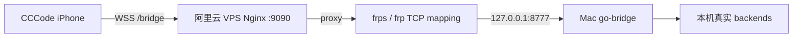
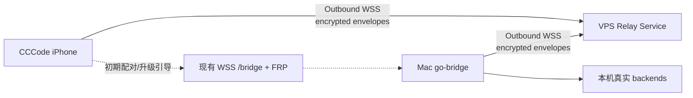
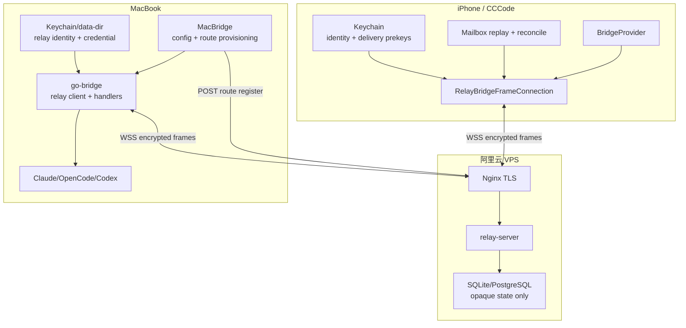
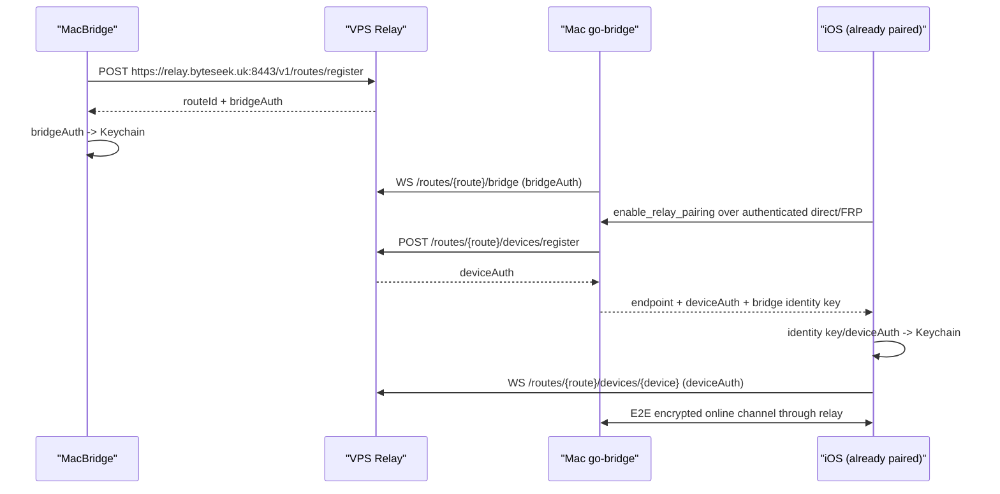

# CCCode 独立 VPS Relay 服务实现与实施方案

**日期**: 2026-05-25
**状态**: 实施方案，待进入执行队列
**范围**: 独立 Relay Service、MacBridge、go-bridge、OpenCodeiOS、阿里云 VPS / Nginx / 现有 FRP 通道
**确定部署目标**: `relay.byteseek.uk` -> 阿里云 VPS `47.236.182.45`（Cloudflare 代理记录，2026-05-25 已由用户配置）
**前置文档**:

- `opencode-ios配置阿里云vps实现外网访问Macbook-opencode实践.md`
- `docs/2026-05-24-CCCode-E2E-Relay与加密离线同步实施方案.md`
- `docs/2026-05-24-CCCode-E2E-Relay与加密离线同步实施方案完成情况.md`
- `docs/2026-05-24-CCCode-E2E-Relay与加密离线同步实施方案代码走读Review报告.md`

---

## 1. 决策摘要

本方案将公网 relay 定位为一个部署在 VPS 上的**独立密文路由与 mailbox 服务**，而不是把现有 FRP 通道重新命名为 relay。

本方案中的生产 Relay endpoint 已确定为：

```text
wss://relay.byteseek.uk:8443
```

当前项目已经具备以下可复用基础：

- iPhone 可通过现有局域网或 VPS/FRP 的 `wss://.../bridge` 连接 Mac 上的 go-bridge。
- 已配对设备可经认证 direct channel 请求 `enable_relay_pairing`，获得 relay endpoint、device credential、bridge identity public key 与 channel generation。
- iOS 与 go-bridge 具备在线 relay ECDHE 信道、ChaCha20-Poly1305 envelope、RFC 9180 HPKE 原语、Keychain 密钥保存与 delivery prekey 自动补充基础。
- MacBridge 已具备 relay endpoint 配置、route 申请与 route credential Keychain 保存入口。

当前尚未具备以下能力：

- 独立部署且重启不丢 route/device/mailbox 的生产 Relay Service。
- 新设备不依赖 direct/FRP 的 `relay-first` HPKE 扫码 claim / 人工批准路径。
- iOS mailbox replay、durable apply-before-ack 与 authoritative reconcile 产品链路。
- 外网真机在线、离线、淘汰、撤销、服务重启的端到端验收证据。

因此采用以下演进顺序：

1. **保留现有 FRP direct 通道**，作为已配对设备升级 relay 的引导路径和故障排查路径。
2. **从 go-bridge 内嵌 RelayHub 抽取独立 VPS Relay Service**，先支撑已信任设备在线加密 relay，再加入持久化 mailbox。
3. **完成 iOS 离线恢复路径**后验收 encrypted offline sync。
4. **最后实现 relay-first 新设备配对**，移除首次外网使用必须经过 FRP/direct 的产品限制。

---

## 2. 目标与非目标

### 2.1 目标

| 目标 | 验收含义 |
| --- | --- |
| Mac 与 iPhone 都只需 outbound 访问 VPS relay | 家庭网络不暴露 go-bridge inbound 端口也可在线使用 |
| VPS 不获得 Bridge inner payload 或业务 token | Relay 仅能看到路由、密文、时间、大小和有限加密元数据 |
| route/device/mailbox 在 relay 重启后可恢复 | 服务升级、崩溃或重启不要求重新配对，也不静默丢失未过期密文 |
| 在线连接保持端到端加密与重放拒绝 | ECDHE traffic key、direction counter、AAD 校验持续生效 |
| iOS 离线时只暂存 durable milestone 密文 | 不把 relay 变成完整聊天历史副本；恢复后以 Mac 为权威 |
| 已配对升级与 relay-first 配对边界清晰 | 先交付真实可用路径，再交付新设备扫码即外网接入 |

### 2.2 非目标

| 非目标 | 原因 |
| --- | --- |
| 在 VPS 运行 OpenCode、Codex、Claude 或复制 session 状态 | Mac 始终是 runtime 和业务状态权威 |
| 用 relay mailbox 回答完整历史、Todo 或生成状态 | mailbox 只传递加密 milestone 与恢复控制信号 |
| 以 fallback 明文路径掩盖 relay 失败 | 真实路径失败必须显式暴露 |
| 立即下线 FRP | 在 relay-first 完成且回归验证稳定前，FRP 是可用引导/诊断通道 |
| 将自签名 TLS 绕过作为正式发布配置 | 生产 relay 应使用域名和受信任证书 |

---

## 3. 与现有 FRP 部署的关系

### 3.1 当前 direct / FRP 架构



该路径的价值是简单直接，且已经可用于配对和日常远程连接；但 VPS 代理链路终止到 Mac Bridge 的业务 WebSocket，不能提供“relay 只见密文”的 E2E 边界。

### 3.2 新 relay 架构



### 3.3 共存策略

| 阶段 | FRP `/bridge` | Relay `/v1/*` | 用户可获得的能力 |
| --- | --- | --- | --- |
| 当前 | 保留 | 未部署 | direct 远程访问 |
| Online Relay 联调 | 保留 | 部署 | 已配对设备经 direct 升级后使用 E2E relay |
| Offline Relay 验收 | 保留 | 持久化完成 | 在线 E2E + 加密离线 milestone 恢复 |
| Relay-first 发布 | 可保留为高级选项/诊断 | 完整 | 新设备扫码即可在外网完成安全配对 |

**明确约束**：Nginx 中原有 `/bridge` 不改指向 relay；relay 使用独立域名或独立 location，避免协议混淆和误判验收结果。

---

## 4. 生产目标架构

### 4.1 已确定域名与入口

正式 relay 使用已配置的 Cloudflare 代理域名 `relay.byteseek.uk`，而不是公网 IP 加自签名证书：

| 入口 | 建议地址 | 服务 |
| --- | --- | --- |
| 保留 direct / FRP | `wss://bridge.example.com/bridge` | Nginx -> FRP -> Mac go-bridge |
| 新 relay | `wss://relay.byteseek.uk:8443/v1/...` | Cloudflare -> VPS Nginx -> Relay Service |
| relay health | `https://relay.byteseek.uk:8443/healthz` | Cloudflare -> VPS Nginx -> Relay Service |

`relay` DNS 记录已采用 Cloudflare 代理模式。根据 Cloudflare 官方文档，代理 WebSocket 连接可用；该 DNS 记录仍不自动证明 VPS origin 的 TLS、Nginx 转发或 relay-server 已就绪。并且当前截图中存在同指向 `47.236.182.45` 的 DNS-only `sub` 记录，因此 origin IP 实际仍可被关联识别，不能将“隐藏源站 IP”作为安全门禁。

现有 direct / FRP 通道目前仍可保留原地址，直至另行迁移：

| 入口 | 联调地址示例 |
| --- | --- |
| direct / FRP | `wss://47.236.182.45:9090/bridge` |
| relay | `wss://relay.byteseek.uk:8443/v1/...` |

产品配置与代码统一以 `wss://relay.byteseek.uk:8443` 作为 relay base endpoint。VPS 的标准 `443` 端口已由现存 xray 服务占用，Cloudflare 支持代理 TLS/WebSocket 的 `8443`，因此 relay 使用专属 SNI virtual host 而不干扰现有业务；不再引入 IP 或 path-prefixed relay endpoint。

### 4.2 组件责任



### 4.3 Trust Boundary

| 数据 | 可被 relay 看见 | 不可被 relay 看见 |
| --- | --- | --- |
| Route 与 endpoint 标识 | `routeId`, `deviceId`, online/offline、cursor | device token、Mac identity private key |
| 传输元数据 | frame 大小、时间、TTL、ciphertext、加密 epoch 元数据 | backend ID、session ID、method、event、文本、Todo |
| Credential | relay credential 的 hash / verifier | 明文 bridge credential 持久副本、Bridge device token |
| 恢复状态 | mailbox 是否有未 ack frame | 解密后的 milestone 与 reconcile 结果 |

Relay 被攻破时，应只能造成密文删除、阻断、重放尝试或流量分析；终端必须通过 AAD、counter、epoch chain/head 和 Mac 权威 reconcile 检测而不能接受伪造业务内容。

---

## 5. 现有代码基线与缺口

### 5.1 可复用代码

| 现有组件 | 可复用范围 | 生产化要求 |
| --- | --- | --- |
| `go-bridge/relay_service.go` | 当前 HTTP/WS API 原型 | 移至独立 `relay-server`，补持久化、health、mailbox/revoke 路由 |
| `go-bridge/relay_hub.go` | 在线转发、内存 mailbox 行为与单测语义 | 抽为 repository/service；禁止以 map 作为生产真相源 |
| `go-bridge/relay_bridge_client.go` | Mac outbound WebSocket 与 secure channel 终止 | 连接外部 relay；补重连/状态/失败观测 |
| `go-bridge/relay_upgrade.go` | 已信任设备 upgrade 与外部 device provisioning | 作为第一阶段产品入口保留 |
| `go-bridge/relay_hpke.go` | 标准 HPKE primitive 与 vectors | 用于后续 relay-first，不等同产品路径完成 |
| `go-bridge/relay_prekey.go` | Mac 端 prekey / delivery epoch 状态逻辑 | 与独立 mailbox API、iOS replay 联调 |
| `RelayBridgeFrameConnection.swift` | 在线 secure transport | 补 mailbox fetch/ack 与恢复控制 |
| `SavedBridgeStore.swift` | identity / prekey Keychain 保存 | 加 durable cursor/chain-head 状态 |
| `MacBridge/RemoteAccessView.swift` | endpoint 配置与 route provision | 增加连接状态、撤销与生产错误展示 |

### 5.2 必须补齐的缺口

| 缺口 | 风险 | 本方案处理阶段 |
| --- | --- | --- |
| RelayHub 为内存 map | 服务重启丢 route/device/mailbox | Phase 1 |
| 独立 relay binary 不存在 | VPS 只能运行掺杂 runtime 的联调形态 | Phase 1 |
| `GET mailbox` / `POST ack` / `POST revoke` 未暴露为部署 API | 离线恢复和撤销不可产品验收 | Phase 2 |
| iOS 无 mailbox replay/reconcile 消费链 | 离线同步只有 Go helper，无真实 App 行为 | Phase 2 |
| relay-first HPKE claim 未送达 Mac | 新设备仍依赖 direct/FRP 初次升级 | Phase 3 |
| 服务级认证、限流、指标、备份不足 | 公网服务不可长期运维 | Phase 1-4 |

---

## 6. Relay Service 协议设计

### 6.1 Endpoint 版本策略

所有部署 API 以 `/v1/` 开头。Relay 只演进 opaque routing contract，不解析 Bridge inner protocol。

### 6.2 Route 与已信任设备 API

第一阶段交付“已配对设备升级 relay”所需接口：

| Method | Endpoint | 鉴权 | 用途 |
| --- | --- | --- | --- |
| `POST` | `/v1/routes/register` | 管理侧防滥用策略，见 9.2 | 创建 bridge route，返回一次性明文 `bridgeAuth` |
| `GET` | `/v1/routes/{routeId}/bridge` | `Bearer bridgeAuth` | Mac outbound WebSocket |
| `POST` | `/v1/routes/{routeId}/devices/register` | `Bearer bridgeAuth` | 已认证 Mac 为 device 创建 `deviceAuth` |
| `GET` | `/v1/routes/{routeId}/devices/{deviceId}` | `Bearer deviceAuth` | iOS outbound WebSocket |
| `POST` | `/v1/routes/{routeId}/devices/{deviceId}/revoke` | `Bearer bridgeAuth` | 撤销 endpoint、删除未确认密文、断开在线 socket |
| `GET` | `/healthz` | 无业务数据 | 进程活性 |
| `GET` | `/readyz` | 无业务数据 | DB 与迁移可用性 |

响应中不得返回已保存 credential；`bridgeAuth` 与 `deviceAuth` 仅在创建时返回一次，服务端只保存验证所需 hash。

### 6.3 Mailbox API

第二阶段交付离线 durable milestone：

| Method | Endpoint | 鉴权 | 用途 |
| --- | --- | --- | --- |
| `GET` | `/v1/routes/{routeId}/devices/{deviceId}/mailbox?after={cursor}&limit={n}` | `Bearer deviceAuth` | 拉取未确认密文 |
| `POST` | `/v1/routes/{routeId}/devices/{deviceId}/mailbox/ack` | `Bearer deviceAuth` | ack 已 durable commit 或 durable 标记需 reconcile 的 cursor |
| `GET` | `/v1/routes/{routeId}/status` | `Bearer bridgeAuth` | MacBridge 诊断 device 数量、在线计数、mailbox bytes，不包含 payload |

`GET mailbox` 响应建议结构：

```json
{
  "frames": [
    {
      "cursor": 41,
      "envelope": {
        "version": 1,
        "routeId": "rt_xxx",
        "senderId": "bridge",
        "destinationId": "dev_xxx",
        "channelGeneration": 1,
        "keyEpochId": "mailbox:9",
        "counter": 1,
        "ciphertext": "..."
      }
    }
  ],
  "nextCursor": 41,
  "hasMore": false
}
```

Relay 不依据 envelope 内业务内容做筛选；进入 durable mailbox 的 milestone 白名单由 Mac go-bridge 在加密前决定。

### 6.4 Relay-first 配对 API

第三阶段才引入新设备 claim，不混入第一阶段 route/device credential 模型。

需要新增一个有限的、仅承载 HPKE 密文的 pending pairing channel：

| Method | Endpoint | 鉴权 | 用途 |
| --- | --- | --- | --- |
| `POST` | `/v1/routes/{routeId}/pairing-claims` | QR 携带的短期 pairing capability | 新 iOS 上传 HPKE sealed claim |
| `GET` 或 WS control frame | Mac 现有 bridge socket | `Bearer bridgeAuth` | Mac 收到待批准 claim 的密文通知/内容 |
| `POST` | `/v1/routes/{routeId}/pairing-claims/{claimId}/complete` | `Bearer bridgeAuth` | Mac 批准后登记正式 device endpoint 并交付 sealed result |
| `GET` | `/v1/routes/{routeId}/pairing-claims/{claimId}/result` | pairing capability | iOS 获取批准/拒绝的加密结果 |

约束：

- QR 中的 pairing capability 必须短期有效、一次使用、和 `pairingId` / route / bridge fingerprint 绑定。
- Relay 不能生成、替换或解密 bridge key、device identity key、claim/result。
- Mac 仍必须有人为批准动作；公网可达不等于信任授权。
- 在该协议实现之前，不把“MacBridge route 已可创建”表述为 relay-first 配对可用。

---

## 7. 持久化数据模型

### 7.1 技术选择

单机阿里云 VPS 的首个生产版本推荐：

- **SQLite WAL**：部署简单，符合单实例 relay 初始规模；数据库文件位于独立 data dir，定期备份。
- 若未来需要多副本、高并发或无停机扩容，再迁移 PostgreSQL；首版不提前引入分布式锁和消息总线。

选择 SQLite 的条件：

- Relay 首版为单节点服务。
- mailbox 负载以单用户/少量设备的密文 milestone 为主，不缓存完整流。
- WebSocket 在线连接保存在进程内，只有 route/device/mailbox/revoke/pairing pending 需要持久化。

### 7.2 表结构

```sql
CREATE TABLE routes (
  route_id TEXT PRIMARY KEY,
  bridge_auth_hash BLOB NOT NULL,
  created_at INTEGER NOT NULL,
  revoked_at INTEGER,
  last_bridge_seen_at INTEGER
);

CREATE TABLE route_devices (
  route_id TEXT NOT NULL,
  device_id TEXT NOT NULL,
  device_auth_hash BLOB NOT NULL,
  created_at INTEGER NOT NULL,
  revoked_at INTEGER,
  last_seen_at INTEGER,
  PRIMARY KEY (route_id, device_id),
  FOREIGN KEY (route_id) REFERENCES routes(route_id)
);

CREATE TABLE mailbox_frames (
  route_id TEXT NOT NULL,
  device_id TEXT NOT NULL,
  cursor INTEGER NOT NULL,
  envelope BLOB NOT NULL,
  envelope_size INTEGER NOT NULL,
  inserted_at INTEGER NOT NULL,
  expires_at INTEGER NOT NULL,
  acked_at INTEGER,
  PRIMARY KEY (route_id, device_id, cursor),
  FOREIGN KEY (route_id, device_id) REFERENCES route_devices(route_id, device_id)
);

CREATE INDEX mailbox_pending_lookup
  ON mailbox_frames(route_id, device_id, cursor)
  WHERE acked_at IS NULL;

CREATE TABLE pending_pairing_claims (
  route_id TEXT NOT NULL,
  claim_id TEXT NOT NULL,
  capability_hash BLOB NOT NULL,
  sealed_claim BLOB,
  sealed_result BLOB,
  state TEXT NOT NULL,
  expires_at INTEGER NOT NULL,
  consumed_at INTEGER,
  PRIMARY KEY (route_id, claim_id)
);
```

### 7.3 数据保存规则

| 数据 | 保存方式 | 保留策略 |
| --- | --- | --- |
| `bridgeAuth`, `deviceAuth`, pairing capability | 仅保存带随机 salt 的 hash / verifier | route/device/pairing 生命周期 |
| 在线 socket | 仅内存 | 断线即释放 |
| mailbox ciphertext | SQLite `BLOB` | 默认 TTL 24 小时，ack 后异步清除 |
| metadata | route/device/cursor/size/timestamps | 仅满足投递、清理与指标需求 |
| 明文 payload、backend/session/event 字段 | 不保存、不日志记录 | 禁止进入 relay |

### 7.4 容量与清理

首版默认值：

| 约束 | 值 |
| --- | --- |
| 单 frame 上限 | 512 KB |
| 单设备未 ack mailbox 上限 | 50 MB |
| 未 ack TTL | 24 小时 |
| pairing claim TTL | 5 分钟 |
| 每次 fetch 最大 frames | 100 |
| 清理任务间隔 | 5 分钟 |

超过容量时，relay 可淘汰最旧未 ack 密文并记录 metric；iOS 必须依靠 counter/epoch/head 检测并进入 reconcile，而不是把缺失消息当作正常完成。

---

## 8. 服务代码组织

### 8.1 新增独立服务目录

建议在本仓库新增独立 Go module 或 command，不继续让 VPS 运行带 backend runtime 的 `go-bridge`：

```text
relay-server/
  cmd/relay-server/main.go       # flags、TLS 后端监听、graceful shutdown
  internal/api/routes.go         # route/device/revoke HTTP endpoints
  internal/api/websocket.go      # bridge/device sockets
  internal/api/mailbox.go        # mailbox fetch/ack
  internal/api/pairing.go        # Phase 3 HPKE opaque pending channel
  internal/auth/credential.go    # credential 生成/hash/constant-time verify
  internal/store/store.go        # repository interface
  internal/store/sqlite.go       # SQLite WAL 实现与 schema migration
  internal/hub/hub.go            # 在线 socket registry + forwarding
  internal/limits/limits.go      # TTL/size/rate limits
  internal/metrics/metrics.go    # 无 payload 指标
  migrations/
  systemd/
```

若选择暂时复用现有 module，也应创建独立 `cmd/relay-server`，并将 `RelayHub` / `RelayService` 所需逻辑下沉到不依赖 handlers/backends 的包中。VPS 生产进程不得初始化 agent drivers 或 Mac 管理 API。

### 8.2 与当前 `go-bridge` 的迁移边界

| 当前代码 | 迁移结果 |
| --- | --- |
| `relay_service.go` | 行为合同与测试迁移至 `relay-server/internal/api` |
| `relay_hub.go` | socket forwarding 保留；route/device/mailbox 状态改调 repository |
| `relay_bridge_client.go` | 继续留在 Mac go-bridge，仅连接部署后的 relay |
| `relay_upgrade.go` | 继续留在 Mac go-bridge，调用外部 `/devices/register` |
| `relay_prekey.go` | 继续留在 Mac go-bridge；relay 不拥有解密或 prekey 消费逻辑 |
| `relay_mailbox.go` / offline router | 审计后分离：加密决策留在 Mac，ciphertext store 行为移到 relay service |

### 8.3 Repository Interface

独立服务内部只暴露 opaque 状态接口：

```go
type Store interface {
    CreateRoute(ctx context.Context, authHash []byte) (Route, error)
    AuthenticateBridge(ctx context.Context, routeID string, credential []byte) (bool, error)
    RegisterDevice(ctx context.Context, routeID, deviceID string, authHash []byte) error
    AuthenticateDevice(ctx context.Context, routeID, deviceID string, credential []byte) (bool, error)
    RevokeDevice(ctx context.Context, routeID, deviceID string, at time.Time) error
    AppendFrame(ctx context.Context, frame OpaqueFrame) (uint64, error)
    FetchFrames(ctx context.Context, routeID, deviceID string, after uint64, limit int) ([]OpaqueFrame, error)
    AckFrames(ctx context.Context, routeID, deviceID string, cursor uint64, at time.Time) error
    ExpireFrames(ctx context.Context, now time.Time) (int64, error)
}
```

`OpaqueFrame` 不应包含 inner message 的结构化字段。

---

## 9. 公网安全与运维要求

### 9.1 Cloudflare、TLS 与 Nginx

生产环境要求：

- relay 固定使用 `relay.byteseek.uk`，Cloudflare DNS 记录保持 `Proxied`；
- Cloudflare Network 设置允许 WebSockets；Cloudflare 官方文档说明 proxied WebSockets 受支持；
- Cloudflare SSL/TLS 模式使用 **Full (strict)**；
- VPS Nginx 在 `8443` origin 终止 TLS，证书使用 Cloudflare Origin CA 或覆盖 `relay.byteseek.uk` 的公共受信任证书；`443` 保留给既有 xray；
- 因同 VPS IP 可能通过其他 DNS-only 记录暴露，源站防护不依赖 IP 隐藏；可增加 Cloudflare Authenticated Origin Pulls，并将防火墙/访问策略限制为预期入口；
- relay-server 仅监听 VPS loopback，例如 `127.0.0.1:8780`；
- Nginx 只将 `/v1/`、`/healthz`、`/readyz` 转发给 relay-server；
- WebSocket read/send timeout 支持长连接，但设置连接和请求级资源上限。

示意配置：

```nginx
server {
    listen 8443 ssl http2;
    server_name relay.byteseek.uk;

    ssl_certificate /etc/letsencrypt/live/relay.byteseek.uk/fullchain.pem;
    ssl_certificate_key /etc/letsencrypt/live/relay.byteseek.uk/privkey.pem;

    location /v1/ {
        proxy_pass http://127.0.0.1:8780;
        proxy_http_version 1.1;
        proxy_set_header Upgrade $http_upgrade;
        proxy_set_header Connection "upgrade";
        proxy_set_header Host $host;
        proxy_set_header X-Forwarded-For $proxy_add_x_forwarded_for;
        proxy_buffering off;
        proxy_read_timeout 86400;
        proxy_send_timeout 86400;
        client_max_body_size 600k;
    }

    location = /healthz {
        proxy_pass http://127.0.0.1:8780;
    }

    location = /readyz {
        proxy_pass http://127.0.0.1:8780;
    }
}
```

该配置已于 `2026-05-25` 在 VPS 落地：Nginx `8443` 的 SNI virtual host 使用 Let's Encrypt 公共证书代理至 `127.0.0.1:8780`，Cloudflare 公网访问与 WebSocket 验收通过。现存 xray `443`、FRP 与 Nginx `9090` 入口保持运行，未为 relay 抢占端口。

### 9.2 Route 注册防滥用

公网正式部署不能无限开放 route 创建。现有运维入口继续使用部署级 provisioning token；普通产品路径新增每安装设备签名激活：

| 方案 | 优点 | 代价 | 建议 |
| --- | --- | --- | --- |
| MacBridge 本机 Ed25519 激活身份签名 + 独立 IP 限速 | 下载后无输入可开通；无全局客户端 secret；同安装可恢复 credential | 匿名免费服务仍需运营侧观察滥用并可升级账户配额 | **当前产品路径** |
| VPS deployment token 保护 route register | 适合运维验收 | 不应暴露给普通用户或打包进客户端 | 运维专用 |
| 用户账户/OAuth 后创建 route | 可绑定订阅与跨设备配额 | 超出当前无账户产品范围 | 后续商业化能力 |

当前实现：

- MacBridge 第一次启动在 Keychain 生成 Ed25519 激活身份和随机 `bridgeAuth`，对 canonical activation payload 签名后调用 `/v1/activations/routes`。
- relay-server 验证签名、时间窗与 nonce，将 install identity public key 绑定到单一 route，并只保存 `bridgeAuth` 摘要；同一安装可签名恢复并轮换 credential。
- 激活接口采用独立 IP 限速；运维 `POST /v1/routes/register` 仍要求 `Authorization: Bearer <deploymentProvisionToken>`。
- deployment provisioning token 不进入正常 MacBridge UI，也不内置到客户端。
- bridge/device WebSocket 仍只使用 route/device credential，不能复用 provisioning token。

### 9.3 Credential 与日志

| 事项 | 规则 |
| --- | --- |
| Credential 生成 | 至少 256 bit CSPRNG；返回明文一次 |
| 服务端保存 | Argon2id 或 HMAC-backed verifier / salted cryptographic hash；不得明文落库 |
| 比较方式 | constant-time comparison |
| Mac 持久化 | route credential 与 provisioning token 存 Keychain，不进入 UserDefaults 和进程参数 |
| iOS 持久化 | device credential、identity/private delivery prekeys 存 Keychain |
| 日志 | 只记录截断 route/device ID、错误码、frame bytes、cursor/count；不记录 credential/ciphertext body |

### 9.4 指标与告警

Relay 可暴露如下无明文指标：

| Metric | 用途 |
| --- | --- |
| connected bridges / devices | 在线状态与容量规划 |
| route/device auth failures | credential 攻击或配置错误 |
| forwarded frame count / bytes | 基础流量 |
| queued / expired / evicted / acked mailbox frames | 离线投递可靠性 |
| WebSocket close reason counts | 网络质量 |
| DB latency / disk bytes / cleanup failures | 运维 |

不得将 ciphertext payload、inner IDs 或解密失败后的 plaintext 信息纳入日志/metrics。

### 9.5 备份与恢复

- SQLite data dir 置于例如 `/var/lib/cccode-relay/relay.db`，权限仅 service user 可读写。
- 使用 WAL-aware backup 或停写窗口备份，不直接复制正在写入的不一致文件。
- 备份包含 opaque auth verifier 与密文 mailbox；仍按敏感数据保护。
- 恢复演练必须验证 route/device credential 仍可连接，未过期 mailbox 仍可 fetch/ack。

---

## 10. Mac 与 iOS 产品接入

### 10.1 已配对设备升级路径（优先交付）

该路径已有主要代码基础，也是部署后最先可验收的路径：



第一阶段成功标准：

- direct/FRP 不改行为；
- MacBridge 能通过真实 VPS relay 申请 route；
- go-bridge 能从家庭网络 outbound 连接 relay；
- 已配对 iPhone 可升级并仅经 relay 进行在线 RPC/event 收发；
- relay 日志与 DB 无 inner plaintext；
- 错误时不默默切换成假 relay 成功。

### 10.2 离线 mailbox 恢复路径

需要新增 iOS 产品实现：

1. iOS 在 relay authenticated channel 成功后维持 delivery prekey 水位。
2. Mac 对允许持久化的 milestone 消费一次性 prekey，构造 mailbox epoch 密文交 relay。
3. iOS 重连后 `GET mailbox`，按 cursor 拉取。
4. iOS 逐帧验证 envelope、epoch chain、counter、AEAD。
5. iOS 原子持久化 `lastCommittedCursor` / chain head / `localReconcileRequired`。
6. durable write 成功后 `POST ack`。
7. iOS 回源 Mac 获取完整 history/Todo/running state，原子更新可见 UI。

不得实现的捷径：

- 不把 mailbox milestone 直接绘制成完整 final message；
- 不在 Mac offline 时排队执行写请求；
- 不用缓存 snapshot 假装 authoritative reconcile 成功。

### 10.3 Relay-first 新设备配对

该路径在在线升级与离线恢复稳定后实施：

1. MacBridge 创建短期 pairing session，二维码包含 relay endpoint、route、bridge HPKE public key、fingerprint 与 pairing capability。
2. iOS 扫码，核验展示 fingerprint，生成长期 device identity key。
3. iOS 以 CryptoKit HPKE 加密 claim，通过 relay pending claim endpoint 上传。
4. Mac 经 bridge socket 收到 sealed claim，使用 bridge private key 解密并在 MacBridge 显示待批准设备。
5. 用户批准后，Mac 绑定 device identity、向 relay 注册正式 device credential，并返回 sealed pairing result。
6. iOS 解密结果后直接建立 relay secure channel；无需先访问 `/bridge` FRP。

验收前必须证明：

- RFC 9180 Go / CryptoKit 跨端向量；
- QR 替换、fingerprint 替换、claim 重放、过期 capability、重复批准均拒绝；
- relay 无法自行批准设备或替换 key。

---

## 11. 阿里云 VPS 部署设计

### 11.1 目标文件布局

```text
/opt/cccode-relay/
  bin/relay-server
  config/relay.env              # 仅 root/service user 可读，不含 Mac route credential
  migrations/

/var/lib/cccode-relay/
  relay.db

/var/log/cccode-relay/
  relay.log                     # 或交由 journald

/etc/systemd/system/
  cccode-relay.service

/etc/nginx/sites-available/
  cccode-relay.conf
```

### 11.2 Runtime 配置

Relay server 需要的首版配置：

| 参数 | 示例 | 说明 |
| --- | --- | --- |
| `RELAY_LISTEN_ADDR` | `127.0.0.1:8780` | 仅供 Nginx 访问 |
| `RELAY_DB_PATH` | `/var/lib/cccode-relay/relay.db` | SQLite 与迁移状态 |
| `RELAY_PUBLIC_ENDPOINT` | `wss://relay.byteseek.uk:8443` | 返回给 Mac/iOS 的 endpoint |
| `RELAY_PROVISION_TOKEN_SHA256` | SHA-256 hex digest | route register 管理门禁，仅存摘要 |
| `RELAY_MAX_MAILBOX_BYTES` | `52428800` | 单 device 上限 |
| `RELAY_MAX_FRAME_BYTES` | `524288` | 单 envelope 上限 |
| `RELAY_MAILBOX_TTL` | `24h` | 密文保留 |
| `RELAY_RATE_LIMIT_PER_MINUTE` | `30` | 按敏感操作/IP 的首版限速 |

### 11.3 systemd 目标形态

```ini
[Unit]
Description=CCCode Opaque Relay Service
After=network-online.target
Wants=network-online.target

[Service]
Type=simple
User=cccode-relay
Group=cccode-relay
EnvironmentFile=/etc/cccode-relay/relay.env
ExecStart=/opt/cccode-relay/bin/relay-server
WorkingDirectory=/var/lib/cccode-relay
Restart=on-failure
RestartSec=3
NoNewPrivileges=true
PrivateTmp=true
ProtectSystem=strict
ReadWritePaths=/var/lib/cccode-relay

[Install]
WantedBy=multi-user.target
```

实际部署已按该安全边界完成：Debian 12 上 `cccode-relay.service` 以专用 `cccode-relay` 用户运行，`relay.db` 为服务用户持有，`/etc/cccode-relay/relay.env` 为 root `0600`；`certbot.timer` 与续签后 reload hook 已启用。

### 11.4 与现有 FRP Nginx 共存

现有 FRP 配置继续处理 `/bridge` 与 `/pairing`；新增 relay 时采用独立 server block 最干净：

```text
bridge.example.com  -> existing Nginx/FRP -> Mac go-bridge
relay.byteseek.uk:8443 -> Cloudflare -> VPS Nginx :8443 -> 127.0.0.1:8780 relay-server
```

`relay.byteseek.uk` 已独立于现有 IP 形式的 FRP 地址，因此 relay 应直接使用独立 hostname，不在 App 中新增 path-prefixed 或 IP 形式的 relay endpoint。

---

## 12. 分阶段实施计划

每一阶段均以 `impl / tests / regression` 三类门禁推进；实现完成而未提供对应验证证据时，不得将阶段标记为完成。

### Phase 0：部署合同冻结与代码拆分准备

**目标**：在新增公网服务前，冻结独立 relay 的 API、数据边界与迁移范围。

| 工作项 | 实施内容 | 验收证据 |
| --- | --- | --- |
| Protocol impl | 固化本文 `/v1` endpoints、credential / mailbox / relay-first 边界 | protocol contract 文档或 fixture |
| Protocol tests | 为 API path、鉴权、禁止字段、size/TTL 建立 Go contract tests | 定向 test 输出 |
| Migration regression | 对照现有 FRP 与 online relay 代码证明不改变 `/bridge` direct path | review 记录 + 现有 build/tests |

退出标准：

- relay base endpoint 已冻结为 `wss://relay.byteseek.uk:8443`；验证 Cloudflare edge 与 VPS origin TLS 配置可满足该 endpoint，且不影响占用 `443` 的现有 xray 服务。
- 确定 SQLite 首版与 deployment provisioning token 策略。
- 不再把内嵌 `RelayHub` 的测试通过当作 VPS 生产服务完成。

### Phase 1：独立 Relay Service 与在线加密通道部署

**目标**：已配对设备能够经真正 VPS relay 在线收发 E2E encrypted RPC/event。

| 工作项 | 实施内容 | 验收证据 |
| --- | --- | --- |
| Service impl | 新建 `relay-server`，SQLite routes/devices、route provision、device provision、bridge/device WS、health/ready | 文件与 migration |
| Service tests | auth/revoke/restart persistence、cross-route isolation、WebSocket forwarding、rate/body limit tests | Go tests，含 `-race` |
| Mac/iOS integration impl | MacBridge provisioning token/endpoint 配置；go-bridge reconnect/status；iOS online relay 连接 | 定向 build/tests |
| Deployment impl | systemd、Nginx TLS、data-dir 权限、日志策略 | VPS 配置审阅记录 |
| Online regression | 已配对真机：direct upgrade -> relay connect -> RPC/event -> network reconnect -> revoke | 真机验收日志 |

退出标准：

- relay-server 重启后 route/device credential 仍有效。
- iOS 与 Mac 无 direct/FRP 业务连接时，在线 relay RPC/event 工作。
- 现有 FRP direct 通道仍可用且未被修改为假 relay。

### Phase 2：持久化 Mailbox 与 iOS Offline Reconcile

**目标**：iOS 离线/后台期间，允许的 encrypted milestones 可 durable 恢复，并由 Mac 权威状态收敛。

| 工作项 | 实施内容 | 验收证据 |
| --- | --- | --- |
| Mailbox service impl | fetch/ack/revoke、TTL/size eviction、cleanup job、metrics | API tests / DB migration |
| Mac delivery impl | observation scope、milestone whitelist、prekey epoch、chain-head RPC 与 outbox 接入真实 handler path | Go integration tests |
| iOS replay impl | durable cursor/chain state、decrypt/apply-before-ack、reconcile presentation、Keychain prekey 删除 | XCTest |
| Failure regression | restart、TTL eviction、capacity eviction、tamper、gap、prekey exhaustion、Mac offline write rejection | 真机 + 服务日志证据 |

退出标准：

- App 崩溃/重启后不会因先 ack 后落盘丢失恢复要求。
- mailbox 只存 milestone ciphertext；不含完整 token stream。
- 三类 backend 各自按真实能力恢复，不制造统一假实时语义。

### Phase 3：Relay-first HPKE 配对

**目标**：全新 iPhone 在没有局域网、Tailscale 或 FRP 的情况下扫码配对 Mac。

| 工作项 | 实施内容 | 验收证据 |
| --- | --- | --- |
| Pairing transport impl | pending claim endpoints / bridge notification / sealed result / TTL capability | relay-server tests |
| MacBridge impl | relay QR、fingerprint 展示、claim approve/reject、设备列表状态 | Mac build/unit tests |
| iOS impl | QR parser、CryptoKit HPKE claim、waiting/approve result、Keychain identity | XCTest |
| Pairing regression | external-network new-device pairing、substitution/replay/expiry/reject/revoke | 真机记录 |

退出标准：

- 首次外网接入不再依赖 direct/FRP。
- Relay 从未获得 device token 或解密明文。
- 人工批准门禁不可绕过。

### Phase 4：发布与运维门禁

**目标**：让 relay 可安全长期运行，而不是仅通过功能 demo。

| 工作项 | 实施内容 | 验收证据 |
| --- | --- | --- |
| Operations impl | backup/restore、migration rollback、metrics/alerts、log redaction、credential rotation | 运维 runbook |
| Load/security tests | frame limit、auth brute-force throttling、socket/resource limits、DB cleanup 性能 | 压测/安全测试报告 |
| Release regression | direct + online relay + offline relay + relay-first + revoke + VPS restart | 发布验收报告 |

退出标准：

- VPS restart/restore/migration 不破坏已注册设备或静默丢 mailbox。
- 安全日志审计确认不存在 credential 或 inner payload 泄露。
- 完整真机验收有可复核记录。

---

## 13. 推荐执行队列

以下任务应在后续进入 `exec-plan` 时拆成 `impl/tests/regression` triplet；本文件自身不代表这些事项已完成。

| 顺序 | 工作单元 | 依赖 |
| --- | --- | --- |
| 1 | 独立 relay protocol / persistence contract | 无 |
| 2 | `relay-server` skeleton + SQLite route/device store | 1 |
| 3 | route provision + bridge/device WebSocket online forwarding | 2 |
| 4 | Nginx/systemd/TLS + MacBridge/go-bridge 外部 endpoint integration | 3 |
| 5 | 已配对设备在线 relay 真机验收 | 4 |
| 6 | mailbox API + persistent ciphertext store + revoke/cleanup | 3 |
| 7 | go-bridge durable milestone delivery 接真实 event path | 6 |
| 8 | iOS replay/reconcile 与 durable ack | 6, 7 |
| 9 | 加密离线端到端验收 | 8 |
| 10 | relay-first HPKE pending claim channel | 3 |
| 11 | MacBridge/iOS relay-first product UI 与真机验收 | 10 |
| 12 | 运维/备份/安全/发布门禁 | 5, 9, 11 |

---

## 14. 验证矩阵

### 14.1 自动化测试

| 层级 | 必测项目 |
| --- | --- |
| Relay store | route/device credential hash、重启恢复、revoke、mailbox cursor/ack/TTL/evict |
| Relay API | auth failures、path isolation、body limit、WebSocket forwarding、offline queue |
| Crypto boundary | RFC 9180 vectors、AAD/counter/padding、epoch chain、prekey retry |
| Mac connector | external relay connect/reconnect、inbound decrypt/dispatch、outbound forwarding |
| iOS transport | online relay handshake、Keychain storage、prekey refill、mailbox replay/apply-before-ack |
| Product settings | MacBridge endpoint/provisioning token/route credential 状态映射，不泄露 secret |

### 14.2 真机验收

真机验收只有在对应实现完成且用户明确安排设备验证时执行：

| 场景 | 期望 |
| --- | --- |
| 已配对 iPhone 在蜂窝网络升级 relay | direct 只承担升级；后续业务帧经 relay |
| Mac 与 iPhone 都在 NAT 后 | 仅 outbound 可建立在线 channel |
| iOS 切后台 / 飞行模式后 Mac 继续执行 | 仅 milestone mailbox 入库；恢复后 authoritative reconcile |
| relay-server restart | route/device 与未过期 mailbox 恢复 |
| mailbox TTL / 容量淘汰 | iOS 检测 gap/head mismatch 并 reconcile |
| Mac offline 时 iOS 写操作 | 明确失败，不排队 |
| 设备 revoke 后重新连接 | relay 与 Mac 均拒绝，pending mailbox 清除 |
| 新 iPhone 外网扫码配对 | Phase 3 完成后才可验收 |

---

## 15. 风险与取舍

| 风险 / 取舍 | 结论 |
| --- | --- |
| 首版继续保留 FRP，产品看似有两条远程路径 | 接受。它允许在线 relay 先真实交付，并提供升级引导与应急诊断；UI 必须标明 Direct 与 Encrypted Relay。 |
| SQLite 仅适合单实例 | 接受。当前规模更需要可部署、可审计和不丢数据；未来再根据流量迁 PostgreSQL。 |
| Relay 可观察流量大小和时间 | 无法由 E2E 加密消除；通过 padding 和最小日志减少泄露，不夸大隐私承诺。 |
| route register 暴露为公网端点会被滥用 | 不接受匿名正式部署；必须加入 provisioning token 或账户门禁。 |
| relay-first 与 offline 同时实施范围过大 | 分阶段。先交付已信任在线通道，随后离线恢复，最后新设备首次配对。 |
| 自签名证书已在 FRP 试验中可用 | 不延续到正式 relay；正式 endpoint 使用受信任证书。 |

---

## 16. 当前可执行结论

本方案落地后，系统的最终安全与部署模型为：

- **现有 FRP**：保留为 direct remote access 和过渡期已信任升级引导，不承诺 relay 的密文不可见边界。
- **独立 VPS relay-server**：只承载 route/device credential 验证、WebSocket 密文转发、持久化 ciphertext mailbox、撤销与有限诊断。
- **Mac go-bridge**：持有 Mac identity private key，终止 E2E 加密，处理真实 Bridge RPC/event 与 authoritative state。
- **iOS CCCode**：持有 device identity/private delivery prekeys，终止 E2E 加密，完成 durable mailbox commit 与回源 reconcile。
- **MacBridge**：自动管理官方 endpoint、设备签名激活、Keychain credential、用户批准和运行状态，不解析业务密文；自托管连接才进入高级配置。

### 16.1 实施状态更新（2026-05-25）

仓库内实现与 VPS 公网 relay 服务端实施单元已经完成：

1. 新增独立 `relay-server` Go module 与进程入口，不初始化 agent/backend runtime；
2. 新增 SQLite WAL 的 route/device/mailbox 存储，实现 fetch/ack、device revoke、TTL 与容量淘汰；
3. 新增 provisioning token、敏感操作按 IP 限速、无 payload 安全日志、health/readiness；
4. 新增 `relay.byteseek.uk` 的 systemd/Nginx/Cloudflare Full (strict) TLS 部署材料；
5. `go-bridge` 遗留内嵌 relay 仅允许 loopback 联调，防止误暴露匿名内存服务；运维 route 注册保留 Keychain/部署 token 路径，但不再作为普通用户开通流程。
6. 已在阿里云 VPS 部署 `cccode-relay.service`，以 `https/wss://relay.byteseek.uk:8443` 对外服务；Let's Encrypt 证书与自动续签已安装。

证明已通过：`relay-server` race tests/build、`go-bridge` race tests、MacBridge build、diff 格式审计，以及真实公网 route/device、WebSocket 在线透传、离线 fetch/ack、撤销和 relay 服务重启后 mailbox 恢复。

7. iOS mailbox replay 基础链路已实现：HTTP fetch/ack API 客户端、Keychain cursor 持久化、在线 traffic key 解密、gap 检测与 reconcile 标记、reconnect 后自动 replay 编排。同时修复了 `RelayBridgeFrameConnection.connectAndHandshake()` 未被 `CCCodeBridgeTransport` 调用的集成缺口。Delivery prekey epoch 解密待 Mac 端实现 mailbox epoch 加密后补齐。

仍未完成且不得误报为生产完成的工作是：

1. iOS mailbox delivery prekey epoch 解密与离线 reconcile 端到端验证（`phase2-ios-mailbox-replay-tests`）；
2. relay-first HPKE 新设备配对路径；
3. 真实 Mac/iPhone App 层公网在线、离线、撤销和服务重启验收。

8. iOS mailbox replay 基础链路测试已完成（28 个新测试：模型序列化、cursor 持久化、crypto 工具、envelope AAD 稳定性、base64 roundtrip、解密边界条件）。
9. relay-first HPKE 配对服务端 API 已实现：`pending_pairing_claims` 持久化表、submit/list/complete/result/consume 端点、capability 验证、state machine（pending→approved/rejected→consumed）和 5 分钟 TTL。3 个自动化测试覆盖完整配对生命周期。
10. relay-first 端侧代码路径已接入：go-bridge management pairing session 可将 relay endpoint、route、bridge HPKE public key、fingerprint 与短期 capability 写入现有二维码，轮询公网 sealed claim 后驱动原有 MacBridge 批准 UI，并以 HPKE sealed result 交付 relay device credential；iOS 扫到该二维码后可在 iOS 17+ 直接通过 relay 上传 claim、等待批准并持久化 secure-channel 凭据，不再依赖 direct/FRP 配对请求到达 Mac。
11. 含 `pending_pairing_claims` 与 `/v1/routes/{route}/pairing-claims` API 的新版 `relay-server` 已于 `2026-05-25 08:51:22 UTC` 发布到 VPS：替换前备份了旧二进制和停服后的 `relay.db`，生产二进制 SHA-256 为 `1f3bcbe8603d033b9610f450538ed16ff259b71d35a84e164d1719dc9ad143ca`；发布后 `cccode-relay`、Nginx、FRP 均保持 active，公网 `/readyz`、`/healthz` 正常，pairing API 探针已从旧服务的 `404` 变为新服务的鉴权/校验响应。
12. MacBridge 的官方 Relay 正常界面已去除 endpoint、Route ID、Credential、Provisioning Token 与本机 listener 等内部配置项；Tailscale/VPS/FRP 折叠为自托管/调试能力。应用启动时通过串行 provisioner 自动准备官方 route、将 credential 保存于 Keychain 并建立 `wss://relay.byteseek.uk:8443` bridge WebSocket；新生成二维码包含 relay endpoint、route、HPKE bridge key 与 pairing capability。首次安装不依赖预置授权的开通过程由下一项设备签名激活路径完成。
13. 普通新用户零配置开通已改为设备签名激活：MacBridge 首次启动在 Keychain 生成 Ed25519 激活身份和随机 bridge credential，通过公网 `/v1/activations/routes` 签名请求创建 route；relay 只持久化 public key 绑定和 credential digest，并对激活使用独立 IP 限速。生产服务已发布该 API；在本机清除旧空 route、credential 与激活身份后重启 App，已无输入生成新 route、连接公网 bridge socket，并生成包含 relay-first 字段的二维码。
14. 首次真机公网扫码暴露并修复 relay-first claim 验证故障：iOS 以 UTC `Z` 构造 HPKE AAD，而 Mac runtime 先前使用本地 `+08:00` 格式化同一 timestamp，导致密文认证必然失败且 UI 不进入批准状态；Mac/iOS 的高频 polling 还会触发生产 `30/min` 限流并掩盖原始错误。现已统一 claim AAD 为 UTC、将 relay pairing polling 调整为 3 秒、保留具体 HTTP/relay 错误码，并新增 CryptoKit Sender 到 Go Receiver 回归向量。安装新版 MacBridge 后，通过生产 relay 提交 CryptoKit claim 已验证 management 状态进入 `claimed`，诊断 claim 随后主动拒绝以避免遗留设备。

证明已通过：`go-bridge`/`relay-server` 全量 Go tests、MacBridge build、iOS build，以及 iOS `BridgePairingClientTests`/`BridgePairingModelsTests` 定向单测；生产 `wss://relay.byteseek.uk:8443` 可达，VPS 日志记录诊断 claim submit/list/complete 均为 HTTP 200。iOS 全量 `CCCodeTests` 仍被既有 `MailboxCursorTests` 与 `RelayCryptoUtilsTests` 失败阻断，不能写成全量绿灯。

仍未完成且不得误报为生产完成的工作是：

1. iOS mailbox delivery prekey epoch 解密与离线 reconcile 端到端验证（真机层）；
2. relay-first 的 iOS 16 兼容性决策或实现（`CryptoKit.HPKE` 的系统可用性从 iOS 17 开始，而当前 deployment target 为 iOS 16）；
3. 真实 Mac/iPhone App 层公网在线、离线、relay-first、撤销和服务重启验收。

这样能够复用已有阿里云 VPS 和 FRP 基础，同时避免将服务端接口、未接通的端侧离线恢复或尚未实现的新设备配对误报为全链路完成。
